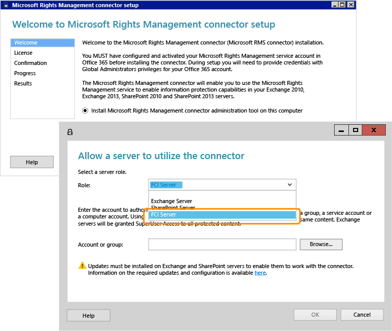

# Volledig schermafbeelding: Installeren en configureren van de RMS-connector voor FCI

Terug naar [Azure RMS in actie: Automatisch beveiligen van bestanden op bestandsservers met Windows Server en bestand classificatie infrastructuur](http://technet.microsoft.com/library/jj585026.aspx).

