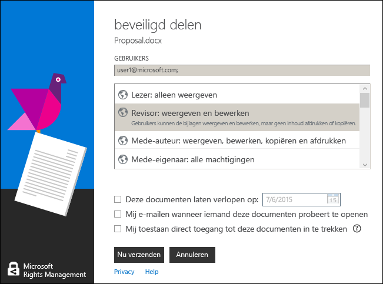
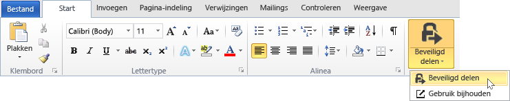

# Gebruikershandleiding voor de Microsoft Rights Management-toepassing voor delen - oorspronkelijke publicatie
Deze gebruikershandleiding voor de Rights Management-toepassing voor delen voor Windows bevat de volgende secties:

-   [Evaluating and Installing Microsoft Rights Management sharing application](../Topic/Microsoft_Rights_Management_sharing_application_user_guide_-_original_publication.md#BKMK_Eval)

-   [Using Microsoft Rights Management sharing application](../Topic/Microsoft_Rights_Management_sharing_application_user_guide_-_original_publication.md#BKMK_UsingMSRMSApp)

-   [Using User-Authored Permissions and Sharing Protected Content](../Topic/Microsoft_Rights_Management_sharing_application_user_guide_-_original_publication.md#BKMK_Custom)

-   [Using the Office Toolbar Add-in](../Topic/Microsoft_Rights_Management_sharing_application_user_guide_-_original_publication.md#BKMK_OfficeToolbar)

-   [Administrator’s guidance for Microsoft Rights Management sharing application](../Topic/Microsoft_Rights_Management_sharing_application_user_guide_-_original_publication.md#BKMK_AdminGuide)

Zie voor veelgestelde vragen en informatie over probleemoplossing [Veelgestelde vragen over de Microsoft Rights Management-toepassing voor delen voor Windows](http://go.microsoft.com/fwlink/?LinkId=303971).

## <a name="BKMK_Eval"></a>Microsoft Rights Management-toepassing voor delen evalueren en installeren
In deze sectie wordt uitgelegd wat de Microsoft Rights Management-toepassing voor delen is en hoe u deze kunt installeren:

-   [What is the Microsoft Rights Management sharing application?](../Topic/Microsoft_Rights_Management_sharing_application_user_guide_-_original_publication.md#BKMK_WhatIs)

-   [Requirements for Microsoft Rights Management sharing application](../Topic/Microsoft_Rights_Management_sharing_application_user_guide_-_original_publication.md#BKMK_Reqs)

-   [Installing the Microsoft Rights Management sharing application](../Topic/Microsoft_Rights_Management_sharing_application_user_guide_-_original_publication.md#BKMK_Install)

### <a name="BKMK_WhatIs"></a>Wat is de Microsoft Rights Management-toepassing voor delen?
Microsoft Rights Management-toepassing voor delen is een optionele downloadbare toepassing voor Microsoft Windows die het volgende biedt:

-   Verbetering van Verkenner (ook wel bekend als Windows Verkenner in Windows 7 en eerdere versies) zodat u een enkel bestand kunt beveiligen of bulksgewijs meerdere bestanden of alle bestanden in een geselecteerde map kunt beveiligen.

-   Ondersteuning voor de beveiliging van elk type bestand en een ingebouwde viewer voor veelgebruikte tekst en afbeeldingsbestanden.

-   Toevoeging van nieuwe knoppen aan de werkbalk van Microsoft Office voor Word, PowerPoint en Excel.

### <a name="BKMK_Reqs"></a>Vereisten voor Microsoft Rights Management-toepassing voor delen
Als u de Microsoft Rights Management-toepassing voor delen wilt gebruiken, moet op uw computer Windows 8.1, Windows 8 of Windows 7 zijn uitgevoerd.

AD RMS-client 2.1 is vereist voor de Microsoft Rights Management-toepassing voor delen, die wordt geïnstalleerd als onderdeel van het installatiepakket. De Microsoft Rights Management-toepassing voor delen werkt alleen met deze versie van de AD RMS-client.

### <a name="BKMK_Install"></a>Installatie van de Microsoft Rights Management-toepassing voor delen
Als u de Microsoft Rights Management-toepassing voor delen wilt installeren, doe dan het volgende:

1.  Ga naar de pagina [Microsoft Rights Management](http://go.microsoft.com/fwlink/?LinkId=303970) op de Microsoft-website.

2.  In de sectie **Computers** klikt u op het pictogram voor de **RMS-app voor Windows** en slaat u het installatiepakket voor de Microsoft Rights Management-toepassing voor delen op uw computer op.

3.  Dubbelklik op het gecomprimeerde bestand dat is gedownload en dubbelklik vervolgens op **setup.exe**. Als u wordt gevraagd om door te gaan, klikt u op **Ja**.

4.  Klik op de pagina **Setup Microsoft RMS** op **Volgende** en wacht totdat de installatie is voltooid.

5.  Als de installatie is voltooid, klikt u op **Opnieuw opstarten** om uw computer opnieuw op te starten en de installatie te voltooien. Klik anders op **Sluiten** en start de computer later opnieuw op om de installatie te voltooien.

## <a name="BKMK_UsingMSRMSApp"></a>De Microsoft Rights Management-toepassing voor delen gebruiken
Deze sectie bevat verschillende manieren om de Microsoft Rights Management-toepassing voor delen te gebruiken:

-   [Creating a protected text (.ptxt) file](../Topic/Microsoft_Rights_Management_sharing_application_user_guide_-_original_publication.md#BKMK_CreatePTXT)

-   [Viewing a protected text (.ptxt) or a protected image file](../Topic/Microsoft_Rights_Management_sharing_application_user_guide_-_original_publication.md#BKMK_ViewPTXT)

-   [Creating a generic protected (.pfile) file](../Topic/Microsoft_Rights_Management_sharing_application_user_guide_-_original_publication.md#BKMK_CreatePFILE)

-   [Viewing a generic protected (.pfile) file](../Topic/Microsoft_Rights_Management_sharing_application_user_guide_-_original_publication.md#BKMK_ViewPFILE)

-   [Removing protection from a file](../Topic/Microsoft_Rights_Management_sharing_application_user_guide_-_original_publication.md#BKMK_Unprotect)

### <a name="BKMK_CreatePTXT"></a>Een beveiligd tekstbestand (.ptxt) maken
De Microsoft Rights Management-toepassing voor delen kan worden gebruikt om een normaal tekstbestand (.txt) te converteren naar een beveiligd bestand (.ptxt).

##### Een beveiligd tekstbestand (.ptxt) maken

1.  Klik met de rechtermuisknop in een map in Verkenner, wijs naar **Nieuw** en klik vervolgens op **Tekstdocument**.

2.  De naam van een bestand wijzigen (bijvoorbeeld: voorbeeld.txt).

3.  Dubbelklik op het bestand om het in Kladblok te openen.

4.  Voeg in Kladblok een paar regels tekst toe aan het bestand, zoals het volgende en sla het vervolgens op:

    ```
    This is a sample text file.
    This is a sample text file.
    This is a sample text file.
    This is a sample text file. 
    This is a sample text file.
    This is a sample text file.
    ```

5.  Klik met de rechtermuisknop op het bestand, wijs naar **Beveiligen** en selecteer een sjabloon in de lijst. (Houd er rekening mee dat als dit de eerste keer is dat u het hulpprogramma gebruikt, u **Bedrijf- beveiliging** moet selecteren om een sjabloon voor uw organisatie te downloaden.)

6.  Op het scherm **Microsoft Rights Management-toepassing voor delen** bevestigt u het beleid dat u wilt toepassen, klikt u op **Toepassen** en vervolgens op **Sluiten** nadat het bestand is beveiligd.

### <a name="BKMK_ViewPTXT"></a>Een beveiligd tekst- (.ptxt) of afbeeldingsbestand weergeven
Als u een beveiligd tekstbestand (.ptxt) wilt weergeven, dubbelklik dan in Verkenner op het bestand (bijvoorbeeld: Voorbeeld.ptxt). Het is mogelijk dat u wordt gevraagd om de toepassing te machtigen om rechten te verkrijgen. Het beveiligingsbeleid wordt weergegeven boven aan het bestand.

Beveiligde afbeeldingen kunnen ook op deze manier worden geopend en bekeken.

### <a name="BKMK_CreatePFILE"></a>Een algemeen beveiligd bestand (.pfile) maken
De algemene beveiligde bestandsindeling (.pfile) kan worden gebruikt om een algemeen beveiligingsniveau te bieden voor bestandstypen die niet direct door Microsoft Rights Management-toepassing voor delen worden ondersteund of andere toepassingen die ingebouwde RMS-beveiliging bieden.

De algemene beveiligde bestandsindeling kan bijvoorbeeld .vsd-bestanden beveiligen die met Microsoft Visio zijn gemaakt (die momenteel geen geïntegreerde beveiliging ondersteunt).

> [!NOTE]
> Bestanden met algemene beveiliging worden voor authenticatie beveiligd. Een gebruiker die is gemachtigd om een beveiligd bestand (.pfile) te gebruiken zal worden geverifieerd en de rechten en machtigingen van de gebruiker worden weergegeven maar kunnen niet worden afgedwongen zodra het bestand in de originele indeling is geopend (bijvoorbeeld, zodra het .vsd-bestand in Visio is geopend). Een gebruiker die niet is gemachtigd of die niet kan worden gemachtigd, kan het beveiligde bestand niet openen.

##### Een algemeen beveiligd bestand (.pfile) maken van een Visio-tekenbestand (.vsd)

1.  Klik met de rechtermuisknop in een map in Verkenner, wijs naar **Nieuw** en klik vervolgens op **Nieuw Visio-document**.

2.  Wijzig de naam van het bestand (bijvoorbeeld: voorbeeld.vsd).

3.  Dubbelklik op het bestand om dit in Visio te openen.

4.  Voeg in Visio onderdelen toe aan de tekening en bewaar en sluit het bestand vervolgens.

5.  Klik met de rechtermuisknop op het bestand, wijs naar **Beveiligen** en selecteer een beleidssjabloon in de lijst. (Houd er rekening mee dat als dit de eerste keer is dat u het hulpprogramma gebruikt, u **Bedrijf- beveiliging** moet selecteren om een sjabloon voor uw organisatie te downloaden.)

6.  Op het scherm **Microsoft Rights Management-toepassing voor delen** selecteert u het beleid dat u wilt toepassen en klikt u vervolgens op **Toepassen**.

7.  Er wordt aangegeven dat uw beveiligde bestand is opgeslagen als Sample.vsd.pfile (het oorspronkelijke bestand is verwijderd).

### <a name="BKMK_ViewPFILE"></a>Een algemeen beveiligd bestand (.pfile) weergeven
U kunt een algemeen beveiligd bestand (.pfile) weergeven door in Verkenner te dubbelklikken op het algemene beveiligde bestand (.pfile) (bijvoorbeeld: Voorbeeld.vsd.pfile) en te klikken op **Openen**.

### <a name="BKMK_Unprotect"></a>Beveiliging opheffen van een bestand
Microsoft Rights Management-toepassing voor delen biedt de mogelijkheid om de beveiliging van bestanden die u eerder hebt beveiligd, op te heffen.

Om de beveiliging van een bestand te verwijderen (d.w.z. opheffen) kunt u de optie **Beveiliging opheffen** als volgt toepassen:

1.  Klik met de rechtermuisknop op **Voorbeeld.ptxt**, wijs naar **Beveiligen** en klik op **Beveiliging opheffen**. Het is mogelijk dat u wordt gevraagd om de toepassing te machtigen om rechten te verkrijgen.

2.  Voorbeeld.ptxt wordt verwijderd en vervangen door voorbeeld.txt.

## <a name="BKMK_Custom"></a>Door de gebruiker opgestelde machtigingen en delen van beveiligde inhoud gebruiken
Deze sectie toont hoe een bestand met door de gebruiker opgestelde machtigingen kan worden beveiligd en gebruikt, hoe u beveiligde inhoud kunt beveiligen en hoe u meerdere bestanden kunt beveiligen:

-   [Protecting a file with user-authored permissions](../Topic/Microsoft_Rights_Management_sharing_application_user_guide_-_original_publication.md#BKMK_ProtectCustom)

-   [Consuming files that have user-authored protection](../Topic/Microsoft_Rights_Management_sharing_application_user_guide_-_original_publication.md#BKMK_UserDefined)

-   [Sharing protected content](../Topic/Microsoft_Rights_Management_sharing_application_user_guide_-_original_publication.md#BKMK_ShareProtected)

-   [Using keyboard shortcuts](../Topic/Microsoft_Rights_Management_sharing_application_user_guide_-_original_publication.md#BKMK_AccessKeys)

-   [Applying protection to multiple files and folders](../Topic/Microsoft_Rights_Management_sharing_application_user_guide_-_original_publication.md#BKMK_Multiple)

### <a name="BKMK_ProtectCustom"></a>Een bestand met door de gebruiker opgestelde machtigingen beveiligen
Door de gebruiker opgestelde beveiliging kan worden gebruikt om het volgende te bereiken:

-   Bestandstoegang beperken tot alleen een specifieke lijst met individuele gebruikers die worden aangeduid met hun e-mailadres.

-   Het gebruik van het bestand beperken tot specifieke rechten zoals rechten voor alleen-lezen voor een document.

Om een bestand te beschermen met door de gebruiker opgestelde machtigingen klikt u met de rechtermuisknop op het bestand, klikt u op **Beveiligen** en vervolgens op **Aangepaste machtigingen**. Het volgende scherm wordt gestart:


Typ de e-mailadressen van de lijst met gebruikers, gebruik de schuifregelaar om beveiligingen voor het bestand te selecteren en klik op **Toepassen**.

### <a name="BKMK_UserDefined"></a>Bestanden met een door de gebruiker opgestelde beveiliging gebruiken
De meeste beveiligde bestanden die door de Microsoft Rights Management-toepassing voor delen worden verwerkt, zijn beveiligd door de toepassing van op sjablonen gebaseerde beveiligingsniveaus. De Microsoft Rights Management-toepassing voor delen ondersteunt echter ook bestanden die een door de gebruiker opgesteld beveiligingsniveau hebben gekregen.

Door de gebruiker opgestelde beveiliging kan worden gebruikt om de volgende beveiligingstypes voor een bestand te krijgen:

-   Bestandstoegang beperken tot een specifieke lijst van individuele gebruikers die worden aangeduid met hun e-mailadressen.

-   Bestandsgebruik beperken tot een enkel recht zoals alleen-afdrukken voor een document.

Voor tekst- en afbeeldingsbestandsindelingen vereist dit beveiligingsniveau dat toepassingen die worden gebruikt om tekst- of afbeeldingsbestanden te bewerken, opslaan of beperken RMS-beveiliging kunnen ondersteunen en de beveiligings-API's kunnen implementeren die zijn opgegeven door de AD RMS SDK.

Wanneer u een beveiligd tekstbestand bekijkt met een door de gebruiker opgestelde machtiging, dan zult u een klein verschil zien in de weergave van de machtigingen van het bestand, zoals weergegeven in het volgende voorbeeld.

Van bestanden die zijn beveiligd met een algemene beveiligingsbestandsindeling (.pfile), worden de specifieke rechten en machtigingen die door de gebruiker zijn opgesteld, weergegeven in het bevestigingsscherm in plaats van de naam van het sjabloon dat is gebruikt om het bestand te beveiligen. Dit wordt weergegeven in de volgende afbeelding.


### <a name="BKMK_ShareProtected"></a>Beveiligde inhoud delen
Klik met de rechtermuisknop op het bestand om inhoud te beveiligen en te delen en klik op **Beveiligd delen**. Het volgende scherm wordt gestart:


Typ de e-mailadressen van de lijst met gebruikers, gebruik de schuifregelaar om beveiligingen voor het bestand te selecteren en klik op **Verzenden**. Outlook wordt gestart met een vooraf ingesteld e-mailbericht waaraan het beveiligde bestand is gekoppeld. Het oorspronkelijke bestand wordt niet beveiligd.

Als u wilt dat gebruikers beveiligde bestanden op niet-Windows-apparaten kunnen weergeven, klikt u op **Gebruik op alle apparaten toestaan**. Gebruikers moeten [de Microsoft Rights Management-toepassing voor delen downloaden](http://go.microsoft.com/fwlink/?LinkId=303970) voor hun apparaat.

### <a name="BKMK_AccessKeys"></a>Toetsenbordsneltoetsen gebruiken
Druk op de **Alt**-toets voor een overzicht van de beschikbare sneltoetsen. Druk op **Alt** + de sneltoets om een optie te selecteren. Klik bijvoorbeeld in het dialoogvenster **Beveiligd delen** op **Alt** om de sneltoetsen te zien en druk op **Alt + u** om **Gebruikers moeten zich elke keer aanmelden wanneer ze dit bestand openen** te selecteren.



### <a name="BKMK_Multiple"></a>Beveiliging toepassen op meerdere bestanden en mappen
De Microsoft Rights Management-toepassing voor delen kan ook worden gebruikt om meer dan een bestand te beveiligen, zoals door in Verkenner meerdere bestanden te selecteren of een map die onbeveiligde bestanden bevat.

##### Meerdere bestanden of alle bestanden beveiligen in een geselecteerde map

1.  In Verkenner kunt u meerdere bestanden selecteren of een map selecteren met meerdere bestanden die moeten worden beveiligd.

2.  Klik met de rechtermuisknop op een map of bestanden, wijs naar **Beveiligen** en selecteer een sjabloon in de lijst. (Houd er rekening mee dat als dit de eerste keer is dat u het hulpprogramma gebruikt, u **Bedrijf- beveiliging** moet selecteren om een sjabloon voor uw organisatie te downloaden.)

3.  Controleer in het scherm **Microsoft Rights Management-toepassing voor delen** of de bestanden zijn beveiligd.

Raadpleeg bij fouten de [Veelgestelde vragen over Microsoft Rights Management-toepassing voor delen voor Windows](http://go.microsoft.com/fwlink/?LinkId=303971).

## <a name="BKMK_OfficeToolbar"></a>De invoegtoepassing Office-werkbalk gebruiken
U kunt Word-, PowerPoint- en Excel-bestanden rechtstreeks in Microsoft Office beveiligen en delen met de invoegtoepassing in het Office-lint voor de Microsoft Rights Management-toepassing voor delen. Klik op **Beveiligd delen** in het lint om de Microsoft Rights Management-toepassing voor delen te starten.



## <a name="BKMK_AdminGuide"></a>Beheerdersrichtlijn voor Microsoft Rights Management-toepassing voor delen
De beheerdershandleiding voor de Microsoft Rights Management-toepassing voor delen bevat de volgende secties:

-   [Microsoft Rights Management sharing application Technical Overview](../Topic/Microsoft_Rights_Management_sharing_application_user_guide_-_original_publication.md#BKMK_AdminOverview)

-   [Supported File Types](../Topic/Microsoft_Rights_Management_sharing_application_user_guide_-_original_publication.md#BKMK_SupportFileTypes)

-   [Automatic deployment for the Microsoft Rights Management sharing application](../Topic/Microsoft_Rights_Management_sharing_application_user_guide_-_original_publication.md#BKMK_ScriptedInstall)

### <a name="BKMK_AdminOverview"></a>Technisch overzicht van de Microsoft Rights Management-toepassing voor delen
De Microsoft Rights Management-toepassing voor delen is een optionele downloadbare toepassing voor Microsoft Windows en andere platforms die voorziet in het volgende:

-   Beveiliging van één bestand of bulksgewijs beveiligen van meerdere bestanden of van alle bestanden in een geselecteerde map.

-   Volledige ondersteuning voor de beveiliging van elk bestandstype met een ingebouwde viewer voor veelgebruikte tekst- en afbeeldingsbestandstypen.

-   Algemene beveiliging voor bestanden die RMS-beveiliging niet ondersteunen.

-   Volledige compatibiliteit met bestanden die zijn beveiligd met Office Information Rights Management (IRM)

-   Volledige compatibiliteit met PDF-bestanden die zijn beveiligd met SharePoint, FCI en ondersteunde PDF-hulpprogramma's

De Microsoft Rights Management-toepassing voor delen maakt gebruik van de nieuwe [AD RMS-Client 2.1-runtime](http://www.microsoft.com/download/details.aspx?id=38396). Deze biedt gebruikers de mogelijkheid om inhoud met behulp van vooraf gedefinieerde of door de gebruiker aangepaste sjablonen aan te passen en te implementeren voor uw organisatie. Met behulp van de functionaliteit van AD RMS 2.1 hebben eindgebruikers dankzij de Microsoft Rights Management-toepassing voor delen een eenvoudige ervaring met beveiliging en gebruik.

Met de versie van Windows Azure AD RMS van oktober 2013 kunt u documenten op uw systeem beveiligen met Office 2010 en deze naar mensen in een ander bedrijf verzenden, die de documenten vervolgens met Windows Azure  AD RMS kunnen gebruiken. Bovendien kunt u met deze versie RMS voor individuen gebruiken en inhoud van mensen in een ander bedrijf gebruiken die Windows Azure AD RMS gebruiken als u AD RMS in cryptografische modus 2 gebruikt. Zie voor meer informatie over cryptografische modus 2: [Cryptografische modi van AD RMS](http://technet.microsoft.com/library/hh867439%28v=ws.10%29.aspx).

U kunt de Microsoft Rights Management-toepassing voor delen downloaden door het volgende te doen:

1.  Meld u aan bij [Microsoft Connect](http://connect.microsoft.com/) met uw Microsoft-account (voorheen bekend als Live ID).

2.  Zoek op de pagina **Start** naar **Rights Management Services** en wordt lid van de groep.

3.  Klik op **Downloads** en vervolgens op **Microsoft Rights Management-toepassing voor delen**.

4.  Selecteer op de pagina **DownloadgegevensMicrosoft Rights Management sharing application.zip** en klik op **Download**.

5.  Installeer indien nodig de Microsoft-beheerder voor bestandsoverdracht en voltooi de stappen om de Microsoft Rights Management-toepassing voor delen te downloaden.

#### Beveiligingsniveaus die worden ondersteund door Microsoft Rights Management-toepassing voor delen
Microsoft Rights Management-toepassing voor delen ondersteunt beveiliging op twee verschillende niveaus, zoals beschreven in de volgende tabel.

||||
|-|-|-|
|Type beveiliging|Systeemeigen|Algemeen|
|Beschrijving|Voor tekst-, afbeelding-, Microsoft Office- (Word, Excel, PowerPoint), .pdf-bestanden en andere bestandstypen van toepassingen die AD RMS ondersteunen, biedt systeemeigen beveiliging een hoog beveiligingsniveau met zowel versleuteling als handhaving van rechten (machtigingen).|Voor alle andere toepassingen en bestandstypen biedt algemene beveiliging een beveiligingsniveau dat bestandsinkapseling met het .pfile-bestandstype bevat en verificatie om te controleren of een gebruiker is gemachtigd om het bestand te openen.|
|Beveiliging|Bestanden zijn volledig versleuteld en beveiliging wordt afgedwongen op de volgende manieren:<br /><br />-   Voordat beveiligde inhoud wordt weergegeven, moet verificatie zijn geslaagd voor degenen die het bestand via e-mail ontvangen of toegang krijgen tot het bestand via bestandsmachtigingen of machtigingen voor delen.<br />-   Bovendien worden gebruiksrechten en het gebruiksbeleid die zijn ingesteld door de eigenaar van de inhoud wanneer bestanden worden beveiligd, volledig afgedwongen als de inhoud wordt weergegeven in de IP-viewer (voor beveiligde tekst- en afbeeldingsbestanden) of de bijbehorende toepassing (voor alle andere ondersteunde bestandstypen).|Bestandsbeveiliging wordt afgedwongen op de volgende manieren:<br /><br />-   Voordat beveiligde inhoud wordt weergegeven, moet succesvolle verificatie optreden voor gebruikers die zijn gemachtigd om het bestand te openen en er toegang toe hebben. Als de verificatie is mislukt, wordt het bestand niet geopend.<br />-   Gebruiksrechten en het gebruiksbeleid die door de eigenaar van de inhoud zijn ingesteld, worden weergegeven om de gemachtigde gebruikers te informeren over het beoogde gebruiksbeleid.<br />-   Logboekregistratie vindt plaats van gemachtigde gebruikers die bestanden openen en zich er toegang tot verlenen. Er worden echter geen gebruiksrechten afgedwongen door toepassingen die niet zijn ondersteund.|
|Standaard voor bestandstypen|Dit is het standaard beveiligingsniveau voor de volgende bestandstypen:<br /><br />-   Tekst- en afbeeldingsbestanden<br />-   Microsoft Office-bestanden (Word, Excel en PowerPoint)<br />-   Portable document format (.pdf)<br /><br />Voor meer informatie, zie: Ondersteunde bestandstypen.|Dit is de standaardbeveiliging voor alle andere bestandstypen (zoals .vsdx, .rtf, enzovoort) die niet worden ondersteund door volledige beveiliging.|

### <a name="BKMK_SupportFileTypes"></a>Ondersteunde bestandstypen
De volgende tabel bevat de bestandstypen die worden ondersteund door Microsoft Rights Management-toepassing voor delen.

|Bestandsextensie|Beschrijving|Oorspronkelijke bestandsextensie|
|--------------------|----------------|------------------------------------|
|.ptxt|Beveiligd tekstbestand|.txt|
|.pxml|Beveiligd XML-bestand|.xml|
|.pjpg|Beveiligd JPG-afbeeldingsbestand|.jpg|
|.pjpeg|Beveiligd JPEG-afbeeldingsbestand|.jpeg|
|.ppng|Beveiligd PNG-afbeeldingsbestand|.png|
|.ptiff|Beveiligd TIFF-afbeeldingsbestand|.tiff|
|.pbmp|Beveiligd Windows-bitmapbestand|.bmp|
|.pgif|Beveiligd GIF-afbeeldingsbestand|.gif|
|.pgiff|Beveiligd GIFF-afbeeldingsbestand|.giff|
|.pjpe|Beveiligd JPE-afbeeldingsbestand|.jpe|
|.pjfif|Beveiligd JFIF-afbeeldingsbestand|.jfif|
|.pjif|Beveiligd JIF-afbeeldingsbestand|.jif|
De volgende tabel bevat de typen die worden ondersteund door Microsoft Office 2013, Office 2010 en Office 2007. Er zijn twee beveiligingstypen: MsoIrmProtector en OpcIrmProtector. Zie [Beveiliging van Microsoft Office-bestandsindelingen](http://archive.msdn.microsoft.com/OfficeProtectors) voor meer informatie over deze beveiligingstypen.

|||
|-|-|
|MsoIrmProtector ondersteunt de volgende bestandstypen:<br /><br />-   doc<br />-   dot<br />-   xla<br />-   xls<br />-   xlt<br />-   pps<br />-   ppt|OpcIrmProtector ondersteunt de volgende bestandstypen:<br /><br />-   docm<br />-   docx<br />-   dotm<br />-   dotx<br />-   xlam<br />-   xlsb<br />-   xlsm<br />-   xlsx<br />-   xltm<br />-   xltx<br />-   xps<br />-   potm<br />-   potx<br />-   ppsx<br />-   ppsm<br />-   pptm<br />-   pptx<br />-   thmx|

### <a name="BKMK_ScriptedInstall"></a>Automatische implementatie voor de Microsoft Rights Management-toepassing voor delen
De Windows-versie van de RMS-toepassing voor delen ondersteunt een scriptinstallatie, waardoor het geschikt is voor bedrijfsimplementaties.

##### De RMS-toepassing voor delen downloaden voor automatische implementatie

1.  Ga naar de pagina [Microsoft Rights Management-toepassing voor delen voor Windows](http://www.microsoft.com/en-us/download/details.aspx?id=40857) in het Microsoft Downloadcentrum en klik op **Download**.

2.  Selecteer en download de bestanden die u nodig hebt. Er zijn twee clientinstallatiepakketten: een voor de 64-bits van Windows (Microsoft Rights Management-toepassing voor delen x64.zip) en een voor de 32-bits versie van Windows (Microsoft Rights Management-toepassing voor delen x86.zip).

3.  Pak de gecomprimeerde installatiepakketten uit door er bijvoorbeeld op te dubbelklikken. Kopieer de uitgepakte bestanden naar een netwerklocatie waartoe clientcomputers toegang hebben.

De installatiepakketten voor de RMS-toepassing voor delen ondersteunen verschillende implementatiescenario's waaronder de volgende:

|Beschrijving|Implementatiescenario|
|----------------|-------------------------|
|Microsoft Online-aanmeldhulp|Vereist voor het volgende:<br /><br />-   Office 2010 en Windows Azure RMS|
|Hotfix voor Office (KB 2596501)|Vereist voor het volgende:<br /><br />-   Office 2010 en Windows Azure RMS|
|Hotfix voor cryptografische modus 2 (KB 2627273)|Vereist voor het volgende:<br /><br />-   Office 2010 en Windows Azure RMS|
|AD RMS-client en de RMS-toepassing voor delen|Vereist voor het volgende:<br /><br />-   Office 2013 en Windows Azure RMS<br />-   Office 2010 en Windows Azure RMS<br />-   Office 2013 en Active Directory RMS<br />-   Office 2010 en Active Directory RMS<br />-   Upgrade van de RMS-toepassing voor delen|
|Office-invoegtoepassing voor het lint|Vereist voor het volgende:<br /><br />-   Office 2013 en Windows Azure RMS<br />-   Office 2013 en Active Directory RMS<br />-   Office 2010 en Active Directory RMS<br />-   Upgrade van de RMS-toepassing voor delen|
|Windows Azure Active Directory Rights Management-hulpprogramma voor systeemvoorbereiding|Vereist voor het volgende:<br /><br />-   Office 2010 en Windows Azure RMS|
> [!NOTE]
> Voor het scenario **Office 2010 en Windows Azure RMS** gebruikt u mogelijk Windows Azure RMS of Active Directory RMS, maar wilt u veilig documenten verzenden naar mensen bij een ander bedrijf die Windows Azure RMS gebruiken.
> 
> Wanneer u het Windows Azure Active Directory Rights Management-hulpmiddel voor systeemvoorbereiding installeert en uitvoert om Office 2010 te ondersteunen, gebeuren de volgende twee dingen:
> 
> -   Het register wordt bewerkt ter ondersteuning van de RMS-toepassing voor delen.
> -   Het 'bootstrapt' de gebruiker, wat inhoudt dat de computer contact maakt met de AD RMS-server of Windows Azure RMS en de certificaten ophaalt die de computer en gebruiker nodig hebben om RMS te gebruiken.

Gebruik de volgende procedures om de opdrachten op te sporen die zijn vereist voor de implementatie van de RMS-toepassing voor delen voor deze implementatiescenario's:

-   Office 2013 en Windows Azure RMS

-   Office 2010 en Windows Azure RMS

-   Office 2013 of Office 2010 en Active Directory RMS

-   De RMS-toepassing voor delen bijwerken

De voorbeelden in de opdrachten gaan er vanuit dat u de gedownloade en uitgepakte bestanden hebt gekopieerd naar een netwerkshare waar clientcomputers toegang tot hebben met **\\server5\apps\rms** en dat de clientcomputers al een map genaamd **C:\Log files** bevatten waar u de logboekbestanden voor de installatie van de toepassing opslaat. Voor elke installatie kiest u de naam van het logboekbestand van de installatie, maar deze moet een .log-bestandsextensie hebben.

> [!IMPORTANT]
> Voordat u de RMS-toepassing voor delen uitvoert, moet u de vereiste opdrachten in deze procedure inpakken zodat deze in de context van de computer voor alle gebruikers kunnen worden geïnstalleerd en met lokale beheerdersrechten kunnen worden geïnstalleerd. Vervolgens kunt u het pakket implementeren op computers met behulp van het standaard implementatiemechanisme voor toepassingen zoals groepsbeleid of System Center Configuration Manager.
> 
> De uitzondering is het Windows Azure Active Directory Rights Management-hulpprogramma voor systeemvoorbereiding: Dit moet eenmaal worden uitgevoerd voor elke gebruiker op de computer en het hulpprogramma moet worden uitgevoerd met verhoogde bevoegdheden om het register te bewerken. Er zijn verschillende manieren om dit te bereiken, waaronder het aan gebruikers vragen om een opdracht uit te voeren (bijvoorbeeld, een koppeling in een e-mailbericht of een koppeling op de portal van de helpdesk) of u kunt deze toevoegen in hun aanmeldingsscript. Als u de opdracht Uitvoeren als niet kunt gebruiken omdat gebruikers geen lokaal Administrator-account hebben, dan zijn er implementatiehulpprogramma's die een opdracht automatisch kunnen uitvoeren volgens de regels die u opgeeft.

##### De RMS-toepassing voor delen voor Office 2013 en Windows Azure RMS implementeren

1.  De AD RMS-client en de RMS-toepassing voor delen met de volgende opdrachten installeren:

    -   Voor 64-bits Windows: x64\setup_ipviewer.exe /norestart /quiet /msicl "MSIRESTARTMANAGERCONTROL=Disable" /log "&lt;logbestandspad en -naam &gt;"

        ```
        x64\setup_ipviewer.exe /norestart /quiet /msicl "MSIRESTARTMANAGERCONTROL=Disable" /log "<log file path and name>"
        ```

    -   Voor 32-bits Windows:

        ```
        X86\setup_ipviewer.exe /norestart /quiet /msicl "MSIRESTARTMANAGERCONTROL=Disable" /log "<log file path and name>"
        ```

    Bijvoorbeeld: `\\server5\apps\rms\x64\setup_ipviewer.exe /norestart /quiet /msicl "MSIRESTARTMANAGERCONTROL=Disable" /log "C:\Log files\ipviewerinstall.log"`

2.  De Office-invoegtoepassing installeren met de volgende opdrachten:

    -   Voor 64-bits versie van Office:

        ```
        msiexec.exe /norestart /quiet MSIRESTARTMANAGERCONTROL=Disable /i "x64\Setup64.msi" /L*v "<log file path and name>"
        ```

    -   Voor 32-bits versie van Office:

        ```
        msiexec.exe /norestart /quiet MSIRESTARTMANAGERCONTROL=Disable /i "x86\Setup.msi" /L*v "<log file path and name>"
        ```

    > [!NOTE]
    > De computer moet opnieuw opstarten om de installatie te voltooien. U kunt automatisch opnieuw opstarten initiëren met behulp van een opdracht zoals 'shutdown /i'.

    Bijvoorbeeld: `\\server5\apps\rms\msiexec.exe /norestart /quiet MSIRESTARTMANAGERCONTROL=Disable /i "x64\Setup64.msi" /L*v "C:\Log files\rmsoffice.log"`

##### De RMS-toepassing voor delen voor Office 2010 en Windows Azure RMS implementeren

1.  Installeer de Microsoft Online-aanmeldhulp met de volgende opdrachten:

    -   Voor 64-bits Windows:

        ```
        msiexec.exe /norestart /quiet MSIRESTARTMANAGERCONTROL=Disable /i "x64\msoidcli_64bit.msi" /L*v "<log file path and name >"
        ```

    -   Voor 32-bits Windows:

        ```
        msiexec.exe /norestart /quiet MSIRESTARTMANAGERCONTROL=Disable /i "x64\msoidcli_64bit.msi" /L*v "<log file path and name>"
        ```

    Bijvoorbeeld: `\\server5\apps\rms\msiexec.exe /norestart /quiet MSIRESTARTMANAGERCONTROL=Disable /i "x64\msoidcli_64bit.msi" /L*v "C:\Log files\assistant.log"`

2.  Installeer de Office-hotfix met de volgende opdrachten:

    -   Voor 64-bits versie van Office:

        ```
        x64\office2010-kb2596501-fullfile-x64-glb.exe /norestart /quiet /log:"<log file path and name >"
        ```

    -   Voor 32-bits versie van Office:

        ```
        x86\office2010-kb2596501-fullfile-x86-glb.exe /norestart /quiet /log:"<log file path and name>"
        ```

    Bijvoorbeeld: `\\server5\apps\rms\x64\office2010-kb2596501-fullfile-x64-glb.exe /norestart /quiet /log:"C:\Log files\kb2596501install.log"`

3.  Installeer de cryptografische modus 2-hotfix met de volgende opdrachten:

    -   Voor 64-bits Windows:

        ```
        wusa.exe /norestart /quiet "x64\Windows6.1-KB2627273-v4-x64.msu" /log:"<log file path and name >"
        ```

    -   Voor 32-bits Windows:

        ```
        wusa.exe /norestart /quiet "x86\Windows6.1-KB2627273-v4-x86.msu" /log:"<log file path and name>"
        ```

    Bijvoorbeeld: `\\server5\apps\rms\wusa.exe /norestart /quiet "x64\Windows6.1-KB2627273-v4-x64.msu" /log:"C:\Log files\kb267273.log"`

4.  De AD RMS-client en de RMS-toepassing voor delen met de volgende opdracht installeren:

    -   Voor 64-bits Windows:

        ```
        x64\setup_ipviewer.exe /norestart /quiet /msicl "MSIRESTARTMANAGERCONTROL=Disable" /log "<log file path and name >"
        ```

    -   Voor 32-bits Windows:

        ```
        X86\setup_ipviewer.exe /norestart /quiet /msicl "MSIRESTARTMANAGERCONTROL=Disable" /log "<log file path and name>"
        ```

    Bijvoorbeeld: `\\server5\apps\rms\x64\setup_ipviewer.exe /norestart /quiet /msicl "MSIRESTARTMANAGERCONTROL=Disable" /log "C:\Log files\ipviewerinstall.log"`

5.  De Office-invoegtoepassing installeren met de volgende opdrachten:

    -   Voor 64-bits versie van Office:

        ```
        msiexec.exe /norestart /quiet MSIRESTARTMANAGERCONTROL=Disable /i "x64\Setup64.msi" /L*v "<log file path and name>"
        ```

    -   Voor 32-bits versie van Office:

        ```
        msiexec.exe /norestart /quiet MSIRESTARTMANAGERCONTROL=Disable /i "x86\Setup.msi" /L*v "<log file path and name>"
        ```

    > [!NOTE]
    > De computer moet opnieuw opstarten om de installatie te voltooien. U kunt automatisch opnieuw opstarten initiëren met behulp van een opdracht zoals 'shutdown /i'.

    Bijvoorbeeld: `\\server5\apps\rms\msiexec.exe /norestart /quiet MSIRESTARTMANAGERCONTROL=Disable /i "x64\Setup64.msi" /L*v "C:\Log files\rmsoffice.log"`

6.  Het Windows Azure Active Directory Rights Management-hulpprogramma voor systeemvoorbereiding installeren door de volgende opdracht voor aanmeldingsscripts toe te voegen:

    > [!IMPORTANT]
    > Om deze opdracht uit te voeren, moeten gebruikers lokale beheerdersrechten hebben.

    -   Voor Windows 8, 64-bits:

        ```
        x64\aadrmprep.exe /initiateMe /logfile "<log file path and name>"
        ```

    -   Voor Windows 8, 32-bits:

        ```
        X86\aadrmprep.exe /initiateMe /logfile "<log file path and name>"
        ```

    -   Voor Windows 7, 64-bits:

        ```
        x64\win7\aadrmprep.exe /initiateMe /logfile "<log file path and name>"
        ```

    -   Voor Windows 7, 32-bits:

        ```
        X86\win7\aadrmprep.exe /initiateMe /logfile "<log file path and name>"
        ```

    > [!NOTE]
    > Deze opdracht kan gebruikers vragen om hun referenties van Windows Azure in te voeren. Als de computer niet aan een domein is toegevoegd, wordt de gebruiker hierom gevraagd. Als de computer is toegevoegd aan een domein, kan het hulpprogramma mogelijk in de cache opgeslagen referenties gebruiken.

    Bijvoorbeeld: `\\server5\apps\rms\x64\aadrmprep.exe /initiateMe /logfile "C:\Log files\aadrmprepinstall.log"`

##### De RMS-toepassing voor delen implementeren voor Office 2013 of Office 2010 en Active Directory RMS

1.  De AD RMS-client en de RMS-toepassing voor delen met de volgende opdrachten installeren:

    -   Voor 64-bits Windows:

        ```
        x64\setup_ipviewer.exe /norestart /quiet /msicl "MSIRESTARTMANAGERCONTROL=Disable" /log "<log file path and name>"
        ```

    -   Voor 32-bits Windows:

        ```
        X86\setup_ipviewer.exe /norestart /quiet /msicl "MSIRESTARTMANAGERCONTROL=Disable" /log "<log file path and name>"
        ```

    Bijvoorbeeld: `\\server5\apps\rms\x64\setup_ipviewer.exe /norestart /quiet /msicl "MSIRESTARTMANAGERCONTROL=Disable" /log "C:\Log files\ipviewerinstall.log"`

2.  De Office-invoegtoepassing installeren met de volgende opdrachten:

    -   Voor 64-bits versie van Office:

        ```
        msiexec.exe /norestart /quiet MSIRESTARTMANAGERCONTROL=Disable /i "x64\Setup64.msi" /L*v "<log file path and name>"
        ```

    -   Voor 32-bits versie van Office:

        ```
        msiexec.exe /norestart /quiet MSIRESTARTMANAGERCONTROL=Disable /i "x86\Setup.msi" /L*v "<log file path and name>"
        ```

    > [!NOTE]
    > De computer moet opnieuw opstarten om de installatie te voltooien. U kunt automatisch opnieuw opstarten initiëren met behulp van een opdracht zoals 'shutdown /i'.

    Bijvoorbeeld: `\\server5\apps\rms\msiexec.exe /norestart /quiet MSIRESTARTMANAGERCONTROL=Disable /i "x64\Setup64.msi" /L*v "C:\Log files\rmsofficeinstall.log"`

##### De RMS-toepassing voor delen bijwerken

1.  De AD RMS-client en de RMS-toepassing voor delen met de volgende opdracht installeren:

    -   Voor 64-bits Windows:

        ```
        x64\setup_ipviewer.exe /norestart /quiet /msicl "MSIRESTARTMANAGERCONTROL=Disable" /log "<log file path and name>"
        ```

    -   Voor 32-bits Windows:

        ```
        X86\setup_ipviewer.exe /norestart /quiet /msicl "MSIRESTARTMANAGERCONTROL=Disable" /log "<log file path and name>"
        ```

    Bijvoorbeeld: `\\server5\apps\rms\x64\setup_ipviewer.exe /norestart /quiet /msicl "MSIRESTARTMANAGERCONTROL=Disable" /log "C:\Log files\ipviewerinstall.log"`

2.  De Office-invoegtoepassing installeren met de volgende opdrachten:

    -   Voor 64-bits versie van Office:

        ```
        msiexec.exe /norestart /quiet MSIRESTARTMANAGERCONTROL=Disable /i "x64\Setup64.msi" /L*v "<log file path and name>"
        ```

    -   Voor 32-bits versie van Office:

        ```
        msiexec.exe /norestart /quiet MSIRESTARTMANAGERCONTROL=Disable /i "x86\Setup.msi" /L*v "<log file path and name>"
        ```

    > [!NOTE]
    > De computer moet opnieuw opstarten om de installatie te voltooien. U kunt automatisch opnieuw opstarten initiëren met behulp van een opdracht zoals 'shutdown /i'.

    Bijvoorbeeld: `\\server5\apps\rms\msiexec.exe /norestart /quiet MSIRESTARTMANAGERCONTROL=Disable /i "x64\Setup64.msi" /L*v "C:\Log files\rmsofficeinstall.log"`

#### <a name="BKMK_verifyscripted"></a>Installatie verifiëren
Met de logboekbestanden van de installatie kunt u controleren of deze is geïnstalleerd.

###### Installatie controleren voor de Microsoft Online-aanmeldhulp

-   Zoek naar de volgende tekst in het logboekbestand van de installatie om te kijken of deze is geslaagd: **Status van de installatie voltooid of fout: 0**

    Voorbeeldregels van een geslaagde installatie:

    **MSI (s) (9C:88) [18:49:04:007]: Product: Microsoft RMS Office-invoegtoepassingen -- Installatie is voltooid.**

    **MSI (s) (9C:88) [18:49:04:007]: Het product is geïnstalleerd. Productnaam: Microsoft RMS Office-invoegtoepassingen. Productversie: 1.0.7. Taal van product: 1033. Fabrikant: Microsoft. Status van de installatie voltooid of fout: 0.**

###### Controleren of de installatie is geslaagd voor de hotfix voor Office

-   Zoek naar een van de volgende tekenreeksen in het logboekbestand van de installatie om te controleren of deze is geslaagd:

    -   Voor 64-bits versie van Office:

        -   **office2010-kb2596501-fullfile-x64-glb.exe is afgesloten met status GESLAAGD**

        -   **office2010-kb2596501-fullfile-x64-glb.exe is afgesloten me status NIET VAN TOEPASSING**

    -   Voor 32-bits versie van Office:

        -   **office2010-kb2596501-fullfile-x86-glb.exe is afgesloten met status GESLAAGD**

        -   **office2010-kb2596501-fullfile-x86-glb.exe is afgesloten met status NIET VAN TOEPASSING**

###### Controleren of de installatie is geslaagd voor de hotfix voor cryptografische modus 2

-   Zoek naar een van de volgende tekenreeksen in het logboekbestand van de installatie om te controleren of deze is geslaagd:

    -   Voor 64-bits Windows:

        -   **Windows6.1-KB2627273-v4-x64.msu is afgesloten met de status GESLAAGD**

        -   **Windows6.1-KB2627273-v4-x64.msu is afgesloten met de status NIET VAN TOEPASSING**

    -   Voor 32-bits Windows:

        -   **Windows6.1-KB2627273-v4-x86.msu is afgesloten met status GESLAAGD**

        -   **Windows6.1-KB2627273-v4-x86.msu is afgesloten met de status NIET VAN TOEPASSING**

###### Controleren of de installatie is geslaagd voor de AD RMS-client en de RMS-toepassing voor delen

-   Zoek naar de volgende tekst in het logboekbestand van de installatie om te kijken of deze is geslaagd: **Status van de installatie voltooid of fout: 0**

    Voorbeeldregels van een geslaagde installatie:

    **MSI (s) (F0:B8) [14:19:57:854]: Product: Active Directory Rights Management Services Client 2.1 -- installatie is voltooid.**

    **MSI (s) (F0:B8) [14:19:57:854]: Het product is geïnstalleerd. Productnaam: Active Directory Rights Management Services-Client 2.1. Productversie: 1.0.1179.1. Taal van product: 1033. Fabrikant: Microsoft Corporation. Status van de installatie voltooid of fout: 0.**

###### Controleren of de installatie van de Office-invoegtoepassing is geslaagd

-   Zoek naar de volgende tekst in het logboekbestand van de installatie om te kijken of deze is geslaagd: **Status van de installatie voltooid of fout: 0**

    Voorbeeldregels van een geslaagde installatie:

    **MSI (s) (9C:88) [18:49:04:007]: Product: Microsoft RMS Office-invoegtoepassingen -- Installatie is voltooid.**

    **MSI (s) (9C:88) [18:49:04:007]: Het product is geïnstalleerd. Productnaam: Microsoft RMS Office-invoegtoepassingen. Productversie: 1.0.7. Taal van product: 1033. Fabrikant: Microsoft. Status van de installatie voltooid of fout: 0.**

###### Controleren of de installatie is geslaagd voor het Windows Azure Active Directory Rights Management-hulpprogramma voor systeemvoorbereiding

-   Zoek naar de volgende tekst in het logboekbestand van de installatie om te kijken of deze is geslaagd: **aadrmprep.exe is afgesloten met de status GESLAAGD**

    > [!NOTE]
    > Soms wordt deze installatie twee keer uitgevoerd. De eerste poging is mislukt en de tweede geslaagd.

Als u handmatig de registerwijzigingen wilt controleren die dit hulpprogramma maakt, dan zijn ze als volgt:

-   [HKEY_LOCAL_MACHINE\SOFTWARE\Microsoft\MSDRM\Federation]

    "FederationHomeRealm"="urn:HostedRmsOnlineService:Certification"

-   [HKEY_LOCAL_MACHINE\SOFTWARE\Wow6432Node\Microsoft\MSDRM\Federation]

    "FederationHomeRealm"="urn:HostedRmsOnlineService:Certification"

-   [HKEY_LOCAL_MACHINE\SOFTWARE\Wow6432Node\Microsoft\MSDRM\ServiceLocation\Activation]

    @="&lt;certificerings-url&gt;"

-   [HKEY_CURRENT_USER\SOFTWARE\Microsoft\Office\14.0\Common\DRM]

    DefaultUser="&lt;default_user&gt;"

#### <a name="BKMK_uninstallscripted"></a>Opdrachten verwijderen
Niet alle installatieopdrachten die zijn vereist voor deze implementaties ondersteunen een opdracht verwijderen. U kunt de installatie van de AD RMS-client en de toepassing voor delen verwijderen en u kunt de Office-invoegtoepassing verwijderen. Gebruik de volgende opdrachten om deze onderdelen te verwijderen.

###### De AD RMS-client en de RMS-toepassing voor delen verwijderen

-   Gebruik de volgende opdrachten:

    -   Voor 64-bits Windows:

        ```
        x64\setup_ipviewer.exe /uninstall /quiet
        ```

    -   Voor 32-bits Windows:

        ```
        x86\setup_ipviewer.exe /uninstall /quiet
        ```

###### De Office-invoegtoepassing verwijderen

-   Gebruik de volgende opdrachten:

    -   Voor 64-bits versie van Office:

        ```
        msiexec /x \x64\Setup[64].msi /quiet
        ```

    -   Voor 32-bits versie van Office:

        ```
        msiexec /x \x86\Setup.msi /quiet
        ```

## Zie ook
[Microsoft Rights Management-toepassing voor delen downloaden (http://go.microsoft.com/fwlink/?LinkId=303970)](http://go.microsoft.com/fwlink/?LinkId=303970)
 [Veelgestelde vragen over Microsoft Rights Management-toepassing voor delen voor Windows](http://go.microsoft.com/fwlink/?LinkId=303971)

