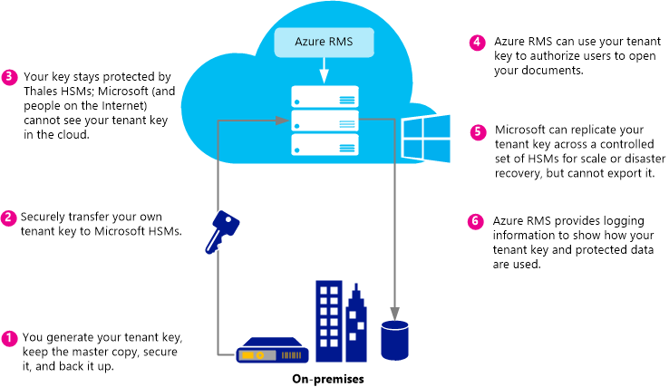

# Plannen en implementeren van uw Azure Rights Management Tenant-sleutel
Gebruik de informatie in dit onderwerp om te plannen en beheren van uw Rights Management-service (RMS) tenant sleutel voor Azure RMS. In plaats van Microsoft voor het beheren van uw tenant sleutel (standaard), kunt u bijvoorbeeld voor het beheren van uw eigen sleutel tenant om te voldoen aan specifieke regelingen die van toepassing op uw organisatie.  Beheer van uw eigen sleutel tenant wordt ook om als uw eigen sleutel of BYOK verwezen.

> [!NOTE]
> De sleutel voor RMS tenant is ook wel bekend als de sleutel Server Licentiegever certificaat (SLC). Azure RMS onderhoudt een of meer sleutels voor elke organisatie die Azure RMS worden bijgehouden. Wanneer een sleutel wordt gebruikt voor RMS binnen een organisatie (zoals gebruikerssleutels, computersleutels, versleutelingssleutels document), koppelen ze versleutelen aan de RMS-tenant-sleutel.

**In één oogopslag:** Gebruik de volgende tabel als een snelle handleiding voor de aanbevolen tenant key-topologie. Vervolgens gebruikt u de aanvullende secties voor meer informatie.

Als u Azure RMS implementeren met behulp van een tenant-sleutel die wordt beheerd door Microsoft, kunt u later om BYOK te wijzigen. Echter wijzigen op dat moment uw Azure RMS tenant sleutel niet van BYOK beheerd door Microsoft.

|Zakelijke vereisten|Aanbevolen tenant key-topologie|
|-----------------------|-----------------------------------|
|Azure RMS snel en zonder speciale hardware implementeren|Beheerd door Microsoft|
|Volledige IRM-functionaliteit in Exchange Online met Azure RMS nodig hebt|Beheerd door Microsoft|
|De sleutels zijn gemaakt door u en wordt beveiligd in een hardware HSM (security module)|BYOK<br /><br />Momenteel leidt deze configuratie tot gereduceerde IRM Exchange Online. Zie voor meer informatie de [BYOK pricing and restrictions](../Topic/Planning_and_Implementing_Your_Azure_Rights_Management_Tenant_Key.md#BKMK_Pricing) sectie.|
Met de volgende secties kunt u kiezen welke toets tenant topologie te gebruiken, de levenscyclus van de tenant begrijpen, het implementeren van brengt uw eigen sleutel (BYOK) en wat in werking te laten volgende stappen:

-   [Choose your tenant key topology: Managed by Microsoft (the default) or managed by you (BYOK)](../Topic/Planning_and_Implementing_Your_Azure_Rights_Management_Tenant_Key.md#BKMK_ChooseTenantKey)

-   [BYOK pricing and restrictions](../Topic/Planning_and_Implementing_Your_Azure_Rights_Management_Tenant_Key.md#BKMK_Pricing)

-   [Implementing bring your own key (BYOK)](../Topic/Planning_and_Implementing_Your_Azure_Rights_Management_Tenant_Key.md#BKMK_ImplementBYOK)

-   [Next steps](../Topic/Planning_and_Implementing_Your_Azure_Rights_Management_Tenant_Key.md#BKMK_NextSteps)

## <a name="BKMK_ChooseTenantKey"></a>Kies uw tenant sleutel topologie: Beheerd door Microsoft (standaard) of beheerd door u (BYOK)
Bepalen welke sleutel topologie tenant is het meest geschikt voor uw organisatie. Standaard Azure RMS uw tenant sleutel genereert en beheert de meeste aspecten van de levenscyclus van de tenant. Dit is de eenvoudigste optie met de laagste administratieve overhead. In de meeste gevallen hoeft u zelfs te weten dat u een sleutel tenant hebt. U alleen aanmelden bij Azure RMS en de rest van het proces Sleutelbeheer kan worden opgelost door Microsoft.

U kunt ook volledige controle over uw tenant sleutel, waarbij de tenant-sleutel maken en het bijhouden van het originele exemplaar op uw locatie. Dit scenario wordt vaak genoemd brengt uw eigen sleutel (BYOK). Met deze optie gebeurt het volgende:

1.  U uw tenant sleutel genereren op uw locatie, in overeenstemming met uw IT-beleid.

2.  U omzetten veilig in de tenant-sleutel van een Hardware Security Module HSM () in uw bezit HSM's die eigendom zijn van en beheerd door Microsoft. Tijdens dit proces blijven uw tenant sleutel nooit de rand van de hardware-beveiliging.

3.  Wanneer u uw tenant sleutel naar Microsoft overbrengen, blijft het beveiligde door Thales HSM's. Microsoft heeft gewerkt met Thales om ervoor te zorgen dat uw tenant sleutel kan niet worden geëxtraheerd uit HSM's van Microsoft.

Hoewel dit optioneel is, u waarschijnlijk ook wilt gebruiken de nabije real-time Gebruik Logboeken van Azure RMS om te zien hoe precies en wanneer de tenant-sleutel wordt gebruikt.

> [!NOTE]
> Als een meting aanvullende beveiliging Azure RMS afzonderlijke beveiliging werelden gebruikt voor de datacenters in Noord-Amerika, EMEA (Europa, Midden-Oosten en Afrika) en Azië. Wanneer u uw eigen sleutel tenant beheren, is het gebonden aan de wereld van de beveiliging van de regio waarin uw RMS-tenant is geregistreerd. Bijvoorbeeld kan niet een sleutel tenant van een Europese klant worden gebruikt in datacenters in Noord-Amerika of Azië.

## <a name="BKMK_OverviewLifecycle"></a>De levenscyclus van de tenant
Als u besluit dat Microsoft uw tenant-sleutel moet beheren, voert Microsoft het grootste deel van de sleutel lifecycle-bewerkingen. Echter, als u besluit voor het beheren van uw tenant sleutel, u bent verantwoordelijk voor veel van de sleutel lifecycle-bewerkingen en enkele aanvullende procedures.

De volgende diagrammen weergeven en deze twee opties worden vergeleken. Het eerste diagram ziet u hoe weinig beheerder overhead er voor u in de standaardconfiguratie zijn wanneer Microsoft de tenant-sleutel beheert.


Het tweede diagram ziet u de extra stappen vereist bij het beheren van uw eigen tenant-sleutel.



Als u de Microsoft beheren van uw tenant sleutel, kunnen geen verdere actie is vereist voor het genereren van de sleutel en u kunt de volgende secties overslaan en ga direct naar [Next steps](../Topic/Planning_and_Implementing_Your_Azure_Rights_Management_Tenant_Key.md#BKMK_NextSteps).

Als u besluit voor het beheren van uw tenant sleutel, lees de volgende secties voor meer informatie.

### Meer informatie over Thales HSM's en Microsoft-toevoegingen
Azure RMS gebruikt Thales HSM's om uw sleutels worden beveiligd.

Thales e-beveiliging is een toonaangevende globale leverancier van gegevensversleuteling en cyber security oplossingen voor de financiële diensten, hoge technologie productie, overheid en technologie sectoren. Met een 40 jaar ervaring van het beschermen van zakelijke en overheid van de informatie Thales oplossingen worden gebruikt door vier van de vijf grootste energie en ruimtevaart bedrijven, 22 NAVO landen en meer dan 80% van wereldwijd betalingstransacties beveiligen.

Microsoft werkt samen treedt met Thales voor het verbeteren van de status van illustraties voor HSM's. Deze verbeteringen kunnen u de standaard voordelen van gehoste services zonder prijsgeeft controle over uw sleutels. Deze verbeteringen laten bijzonder, de HSM's beheren, zodat u geen naar hebt Microsoft. Als een cloudservice Azure RMS geschaald op korte termijn om te voldoen aan uw organisatie gebruik punten van. Tegelijkertijd, uw sleutel beveiligd binnen HSM's van Microsoft: U behouden controle over de sleutel lifecycle omdat u de sleutel genereren en naar HSM's van Microsoft overzetten.

Zie voor meer informatie [Thales HSM's en Azure RMS](http://www.thales-esecurity.com/msrms/cloud) op de website Thales.

## <a name="BKMK_Pricing"></a>BYOK prijzen en beperkingen
Organisatie die een IT-beheerde Azure-abonnement hebt, kunt BYOK gebruiken en meld u het gebruik ervan zonder extra kosten. Organisaties die gebruikmaken van RMS voor personen niet BYOK en logboekregistratie omdat ze niet een tenantbeheerder hebben configureren van deze functies gebruiken.

> [!NOTE]
> Zie voor meer informatie over RMS voor personen [RMS voor personen en Azure Rights Management](../Topic/RMS_for_Individuals_and_Azure_Rights_Management.md).


BYOK en logboekregistratie werken naadloos met elke toepassing die is geïntegreerd met Azure RMS. Dit omvat cloudservices, zoals SharePoint Online, het lokale servers met Exchange en SharePoint die met Azure RMS werken met behulp van de RMS-connector en de clienttoepassingen zoals Office 2013. U krijgt sleutelgebruik logboeken ongeacht welke toepassing aanvragen van Azure RMS maakt.

Er is een uitzondering: Op dit moment **Azure RMS BYOK is niet compatibel met Exchange Online**.  Als u gebruiken Exchange Online wilt, wordt u aangeraden u Azure RMS in de Sleutelbeheer standaardmodus nu waar Microsoft genereert en beheert de sleutel implementeren. U hebt de mogelijkheid om te verplaatsen naar BYOK later, bijvoorbeeld wanneer Exchange Online biedt ondersteuning voor Azure RMS BYOK. Als u geen tijd, moet een andere optie is echter Azure RMS met BYOK nu implementeren met verminderde RMS-functionaliteit voor Exchange Online (niet-beveiligde e-mailberichten en niet-beveiligde bijlagen blijven volledig functioneel):

-   Beveiligde e-mailberichten of beveiligde bijlagen in Outlook Web Access kunnen niet worden weergegeven.

-   Beveiligde e-mailberichten op mobiele apparaten die gebruikmaken van Exchange ActiveSync IRM kunnen niet worden weergegeven.

-   Transport decodering (bijvoorbeeld scannen op malware) en journal decodering is niet mogelijk is, dus beveiligd e-mailberichten en beveiligde bijlagen worden overgeslagen.

-   Transport protection regels en gegevens gegevensverlies voorkomen (DLP) die IRM afdwingen is niet mogelijk, zodat RMS beveiliging kan niet worden toegepast met behulp van deze methoden.

-   Zoeken op basis van een server voor beveiligde e-mailberichten, zodat beveiligde e-mailberichten worden overgeslagen.

Wanneer u Azure RMS BYOK met verminderde RMS-functionaliteit voor Exchange Online, werkt RMS met clients e-mail in Outlook op Windows en Mac en andere e-clients die geen Exchange ActiveSync IRM gebruiken.

Als u naar Azure RMS van AD RMS migreert, u mogelijk hebt geïmporteerd uw sleutel als een vertrouwde publicatieserver domein (vertrouwde Uitgiftedomein) naar Exchange Online (ook BYOK in Exchange-terminologie gescheiden van Azure RMS BYOK is genoemd). In dit geval moet u het vertrouwde Uitgiftedomein van Exchange Online conflicterende sjablonen en beleid te voorkomen. Zie voor meer informatie [verwijderen RMSTrustedPublishingDomain](https://technet.microsoft.com/library/jj200720%28v=exchg.150%29.aspx) uit de bibliotheek met Exchange Online-cmdlets.

Soms is de uitzondering Azure RMS BYOK voor Exchange Online niet een probleem optreedt in de praktijk. Bijvoorbeeld, uitvoeren organisaties die BYOK en logboekregistratie moeten hun gegevens toepassingen (Exchange, SharePoint, Office) op de lokale en gebruik Azure RMS voor functionaliteit die niet gemakkelijk beschikbaar is met de lokale AD RMS (bijvoorbeeld de samenwerking met andere bedrijven en toegang via mobiele clients). BYOK en logboekregistratie werk goed in dit scenario en de organisatie volledige controle over hun abonnement Azure RMS toestaan.

## <a name="BKMK_ImplementBYOK"></a>Implementatie van brengt uw eigen sleutel (BYOK)
De informatie en procedures in dit gedeelte te gebruiken als u hebt besloten te genereren en beheren van uw tenant sleutel; het Breng uw eigen scenario sleutel (BYOK):

-   [Prerequisites for BYOK](../Topic/Planning_and_Implementing_Your_Azure_Rights_Management_Tenant_Key.md#BKMK_Preqs)

-   [Generate and transfer your tenant key – over the Internet](../Topic/Planning_and_Implementing_Your_Azure_Rights_Management_Tenant_Key.md#BKMK_BYOK_Internet)

-   [Generate and transfer your tenant key – in person](../Topic/Planning_and_Implementing_Your_Azure_Rights_Management_Tenant_Key.md#BKMK_BYOK_InPerson)

> [!IMPORTANT]
> Als u al hebt gestart gebruiken [!INCLUDE[aad_rightsmanagement_1](../Token/aad_rightsmanagement_1_md.md)] (de service is geactiveerd) en moet u gebruikers die Office 2010 uitvoeren, neem contact op met Microsoft klantenondersteuning (CSS) voordat u deze procedures uitvoert. Afhankelijk van uw scenario en vereisten, kunt u BYOK, maar met een aantal beperkingen of extra stappen.
> 
> Ook contact opnemen met CSS als uw organisatie specifiek beleid heeft voor het verwerken van sleutels.

### <a name="BKMK_Preqs"></a>Vereisten voor BYOK
Zie de volgende tabel voor een lijst met vereisten voor brengt uw eigen sleutel (BYOK).

|Vereiste|Meer informatie|
|------------|-------------------|
|Een abonnement dat Azure RMS ondersteunt|Zie voor meer informatie over de beschikbare abonnementen, de [Cloud-abonnementen die ondersteuning van Azure RMS](../Topic/Requirements_for_Azure_Rights_Management.md#BKMK_SupportedSubscriptions) sectie de [Vereisten voor Azure Rights Management](../Topic/Requirements_for_Azure_Rights_Management.md) onderwerp.|
|U gebruik geen RMS voor personen of Exchange Online. Of als u Exchange Online, u begrijpt en de beperkingen van BYOK met deze configuratie accepteren.|Zie voor meer informatie over de beperkingen en de huidige beperkingen voor BYOK de [BYOK pricing and restrictions](../Topic/Planning_and_Implementing_Your_Azure_Rights_Management_Tenant_Key.md#BKMK_Pricing) in dit onderwerp. **Important:** BYOK is momenteel niet compatibel met Exchange Online.|
|Thales HSM, smartcards en ondersteuningssoftware<br /><br />Als u een migratie van AD RMS naar Azure RMS met behulp van softwaresleutel voor hardwaresleutel, hebt u een minimumversie van 11.62 voor de Thales stuurprogramma's.|U moet toegang hebben tot een Thales Hardware Security Module en basic operationele kennis van Thales HSM's. Zie [Thales Hardware Security Module](http://www.thales-esecurity.com/msrms/buy) voor de lijst met compatibele modellen of een HSM aanschaffen als u geen hebt.|
|Als u wilt uw tenant sleutel overbrengen via het Internet in plaats van fysiek aanwezig zijn in Redmond, VS:<br /><br />1.  Een offline x 64 werkstation met een minimale Windows-besturingssysteem van Windows 7 en Thales nShield software die ten minste versie 11.62.<br />    Als dit werkstation Windows 7 wordt uitgevoerd, moet u [Installeer Microsoft .NET Framework 4.5](http://go.microsoft.com/fwlink/?LinkId=225702).<br />2.  Een werkstation dat is verbonden met Internet en een minimale Windows-besturingssysteem van Windows 7.<br />3.  Een USB-station of andere portable opslagapparaat met ten minste 16 MB vrije ruimte.|Deze vereisten zijn niet vereist als u Redmond en op de tenant-sleutel in persoon te dragen.<br /><br />Uit veiligheidsoverwegingen wordt aangeraden de eerste werkstation is niet verbonden met een netwerk. Maar wordt dit niet programmatisch afgedwongen. **Note:** In de instructies die volgen, dit werkstation verbroken werkstation genoemd.<br />Bovendien als uw tenant sleutel voor een productienetwerk is, wordt aangeraden een tweede, afzonderlijke werkstation te downloaden van de toolset en uploaden van de tenant-sleutel te gebruiken. Maar voor testdoeleinden, kunt u hetzelfde werkstation gebruiken als het eerste. **Note:** In de instructies die volgen, dit tweede werkstation werkstation met de internetverbinding genoemd.|
|Optioneel: Azure-abonnement|Als u wilt registreren uw tenant sleutelgebruik (en gebruik van Rights Management), hebt u een abonnement op Azure en voldoende opslag op Azure voor het opslaan van de logboeken.|
De procedures voor het genereren en het gebruik van uw eigen tenant-sleutel is afhankelijk van of wilt u dit doen via het Internet of in persoon:

-   **Via het Internet:** Dit is vereist voor een aantal extra configuratiestappen, zoals het downloaden en het gebruik van een pakket hulpprogramma's en Windows PowerShell-cmdlets. U hebt echter niet fysiek worden in een Microsoft-faciliteit overzetten van uw tenant-sleutel. Beveiliging wordt beheerd door de volgende methoden:

    -   U de tenant-sleutel genereren van een offline werkstation, waardoor de aanvallen.

    -   De sleutel tenant is versleuteld met een sleutel Exchange sleutel (KEK), dat versleutelde blijft voordat deze worden overgebracht naar de Azure RMS HSM's. Alleen de gecodeerde versie van uw tenant sleutel blijft het oorspronkelijke werkstation.

    -   Een hulpprogramma stelt de eigenschappen van de tenant-sleutel die uw tenant sleutel aan de hele wereld Azure RMS-beveiliging gebonden. Dus kunnen de Azure RMS HSM's ontvangt en uw tenant sleutel ontsleuteld, deze HSM's gebruiken. De sleutel tenant kan niet worden geëxporteerd. Deze binding wordt afgedwongen door de Thales HSM's.

    -   De sleutel Exchange sleutel (KEK) die wordt gebruikt voor het versleutelen van de tenant-sleutel wordt gegenereerd vanuit de Azure RMS HSM's en kan niet worden geëxporteerd. De HSM's afdwingen dat er geen duidelijke versie van de KEK buiten de HSM's kunnen worden. Bovendien bevat de toolset verklaring van Thales dat de KEK kan niet worden geëxporteerd en binnen een legitieme HSM die is gemaakt door Thales is gegenereerd.

    -   De toolset bevat verklaring van Thales dat de hele wereld Azure RMS-beveiliging ook op een legitieme HSM geproduceerd door Thales is gegenereerd. Dit blijkt voor u dat Microsoft genuine hardware wordt gebruikt.

    -   Microsoft maakt gebruik van afzonderlijke KEKs, evenals scheiden beveiliging werelden in elke geografische regio, die zorgt ervoor dat uw tenant sleutel kan alleen worden gebruikt in datacenters in de regio waarin u het gecodeerd. Bijvoorbeeld kan niet een sleutel tenant van een Europese klant worden gebruikt in datacenters in Noord-Amerika of Azië.

    > [!NOTE]
    > De sleutel tenant kunt veilig verplaatsen door niet-vertrouwde computers en netwerken omdat deze is versleuteld en beveiligd met niveau toegangsmachtigingen, die ervoor zorgt dat alleen binnen uw HSM's en HSM's van Microsoft voor Azure RMS. U kunt de scripts die zijn opgegeven in de toolset om te controleren of de veiligheidsmaatregelen en meer informatie over deze procedure uit Thales lezen: [Hardware Sleutelbeheer in de Cloud RMS](https://www.thales-esecurity.com/knowledge-base/white-papers/hardware-key-management-in-the-rms-cloud).

-   **Persoonlijk:** Dit is vereist dat u contact opneemt met Microsoft klantenondersteuning (CSS) om een sleutel overdracht afspraak voor Azure RMS. U moet een Microsoft Office reis in Redmond, Washington, Verenigde Staten van Amerika overzetten van uw tenant-sleutel in de wereld Azure RMS beveiliging.

### <a name="BKMK_BYOK_Internet"></a>Genereren en uw tenant sleutel – overbrengen via het Internet
De volgende procedures gebruiken als u wilt uw tenant sleutel overbrengen via het Internet in plaats van een Microsoft-mogelijkheid om over te dragen van de tenant-sleutel in persoon naartoe:

-   [Prepare your Internet-connected workstation](../Topic/Planning_and_Implementing_Your_Azure_Rights_Management_Tenant_Key.md#BKMK_InternetPrepareWorkstation)

-   [Prepare your disconnected workstation](../Topic/Planning_and_Implementing_Your_Azure_Rights_Management_Tenant_Key.md#BKMK_DisconnectedPrepareWorkstation)

-   [Generate your tenant key](../Topic/Planning_and_Implementing_Your_Azure_Rights_Management_Tenant_Key.md#BKMK_InternetGenerate)

-   [Prepare your tenant key for transfer](../Topic/Planning_and_Implementing_Your_Azure_Rights_Management_Tenant_Key.md#BKMK_InternetPrepareTransfer)

-   [Transfer your tenant key to Azure RMS](../Topic/Planning_and_Implementing_Your_Azure_Rights_Management_Tenant_Key.md#BKMK_InternetTransfer)

#### <a name="BKMK_InternetPrepareWorkstation"></a>Uw internetverbinding werkstation voorbereiden
Als u met het voorbereiden van het werkstation dat is verbonden met Internet, volgt 3:

-   [Step 1: Install Windows PowerShell for Azure Rights Management](../Topic/Planning_and_Implementing_Your_Azure_Rights_Management_Tenant_Key.md#BKMK_PrepareInternetConnectedWorkstation1)

-   [Step 2: Get your Azure Active Directory tenant ID](../Topic/Planning_and_Implementing_Your_Azure_Rights_Management_Tenant_Key.md#BKMK_PrepareInternetConnectedWorkstation2)

-   [Step 3: Download the BYOK toolset](../Topic/Planning_and_Implementing_Your_Azure_Rights_Management_Tenant_Key.md#BKMK_PrepareInternetConnectedWorkstation3)

##### <a name="BKMK_PrepareInternetConnectedWorkstation1"></a>Stap 1: Windows PowerShell voor Azure Rights Management installeren
Vanaf het werkstation internetverbinding download en installeer de Windows PowerShell-module voor Azure Rights Management.

> [!NOTE]
> Als u deze Windows PowerShell-module eerder hebt gedownload, voert u de volgende opdracht om te controleren of het versienummer ten minste 2.1.0.0 is: `(Get-Module aadrm -ListAvailable).Version`

Zie voor installatie-instructies [Installatie van Windows PowerShell voor Azure Rights Management](../Topic/Installing_Windows_PowerShell_for_Azure_Rights_Management.md).

##### <a name="BKMK_PrepareInternetConnectedWorkstation2"></a>Stap 2: Uw Azure Active Directory-tenant-ID ophalen
Start van Windows PowerShell met de **Als administrator uitvoeren** optie en voer de volgende opdrachten:

-   Gebruik de [Connect AadrmService](http://msdn.microsoft.com/library/windowsazure/dn629415.aspx) cmdlet verbinding maken met de Azure RMS-service:

    ```
    Connect-AadrmService
    ```
    Wanneer u wordt gevraagd, typt u uw [!INCLUDE[aad_rightsmanagement_1](../Token/aad_rightsmanagement_1_md.md)] tenant beheerdersreferenties (meestal, gebruikt u een account dat een globale beheerder voor Azure Active Directory of Office 365).

-   Gebruik de [Get-AadrmConfiguration](http://msdn.microsoft.com/library/windowsazure/dn629410.aspx) cmdlet weer te geven van de configuratie van uw tenant:

    ```
    Get-AadrmConfiguration
    ```
    Sla de GUID van de eerste regel (BPOSId) van de uitvoer. Dit is uw Azure Active Directory-tenant-ID, die u later moet bij het voorbereiden van de tenant-sleutel voor het uploaden van bestanden.

-   Gebruik de [verbinding verbreken AadrmService](http://msdn.microsoft.com/library/windowsazure/dn629416.aspx) cmdlet loskoppelen van de Azure RMS-service totdat u uw sleutel uploaden:

    ```
    Disconnect-AadrmService
    ```

De Windows PowerShell-venster niet sluiten.

##### <a name="BKMK_PrepareInternetConnectedWorkstation3"></a>Stap 3: De toolset BYOK downloaden
Ga naar het Microsoft Download Center en [downloaden van de toolset BYOK](http://go.microsoft.com/fwlink/?LinkId=335781) voor uw regio:

|Regio|Pakketnaam|
|---------|--------------|
|Noord-Amerika|AzureRMS-BYOK-hulpprogramma's-Verenigd States.zip|
|Europa|AzureRMS BYOK-hulpprogramma's voor Europe.zip|
|Azië|AzureRMS BYOK-hulpprogramma's voor AsiaPacific.zip|
De toolset bevat het volgende:

-   Een sleutel Exchange sleutel (KEK)-pakket met een naam die beginnen met **BYOK-KEK-pak -**.

-   Een pakket Security World met een naam die beginnen met **BYOK-SecurityWorld-pak -**.

-   Een python script met de naam **verifykeypackage.py**.

-   Een opdrachtregelprogramma uitvoerbaar bestand met de naam **KeyTransferRemote.exe**, een bestand met metagegevens met de naam **KeyTransferRemote.exe.config**, en de bijbehorende DLL-bestanden.

-   Een Visual C++ herdistributiepakket, met de naam **vcredist_x64.exe**.

Kopieer het pakket naar een USB-station of andere portable opslag.

#### <a name="BKMK_DisconnectedPrepareWorkstation"></a>Uw verbroken werkstation voorbereiden
Als u uw werkstation die niet is verbonden met een netwerk (Internet of uw interne netwerk) voorbereiden, volgt 2:

-   [Step 1: Prepare the disconnected workstation with Thales HSM](../Topic/Planning_and_Implementing_Your_Azure_Rights_Management_Tenant_Key.md#BKMK_PrepareDisconnectedWorkstation1)

-   [Step 2: Install the BYOK toolset on the disconnected workstation](../Topic/Planning_and_Implementing_Your_Azure_Rights_Management_Tenant_Key.md#BKMK_PrepareDisconnectedWorkstation2)

##### <a name="BKMK_PrepareDisconnectedWorkstation1"></a>Stap 1: Het verbonden werkstation met Thales HSM voorbereiden
Op het werkstation verbroken ondersteuningssoftware nCipher (Thales) op een Windows-computer installeren en vervolgens een HSM Thales aan die computer koppelen.

Zorg ervoor dat de Thales-hulpprogramma's in het pad **(%nfast_home%\bin** en **%nfast_home%\python\bin**). Typ bijvoorbeeld het volgende:

```
set PATH=%PATH%;”%nfast_home%\bin”;”%nfast_home%\python\bin”
```
Voor meer informatie raadpleegt u de gids voor gebruiker opgenomen met de HSM Thales of Ga naar de website Thales voor Azure RMS op [http://www.thales-esecurity.com/msrms/cloud](http://www.thales-esecurity.com/msrms/cloud).

##### <a name="BKMK_PrepareDisconnectedWorkstation2"></a>Stap 2: De toolset BYOK installeren op het werkstation met de verbinding is verbroken
Het pakket BYOK toolset van het USB-station of andere portable opslag kopiëren en voer de volgende handelingen uit:

1.  Pak de bestanden uit het gedownloade pakket naar een map.

2.  Voer vcredist_x64.exe uit die map.

3.  Volg de instructies voor de installatie de Visual C++-runtime-onderdelen voor Visual Studio 2012.

#### <a name="BKMK_InternetGenerate"></a>Uw tenant sleutel genereren
Op het verbonden werkstation volgende 3 stappen om uw eigen tenant-sleutel te genereren:

-   [Step 1: Create a security world](../Topic/Planning_and_Implementing_Your_Azure_Rights_Management_Tenant_Key.md#BKMK_InternetGenerate1)

-   [Step 2: Validate the downloaded package](../Topic/Planning_and_Implementing_Your_Azure_Rights_Management_Tenant_Key.md#BKMK_InternetGenerate2)

-   [Step 3: Create a new key](../Topic/Planning_and_Implementing_Your_Azure_Rights_Management_Tenant_Key.md#BKMK_InternetGenerate3)

##### <a name="BKMK_InternetGenerate1"></a>Stap 1: Maken van een wereld beveiliging
Start een opdrachtprompt en het nieuwe wereld Thales programma uitvoeren.

```
new-world.exe --initialize --cipher-suite=DLf1024s160mRijndael --module=1 --acs-quorum=2/3
```
Dit programma maakt een **beveiliging World** bestand % NFAST_KMDATA%\local\world die overeenkomt met de map C:\ProgramData\nCipher\Key Management Settings\User. U kunt verschillende waarden voor het quorum, maar in ons voorbeeld wordt u gevraagd drie lege kaarten en pincodes voor iedere invoeren. Klik, twee kaarten moet administratorbevoegdheden toegang hebben tot de beveiliging wereld (opgegeven quorum).  Deze kaarten worden de **beheerder kaart ingesteld** voor de nieuwe security wereld. In deze fase kunt u het wachtwoord of PINCODE opgeven voor elke ACS-kaart of later toevoegen met de opdracht.

> [!TIP]
> U kunt de huidige status van de configuratie van uw HSM controleren met behulp van de `nkminfo` opdracht.

Ga als volgt:

1.  De Thales CNG-provider installeren zoals beschreven in de documentatie van Thales en configureren voor het gebruik van nieuwe beveiliging ter wereld.

2.  Maak een back-up van het bestand wereld in **%nfast_kmdata%\local**. Zorg ervoor dat er geen enkele persoon toegang tot meer dan een kaart heeft beveiligen en bescherming van het bestand wereld, de beheerder kaarten en hun pincodes.

##### <a name="BKMK_InternetGenerate2"></a>Stap 2: Het gedownloade pakket valideren
Deze stap is optioneel maar aanbevolen zodat u kunt de volgende valideren:

-   De Exchange Key die is opgenomen in de werkset is van een legitieme Thales HSM gegenereerd.

-   De hash van de wereld Azure RMS beveiliging die is opgenomen in de toolset is in een legitieme Thales HSM gegenereerd.

-   De Key Exchange is niet geëxporteerd.

> [!NOTE]
> Voor het valideren van het gedownloade pakket moet de HSM moet worden verbonden, ingeschakeld, en een wereld beveiliging op het (zoals die u net hebt gemaakt).

###### Het gedownloade pakket valideren

1.  Voer het script verifykeypackage.py door te koppelen een van de volgende, afhankelijk van uw regio:

    -   Voor Noord-Amerika:

        ```
        python verifykeypackage.py -k BYOK-KEK-pkg-NA-1 -w BYOK-SecurityWorld-pkg-NA-1
        ```

    -   Voor Europa:

        ```
        python verifykeypackage.py -k BYOK-KEK-pkg-EU-1 -w BYOK-SecurityWorld-pkg-EU-1
        ```

    -   Voor Azië:

        ```
        python verifykeypackage.py -k BYOK-KEK-pkg-AP-1 -w BYOK-SecurityWorld-pkg-AP-1
        ```

    > [!TIP]
    > De software Thales bevat een interpreter Python op %NFAST_HOME%\python\bin

2.  Bevestigen dat u de volgende waarmee wordt aangegeven geslaagde validatie zien: **Resultaat:  GESLAAGD**

Dit script valideert de keten ondertekenaar tot aan de hoofdsleutel Thales. De hash van deze hoofdsleutel is ingesloten in het script en de waarde moet **59178a47 de508c3f 291277ee 184f46c4 f1d9c639**. U kunt deze waarde ook afzonderlijk controleren door naar de pagina de [Thales website](http://www.thalesesec.com/).

U bent nu gereed voor het maken van een nieuwe sleutel die de sleutel voor RMS-tenant.

##### <a name="BKMK_InternetGenerate3"></a>Stap 3: Maak een nieuwe sleutel
Een CNG-sleutel genereren met behulp van de Thales **generatekey** en **cngimport** programma's.

Voer de volgende opdracht om de sleutel te genereren:

```
generatekey --generate simple type=RSA size=2048 protect=module ident=contosokey plainname=contosokey nvram=no pubexp=
```
Als u deze opdracht uitvoert, gebruikt u deze instructies:

-   Voor de sleutelgrootte we raden aan 2048 maar ook de RSA-verificatiesleutels 1024 bits ondersteuning voor bestaande AD RMS-klanten die deze sleutels en migreert naar Azure RMS.

-   Vervang de waarde van *contosokey* voor de **ident** en **plainname** met een tekenreekswaarde. Administratieve overhead minimaliseren en het risico van fouten, wordt aangeraden dezelfde waarde voor beide gebruiken en alle kleine letters gebruiken.

-   De pubexp is leeg (standaard) links in dit voorbeeld, maar u kunt specifieke waarden opgeven. Zie de documentatie van Thales voor meer informatie.

Voer de volgende opdracht om te importeren in de sleutel CNG:

```
cngimport --import -M --key=contosokey --appname=simple contosokey
```
Als u deze opdracht uitvoert, gebruikt u deze instructies:

-   Vervang *contosokey* met dezelfde waarde die u hebt opgegeven in [Step 1: Create a security world](../Topic/Planning_and_Implementing_Your_Azure_Rights_Management_Tenant_Key.md#BKMK_InternetGenerate1) van de *uw tenant sleutel genereren* sectie.

-   Gebruik de **- M** optie zodat de sleutel geschikt voor dit scenario is. Zonder dit zijn de resulterende sleutel een bepaalde gebruiker sleutel voor de huidige gebruiker.

Met deze opdracht wordt een bestand Getokeniseerd sleutel gemaakt in de map %NFAST_KMDATA%\local een beginnen met **key_caping_** gevolgd door een SID. Voorbeeld: **key_caping_machine--801c1a878c925fd9df4d62ba001b94701c039e2fb**. Dit bestand bevat een versleutelde sleutel.

> [!TIP]
> Ziet u de huidige status van de configuratie van de sleutels met behulp van de `nkminfo –k` opdracht.

Back-up van deze sleutel Getokeniseerd bestand in een veilige locatie.

> [!IMPORTANT]
> Wanneer u later uw sleutel naar Azure RMS overbrengen, kan niet Microsoft deze sleutel aan u exporteren zodat het erg belangrijk back-up van uw wereld sleutel en beveiliging veilig wordt. Neem contact op met Thales voor richtlijnen en aanbevolen procedures voor back-ups van uw sleutel.

U bent nu uw tenant sleutel overbrengen naar Azure RMS gereed.

#### <a name="BKMK_InternetPrepareTransfer"></a>De sleutel van de tenant voor overdracht voorbereiden
Op het verbonden werkstation volgende 4 stappen voor het voorbereiden van uw eigen tenant-sleutel:

-   [Step 1: Create a copy of your key with reduced permissions](../Topic/Planning_and_Implementing_Your_Azure_Rights_Management_Tenant_Key.md#BKMK_InternetPrepareTransfer1)

-   [Step 2: Inspect the new copy of the key](../Topic/Planning_and_Implementing_Your_Azure_Rights_Management_Tenant_Key.md#BKMK_InternetPrepareTransfer2)

-   [Step 3: Encrypt your key by using Microsoft’s Key Exchange Key](../Topic/Planning_and_Implementing_Your_Azure_Rights_Management_Tenant_Key.md#BKMK_InternetPrepareTransfer3)

-   [Step 4: Copy your key transfer package to the Internet-connected workstation](../Topic/Planning_and_Implementing_Your_Azure_Rights_Management_Tenant_Key.md#BKMK_InternetPrepareTransfer4)

##### <a name="BKMK_InternetPrepareTransfer1"></a>Stap 1: Een kopie van de sleutel maken met minder machtigingen
Als u wilt beperken de machtigingen voor uw tenant sleutel, het volgende doen:

-   Vanaf een opdrachtprompt een van de volgende, afhankelijk van uw regio worden uitgevoerd:

    -   Voor Noord-Amerika:

        ```
        KeyTransferRemote.exe -ModifyAcls -KeyAppName simple -KeyIdentifier contosokey -ExchangeKeyPackage BYOK-KEK-pkg-NA-1 -NewSecurityWorldPackage BYOK-SecurityWorld-pkg-NA-1
        ```

    -   Voor Europa:

        ```
        KeyTransferRemote.exe -ModifyAcls -KeyAppName simple -KeyIdentifier contosokey -ExchangeKeyPackage BYOK-KEK-pkg-EU-1 -NewSecurityWorldPackage BYOK-SecurityWorld-pkg-EU-1
        ```

    -   Voor Azië:

        ```
        KeyTransferRemote.exe -ModifyAcls -KeyAppName simple -KeyIdentifier contosokey -ExchangeKeyPackage BYOK-KEK-pkg-AP-1 -NewSecurityWorldPackage BYOK-SecurityWorld-pkg-AP-1
        ```

Als u deze opdracht uitvoert, vervangen *contosokey* met dezelfde waarde u hebt opgegeven in [Step 1: Create a security world](../Topic/Planning_and_Implementing_Your_Azure_Rights_Management_Tenant_Key.md#BKMK_InternetGenerate1) van de *uw tenant sleutel genereren* sectie.

U wordt gevraagd uw beveiliging world ACS-kaarten aansluiten en opgegeven hun wachtwoord of PINCODE...

Als de opdracht is voltooid, ziet u **resultaat: SUCCES** en de kopie van uw tenant sleutel met minder machtigingen in het bestand met de naam key_xferacId_*&lt; contosokey &gt;*.

##### <a name="BKMK_InternetPrepareTransfer2"></a>Stap 2: Bekijk de nieuwe kopie van de sleutel
Eventueel de Thales's uitvoeren om de minimale machtigingen voor de nieuwe sleutel tenant bevestigen:

-   aclprint.PY:

    ```
    "%nfast_home%\bin\preload.exe" -m 1 -A xferacld -K contosokey "%nfast_home%\python\bin\python" "%nfast_home%\python\examples\aclprint.py"
    ```

-   kmfile-dump.exe:

    ```
    "%nfast_home%\bin\kmfile-dump.exe" "%NFAST_KMDATA%\local\key_xferacld_contosokey"
    ```

Wanneer u deze opdracht uitvoert, vervangen door *contosokey* met dezelfde waarde u hebt opgegeven in [Step 1: Create a security world](../Topic/Planning_and_Implementing_Your_Azure_Rights_Management_Tenant_Key.md#BKMK_InternetGenerate1) van de *uw tenant sleutel genereren* sectie.

##### <a name="BKMK_InternetPrepareTransfer3"></a>Stap 3: De sleutel met behulp van Microsoft sleutel uitwisselingssleutel versleutelen
Voer een van de volgende opdrachten, afhankelijk van uw regio:

-   Voor Noord-Amerika:

    ```
    KeyTransferRemote.exe -Package -KeyIdentifier contosokey -ExchangeKeyPackage BYOK-KEK-pkg-NA-1 -NewSecurityWorldPackage BYOK-SecurityWorld-pkg-NA-1 -TenantBposId GUID -KeyFriendlyName ContosoFirstkey
    ```

-   Voor Europa:

    ```
    KeyTransferRemote.exe -Package -KeyIdentifier contosokey -ExchangeKeyPackage BYOK-KEK-pkg-EU-1 -NewSecurityWorldPackage BYOK-SecurityWorld-pkg-EU-1 -TenantBposId GUID -KeyFriendlyName ContosoFirstkey
    ```

-   Voor Azië:

    ```
    KeyTransferRemote.exe -Package -KeyIdentifier contosokey -ExchangeKeyPackage BYOK-KEK-pkg-AP-1 -NewSecurityWorldPackage BYOK-SecurityWorld-pkg-AP-1 -TenantBposId GUID -KeyFriendlyName ContosoFirstkey
    ```

Als u deze opdracht uitvoert, gebruikt u deze instructies:

-   Vervang *contosokey* met de id die u gebruikt voor het genereren van de sleutel in [Step 1: Create a security world](../Topic/Planning_and_Implementing_Your_Azure_Rights_Management_Tenant_Key.md#BKMK_InternetGenerate1) van de *uw tenant sleutel genereren* sectie.

-   Vervangen *GUID* tenant met uw Azure Active Directory-ID die u hebt opgevraagd in [Step 2: Get your Azure Active Directory tenant ID](../Topic/Planning_and_Implementing_Your_Azure_Rights_Management_Tenant_Key.md#BKMK_PrepareInternetConnectedWorkstation2) van de *voorbereiden van uw internetverbinding werkstation* sectie.

-   Vervang *ContosoFirstKey* met een label dat wordt gebruikt voor de naam van het uitvoerbestand.

Wanneer deze is voltooid met succes het beeldschermen **resultaat: SUCCES** en er wordt een nieuw bestand in de huidige map met de volgende naam: TransferPackage -*ContosoFirstkey*.byok

##### <a name="BKMK_InternetPrepareTransfer4"></a>Stap 4: Het pakket sleutel overdracht naar het werkstation internetverbinding kopiëren
Gebruik een USB-station of andere portable opslag om het uitvoerbestand van de vorige stap (KeyTransferPackage -*ContosoFirstkey*.byok) bij uw internetverbinding werkstation.

> [!NOTE]
> Gebruik beveiligingsvoorschriften om het bestand worden beveiligd omdat het uw persoonlijke sleutel bevat.

#### <a name="BKMK_InternetTransfer"></a>De sleutel tenant overbrengen naar Azure RMS
Volg deze 3 stappen om uw nieuwe sleutel tenant overbrengen naar Azure RMS op het werkstation internetverbinding:

-   [Step 1: Connect to Azure RMS](../Topic/Planning_and_Implementing_Your_Azure_Rights_Management_Tenant_Key.md#BKMK_InternetTransfer1)

-   [Step 2: Upload the key package](../Topic/Planning_and_Implementing_Your_Azure_Rights_Management_Tenant_Key.md#BKMK_InternetTransfer2)

-   [Step 3: Enumerate your tenant keys – as needed](../Topic/Planning_and_Implementing_Your_Azure_Rights_Management_Tenant_Key.md#BKMK_InternetTransfer3)

##### <a name="BKMK_InternetTransfer1"></a>Stap 1: Verbinding maken met Azure RMS
Terug naar de Windows PowerShell-venster en typ het volgende:

1.  Maak opnieuw verbinding met de [!INCLUDE[aad_rightsmanagement_1](../Token/aad_rightsmanagement_1_md.md)] service:

    ```
    Connect-AadrmService
    ```

2.  Gebruik de [Get-AadrmKeys](http://msdn.microsoft.com/library/windowsazure/dn629420.aspx) cmdlet om te zien van uw huidige configuratie van de tenant-sleutel:

    ```
    Get-AadrmKeys
    ```

##### <a name="BKMK_InternetTransfer2"></a>Stap 2: De sleutel pakket uploaden
Gebruik de [toevoegen AadrmKey](http://msdn.microsoft.com/library/windowsazure/dn629418.aspx) cmdlet voor het uploaden van de sleutel overdracht pakket die u hebt gekopieerd vanuit het verbonden werkstation:

```
Add-AadrmKey –KeyFile <PathToPackageFile> -Verbose
```
> [!WARNING]
> U wordt gevraagd om deze actie te bevestigen. Het is belangrijk te weten dat deze actie kan niet gemaakt worden. Als u een sleutel tenant uploadt, wordt automatisch van uw organisatie tenant primaire sleutel en gebruikers gaat deze sleutel tenant gebruiken als ze documenten en bestanden worden beveiligd.

Als het uploaden geslaagd is, ziet u het volgende bericht: **Rights management-service is de sleutel toegevoegd.**

Verwacht een replicatievertraging voor de wijziging doorgeven aan alle [!INCLUDE[aad_rightsmanagement_1](../Token/aad_rightsmanagement_1_md.md)] datacenters.

##### <a name="BKMK_InternetTransfer3"></a>Stap 3: Inventarisatie van de sleutels tenant – indien nodig
De cmdlet Get-AadrmKeys opnieuw gebruiken om de wijziging in uw tenant sleutel en wanneer u een overzicht van de tenant-sleutels wilt. De tenant-sleutels weergegeven omvat de initiële tenant-sleutel die Microsoft voor u gegenereerd en tenant sleutels die u hebt toegevoegd:

```
Get-AadrmKeys
```
De tenant-sleutel die is gemarkeerd als **Active** dat uw organisatie momenteel wordt gebruikt om documenten en bestanden te beschermen.

U hebt nu voltooid alle de stappen die nodig zijn voor uw eigen sleutel brengen via het Internet en gaat u naar [Next steps](../Topic/Planning_and_Implementing_Your_Azure_Rights_Management_Tenant_Key.md#BKMK_NextSteps).

### <a name="BKMK_BYOK_InPerson"></a>Genereren en de sleutel tenant – in persoon te brengen
De volgende procedures gebruiken als u niet wilt dat uw tenant sleutel overbrengen via het Internet, maar in plaats daarvan de tenant-sleutel in persoon te dragen.

-   [Generate your tenant key](../Topic/Planning_and_Implementing_Your_Azure_Rights_Management_Tenant_Key.md#BKMK_GenerateKey)

-   [Transfer your tenant key to Azure RMS](../Topic/Planning_and_Implementing_Your_Azure_Rights_Management_Tenant_Key.md#BKMK_Transfer)

#### <a name="BKMK_GenerateKey"></a>Uw tenant sleutel genereren
Volg onderstaande 3 stappen voor het genereren van uw eigen tenant-sleutel:

-   [Step 1: Prepare a workstation with Thales HSM](../Topic/Planning_and_Implementing_Your_Azure_Rights_Management_Tenant_Key.md#BKMK_GenerateYourKey1)

-   [Step 2: Create a security world](../Topic/Planning_and_Implementing_Your_Azure_Rights_Management_Tenant_Key.md#BKMK_GenerateYourKey2)

-   [Step 3: Create a new key](../Topic/Planning_and_Implementing_Your_Azure_Rights_Management_Tenant_Key.md#BKMK_GenerateYourKey3)

##### <a name="BKMK_GenerateYourKey1"></a>Stap 1: Een werkstation met Thales HSM voorbereiden
De nCipher (Thales) ondersteuningssoftware installeren op een Windows-computer. Een HSM Thales aan die computer koppelen. Controleer of de Thales-hulpprogramma's in het pad. Voor meer informatie raadpleegt u de gids voor gebruiker opgenomen met de HSM Thales of Ga naar de website Thales voor Azure RMS op [http://www.thales-esecurity.com/msrms/cloud](http://www.thales-esecurity.com/msrms/cloud).

##### <a name="BKMK_GenerateYourKey2"></a>Stap 2: Maken van een wereld beveiliging
Start een opdrachtprompt en het nieuwe wereld Thales programma uitvoeren.

```
new-world.exe --initialize --cipher-suite=DLf1024s160mRijndael --module=1 --acs-quorum=2/3
```
Dit programma maakt een **beveiliging World** bestand % NFAST_KMDATA%\local\world die overeenkomt met de map C:\ProgramData\nCipher\Key Management Settings\User. U kunt verschillende waarden voor het quorum, maar in ons voorbeeld wordt u gevraagd drie lege kaarten en pincodes voor iedere invoeren. Vervolgens wordt elke twee kaarten volledige toegang geven tot de wereld beveiliging.  Deze kaarten worden de **beheerder kaart ingesteld** voor de nieuwe security wereld.

Ga als volgt:

1.  De Thales CNG-provider installeren zoals beschreven in de documentatie van Thales en configureren voor het gebruik van nieuwe beveiliging ter wereld.

2.  Back-up van het bestand voor de hele wereld. Zorg ervoor dat er geen enkele persoon toegang tot meer dan een kaart heeft beveiligen en bescherming van het bestand wereld, de beheerder kaarten en hun pincodes.

U bent nu gereed voor het maken van een nieuwe sleutel die de sleutel voor RMS-tenant.

##### <a name="BKMK_GenerateYourKey3"></a>Stap 3: Maak een nieuwe sleutel
Een CNG-sleutel genereren met behulp van de Thales **generatekey** en **cngimport** programma's.

Voer de volgende opdracht om de sleutel te genereren:

```
generatekey --generate simple type=RSA size=2048 protect=module ident=contosokey plainname=contosokey nvram=no pubexp=
```
Als u deze opdracht uitvoert, gebruikt u deze instructies:

-   Voor de sleutelgrootte we raden aan 2048 maar ook de RSA-verificatiesleutels 1024 bits ondersteuning voor bestaande AD RMS-klanten die deze sleutels en migreert naar Azure RMS.

-   Vervang de waarde van *contosokey* voor de **ident** en **plainname** met een tekenreekswaarde. Administratieve overhead minimaliseren en het risico van fouten, wordt aangeraden dezelfde waarde voor beide gebruiken en alle kleine letters gebruiken.

-   De pubexp is leeg (standaard) links in dit voorbeeld, maar u kunt specifieke waarden opgeven. Zie de documentatie van Thales voor meer informatie.

Voer de volgende opdracht om te importeren in de sleutel CNG:

```
cngimport --import –M --key=contosokey --appname=simple contosokey
```
Als u deze opdracht uitvoert, gebruikt u deze instructies:

-   Vervang *contosokey* met dezelfde waarde die u in stap 1 hebt opgegeven.

-   Gebruik de **- M** optie zodat de sleutel geschikt voor dit scenario is. Zonder dit zijn de resulterende sleutel een bepaalde gebruiker sleutel voor de huidige gebruiker.

Met deze opdracht wordt een bestand Getokeniseerd sleutel gemaakt in de map %NFAST_KMDATA%\local een beginnen met **key_caping_** gevolgd door een SID. Voorbeeld: **key_caping_machine--801c1a878c925fd9df4d62ba001b94701c039e2fb**. Dit bestand bevat een versleutelde sleutel.

Back-up van deze sleutel Getokeniseerd bestand in een veilige locatie.

> [!IMPORTANT]
> Wanneer u uw sleutel later naar Azure RMS overbrengt, is Microsoft heeft een niet-herstelbare kopie van de sleutel. Dit betekent dat niemand uw sleutel uit de HSM's van Microsoft ophalen kan. Hiermee kunt u exclusieve controle over uw tenant sleutel behouden. Het wordt daarom zeer belangrijk back-up van uw wereld sleutel en beveiliging veilig. Neem contact op met Thales voor richtlijnen en aanbevolen procedures voor back-ups van uw sleutel.

U bent nu uw tenant sleutel overbrengen naar Azure RMS gereed.

#### <a name="BKMK_Transfer"></a>De sleutel tenant overbrengen naar Azure RMS
Nadat u uw eigen sleutel zijn gegenereerd, moet u het overdragen naar Azure RMS voordat u deze gebruiken. Voor het hoogste niveau van beveiliging is deze overdracht een handmatig proces dat moet worden ingevoegd op de Microsoft office in Redmond, Washington, Verenigde Staten van Amerika. Als u wilt voltooien, volgt 3:

-   [Step 1: Bring your key to Microsoft](../Topic/Planning_and_Implementing_Your_Azure_Rights_Management_Tenant_Key.md#BKMK_TransferYourKey1)

-   [Step 2: Transfer your key to the Window Azure RMS security world](../Topic/Planning_and_Implementing_Your_Azure_Rights_Management_Tenant_Key.md#BKMK_TransferYourKey2)

-   [Step 3: Closing procedures](../Topic/Planning_and_Implementing_Your_Azure_Rights_Management_Tenant_Key.md#BKMK_TransferYourKey3)

###### Stap 1: Breng uw sleutel naar Microsoft

-   Neem contact op met Microsoft klantenondersteuning (CSS) naar een sleutel overdracht afspraak voor Azure RMS. Breng de volgende naar Microsoft Redmond:

    -   Een quorum van uw administratieve kaarten. Als u de vorige instructies in gevolgd [Step 2: Create a security world](../Topic/Planning_and_Implementing_Your_Azure_Rights_Management_Tenant_Key.md#BKMK_GenerateYourKey2), dit zijn twee van de drie kaarten.

    -   Personeel geautoriseerd voor het transport van uw administratieve kaarten en pincodes, meestal twee (één voor elke kaart).

    -   Uw beveiliging World-bestand (% NFAST_KMDATA%\local\world) op een USB-station.

    -   Uw Getokeniseerd sleutelbestand op een USB-station.

###### Stap 2: De sleutel overbrengen naar de hele wereld venster Azure RMS-beveiliging

1.  Wanneer u op Microsoft overzetten van uw sleutel bereikt, gebeurt het volgende:

    -   Microsoft biedt u een offline werkstation waarop een Thales HSM gekoppeld, Thales software is geïnstalleerd en een vooraf geladen Azure RMS beveiliging World-bestand in de map C:\Temp\Destination.

    -   Op dit werkstation laden u uw beveiliging wereld en Getokeniseerd sleutelbestand vanaf uw USB-station in de map C:\Temp\Source.

    -   De sleutel overbrengen in de wereld van de beveiliging Azure RMS Azure RMS operators veilig via Thales hulpprogramma's.

    Dit proces bekijken lijkt op de volgende waarbij de laatste parameter van de sleutel xfer im in dit voorbeeld wordt vervangen door de bestandsnaam Getokeniseerd sleutel:

    **C:\ &gt; mk-reprogram.exe--eigenaar c:\Temp\Destination c:\Temp\Source toevoegen**

    **C:\ &gt; sleutel-xfer-im.exe c:\Temp\Source c:\Temp\Destination--module c:\Temp\Source\key_caping_machine--801c1a878c925fd9df4d62ba001b94701c039e2fb**

2.  Opnieuw MK programmeren, vraagt u en de operators Azure RMS plug-in hun respectieve beheerder kaarten en pincodes. Deze opdrachten uitvoerbestand een Getokeniseerd sleutel in C:\Temp\Destination met de sleutel beveiligd door Azure RMS beveiliging ter wereld.

###### Stap 3: Procedures sluiten

-   In uw aanwezigheid doen Azure RMS operators het volgende:

    -   Een hulpprogramma dat Microsoft ontwikkeld in samenwerking met Thales uitgevoerd die twee machtigingen worden verwijderd: De machtiging voor het herstellen van de sleutel en de machtiging machtigingen wijzigen. Nadat deze is voltooid, wordt dit exemplaar van de sleutel in de wereld Azure RMS beveiliging vergrendeld. Thales HSM's kunnen niet Azure RMs-operators met hun kaarten beheerder op de platte tekst kopie van uw sleutel hersteld.

    -   Kopieer de resulterende sleutelbestand naar een USB-station later uploaden naar de Azure RMS-service.

    -   De HSM Factory-reset en het werkstation schone wissen.

U hebt nu alle de stappen die nodig zijn voor uw eigen sleutel persoonlijk brengen en kunnen terugkeren naar uw organisatie voor de volgende stappen voltooid.

## <a name="BKMK_NextSteps"></a>Volgende stappen

1.  Start uw tenant sleutel te gebruiken:

    -   Als u nog niet hebt gedaan, moet u nu Rights Management activeren zodat uw organisatie beginnen met het kunt gebruik van RMS. Gebruikers starten direct met de tenant-toets (beheerd door Microsoft of door u beheerd).

        Zie voor meer informatie over het activeren van [Azure Rights Management activeren](../Topic/Activating_Azure_Rights_Management.md).

    -   Als u had al geactiveerd Rights Management en vervolgens besloten voor het beheren van uw eigen tenant sleutel, gebruikers overgang geleidelijk uit de oude tenant sleutel naar de nieuwe tenant-sleutel en deze einde overgang duren enkele weken om te voltooien. Documenten en bestanden die zijn beveiligd met de oude tenant sleutel blijft toegankelijk voor geautoriseerde gebruikers.

2.  Overweeg het gebruikslogboekregistratie registreert elke transactie waarmee RMS inschakelen.

    Als u bepaald voor het beheren van uw eigen tenant sleutel, bevat logboekregistratie voor informatie over het gebruik van de tenant-sleutel. Zie het volgende voorbeeld van een logboekbestand weergegeven in Excel waar de **decoderen** en **SignDigest** soorten verzoeken laten zien dat de tenant-sleutel wordt gebruikt.

    

    Zie voor meer informatie over het van gebruikslogboekregistratie [Logboekregistratie en analyseren van Azure Rights Management-gebruik](../Topic/Logging_and_Analyzing_Azure_Rights_Management_Usage.md).

3.  Uw tenant sleutel bijhouden.

    Zie voor meer informatie [Bewerkingen voor uw Azure Rights Management Tenant-sleutel](../Topic/Operations_for_Your_Azure_Rights_Management_Tenant_Key.md).

## Zie ook
[Azure Rights Management configureren](../Topic/Configuring_Azure_Rights_Management.md)

