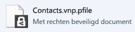

# Een bestand op een apparaat worden beveiligd (beveiligen) met behulp van de Rights Management-toepassing delen
Wanneer u een bestand in plaats beveiligt, vervangt de oorspronkelijke, niet-beveiligde bestand. Vervolgens kunt u het bestand waar is, kopiëren naar een andere map of het apparaat of delen van de map die is in en het bestand wordt beveiligd blijven. U kunt ook het beveiligde bestand aan een e-mailbericht koppelen Hoewel u de aanbevolen manier om een beveiligd bestand delen via e-mail rechtstreeks vanuit het bestand Explorer of een Office-toepassing (Zie [Een bestand dat u per e-mail delen met behulp van de Rights Management-toepassing delen beveiligen](../Topic/Protect_a_file_that_you_share_by_email_by_using_the_Rights_Management_sharing_application.md)).

> [!TIP]
> Als er fouten wanneer u probeert om bestanden te beschermen, verwijzen naar [Veelgestelde vragen over Microsoft Rights Management delen van de toepassing voor Windows](http://go.microsoft.com/fwlink/?LinkId=303971).

## Ter bescherming van een bestand op een apparaat (beveiligen)

1.  In File Explorer, selecteert u een bestand te beschermen. Klik met de rechtermuisknop, selecteer **beveiligen met RMS**, en selecteer vervolgens **beveiligen**. Bijvoorbeeld:

    

    > [!NOTE]
    > Als u dat niet ziet het **beveiligen met RMS** selecteert, is het waarschijnlijk dat de RMS sharing van toepassing is niet geïnstalleerd op uw computer of uw computer moet opnieuw worden gestart om de installatie te voltooien. Zie voor meer informatie over het installeren van de RMS sharing toepassing [Download en installeer de Rights Management-toepassing delen](../Topic/Download_and_install_the_Rights_Management_sharing_application.md).

2.  Een van de volgende handelingen uit:

    -   Selecteer een sjabloon: Dit zijn vooraf gedefinieerde machtigingen voor doorgaans toegang en gebruik voor mensen in uw organisatie. Bijvoorbeeld als de naam van uw organisatie "Contoso, Ltd" ziet u mogelijk **Contoso, Ltd - alleen vertrouwelijke weergeven**. Als dit de eerste keer dat u hebt een bestand op deze computer beveiligd, moet u eerst selecteren **bedrijf gedefinieerde beveiliging** te downloaden van de sjablonen.

        De volgende keer dat u op de **beveiligen** selecteert, ziet u maximaal 10 sjablonen kiezen uit. Als er meer dan 10 sjablonen die beschikbaar zijn en die u wilt niet wordt weergegeven, klikt u op **bedrijf gedefinieerde beveiliging** alle sjablonen te downloaden.

        Wanneer u een sjabloon selecteert, kunt u ook meerdere bestanden en een map beveiligen. Wanneer u een map selecteert, alle bestanden in deze map worden geselecteerd voor beveiliging, maar nieuwe bestanden die u in de map maakt niet automatisch beveiligd.

    -   Selecteer **aangepaste machtigingen**: Selecteer deze optie als u de sjablonen niet het niveau van bescherming die u nodig hebt of wilt u de beveiligingsopties expliciet instellen zelf. Geef de opties die u wilt gebruiken voor dit bestand in de [dialoogvenster Beveiliging toevoegen](http://technet.microsoft.com/library/dn574738.aspx), en klik vervolgens op **toepassen**.

3.  U kunt snel een dialoogvenster u vertellen dat het bestand is beveiligd en vervolgens de focus naar bestand Explorer retourneert zien. Nu zijn het geselecteerde bestand of de bestanden beveiligd. In sommige gevallen (wanneer de bestandsextensie toe te voegen beveiliging wordt gewijzigd), het oorspronkelijke bestand in Verkenner is vervangen door een nieuw bestand met het pictogram Rights Management beveiliging vergrendelen. Bijvoorbeeld:

    

Als u later beveiliging verwijderen uit een bestand wilt, raadpleegt u [Beveiliging verwijderen uit een bestand met behulp van de Rights Management-toepassing delen](../Topic/Remove_protection_from_a_file_by_using_the_Rights_Management_sharing_application.md).

## Voorbeelden en andere instructies
Zie de volgende secties van de Rights Management delen application user guide voor voorbeelden voor het gebruik van de Rights Management-toepassing en praktische instructies delen:

-   [Voorbeelden voor het gebruik van de RMS sharing toepassing](../Topic/Rights_Management_sharing_application_user_guide.md#BKMK_SharingExamples)

-   [Wat wilt u doen?](../Topic/Rights_Management_sharing_application_user_guide.md#BKMK_SharingInstructions)

## Zie ook
[Rights Management delen toepassing handleiding](../Topic/Rights_Management_sharing_application_user_guide.md)

