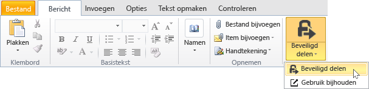
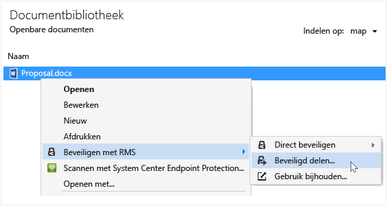
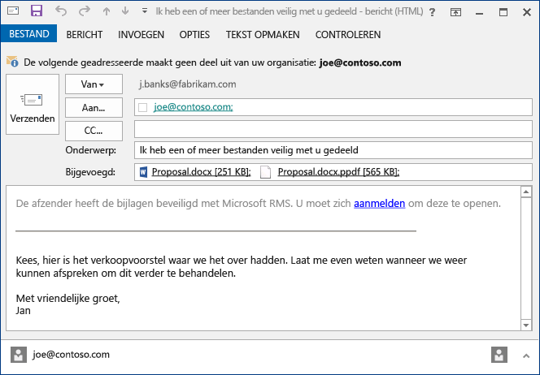

# Een bestand dat u per e-mail delen met behulp van de Rights Management-toepassing delen beveiligen
Wanneer u een bestand dat u per e-mail delen beveiligt, wordt een nieuwe versie van het oorspronkelijke bestand. Bestand met de oorspronkelijke onbeveiligde blijft en de nieuwe versie is beveiligd en automatisch gekoppeld aan een e-mailbericht dat u vervolgens verzenden.

In sommige gevallen (voor de bestanden die zijn gemaakt door Microsoft Word, Excel en PowerPoint), maakt de RMS sharing toepassing twee versies van het bestand dat het aangesloten op het e-mailbericht. De tweede versie van het bestand heeft een **.ppdf** bestandsextensie en er is een PDF-schaduwkopie van het bestand. Deze versie van het bestand zorgt ervoor dat ontvangers kunnen het bestand lezen, zelfs als ze geen dezelfde toepassing geïnstalleerd dat u gebruikt om deze te maken. Dit is vaak het geval wanneer mensen hun e-mail op mobiele apparaten te lezen en hun e-mailbijlagen te bekijken. Alle die nodig zijn voor het bestand openen de RMS sharing van toepassing is. Vervolgens kan bijgevoegd bestand lezen, maar ze niet wijzigen, totdat de andere versie van het bestand openen met behulp van een toepassing die RMS ondersteunt.

Als uw organisatie gebruikmaakt van Azure RMS, u kunt bijhouden van de bestanden die u door het delen van beveiligen:

-   Selecteer een optie e-mailberichten ontvangt wanneer iemand probeert te openen van deze beveiligde bijlagen. Telkens wanneer het bestand wordt geopend, krijgt u een melding die u wilt openen van het bestand en wanneer en of ze voltooid zijn (ze zijn geverifieerd) of niet.

-   Gebruik de documentatie van site bijhouden. U kunt zelfs stoppen als u toegang tot deze in de site document bijhouden voor het delen van het bestand. Zie voor meer informatie [Bijhouden en uw documenten intrekken wanneer u de RMS sharing toepassing](../Topic/Track_and_revoke_your_documents_when_you_use_the_RMS_sharing_application.md).

## Met behulp van Outlook: Een bestand dat u per e-mail delen beveiligen

1.  Maak uw e-mailbericht en het bestand bijvoegen. Klik vervolgens op de **bericht** tabblad in de **RMS** groep, klikt u op **beveiligd delen** en klik vervolgens op **beveiligd delen** opnieuw:

    

    Als u deze knop niet ziet, is het waarschijnlijk dat de RMS sharing van toepassing is niet geïnstalleerd op uw computer, de meest recente versie is niet geïnstalleerd of de computer moet opnieuw worden gestart om de installatie te voltooien. Zie voor meer informatie over het installeren van de toepassing delen [Download en installeer de Rights Management-toepassing delen](../Topic/Download_and_install_the_Rights_Management_sharing_application.md).

2.  Geef de opties die u wilt gebruiken voor dit bestand in de [beveiligde dialoogvenster delen](http://technet.microsoft.com/library/dn574738.aspx), en klik vervolgens op **nu verzenden**.

### Andere manieren om te beveiligen van een bestand dat u per e-mail delen
Naast het delen van een beveiligd bestand met Outlook, kunt u ook andere deze alternatieven gebruiken:

-   Uit bestand Explorer: Deze methode werkt voor alle bestanden.

-   Vanuit een Office-toepassing: Deze methode werkt voor toepassingen die de RMS sharing toepassing ondersteunt met behulp van de invoegtoepassing Office zodat u de **RMS** groep in het lint.

##### Gebruik File Explorer of een Office-toepassing: Een bestand dat u per e-mail delen beveiligen

1.  Gebruik een van de volgende opties:

    -   Voor het bestand Explorer: Met de rechtermuisknop op het bestand, selecteert u **beveiligen met RMS**, en selecteer vervolgens **beveiligd delen**:

        

    -   Voor de Office-toepassingen, Word, Excel en PowerPoint: Zorg ervoor dat het bestand eerst opgeslagen. Klik vervolgens op de **Home** tabblad in de **RMS** groep, klikt u op **beveiligd delen** en klik vervolgens op **beveiligd delen** opnieuw:

        

    Als u deze opties voor beveiliging niet ziet, is het waarschijnlijk dat de RMS sharing van toepassing is niet geïnstalleerd op uw computer, de meest recente versie is niet geïnstalleerd of de computer moet opnieuw worden gestart om de installatie te voltooien. Zie voor meer informatie over het installeren van de toepassing delen [Download en installeer de Rights Management-toepassing delen](../Topic/Download_and_install_the_Rights_Management_sharing_application.md).

2.  Geef de opties die u wilt gebruiken voor dit bestand in de [beveiligde dialoogvenster delen](http://technet.microsoft.com/library/dn574738.aspx), en klik vervolgens op **verzenden**.

3.  Snel ziet u een dialoogvenster u vertellen dat het bestand is beveiligd en u een e-mailbericht voor u gemaakt die aangeeft dat de bijlagen worden beschermd met Microsoft RMS zien en zij moeten zich aanmelden. Wanneer ze op de koppeling aan te melden, zien ze instructies en koppelingen om ervoor te zorgen dat ze kunnen uw beveiligde bijlage openen.

    Voorbeeld:

    

    Zijn vraagt u zich af: [Wat is het bestand .ppdf die automatisch wordt gemaakt?](../Topic/Dialog_box_options_for_the_Rights_Management_sharing_application.md#BKMK_PPDF)

4.  Optioneel: U kunt alle items die u in dit e-mailbericht wilt wijzigen. U kunt bijvoorbeeld toevoegen aan of wijzig het onderwerp of de tekst in het bericht.

    > [!WARNING]
    > Hoewel u kunt toevoegen of verwijderen van mensen van dit e-mailbericht, dit niet wordt gewijzigd door de machtigingen voor de bijlage die u hebt opgegeven in de **beveiligd delen** in het dialoogvenster. Als u wijzigen die machtigingen wilt, bijvoorbeeld een nieuwe persoon machtigen naar het bestand opent, het e-mailbericht sluiten zonder op te slaan of te verzenden en terug naar stap 1.

5.  Het e-mailbericht verzonden.

## Voorbeelden en andere instructies
Zie de volgende secties van de Rights Management delen application user guide voor voorbeelden voor het gebruik van de Rights Management-toepassing en praktische instructies delen:

-   [Voorbeelden voor het gebruik van de RMS sharing toepassing](../Topic/Rights_Management_sharing_application_user_guide.md#BKMK_SharingExamples)

-   [Wat wilt u doen?](../Topic/Rights_Management_sharing_application_user_guide.md#BKMK_SharingInstructions)

## Zie ook
[Rights Management delen toepassing handleiding](../Topic/Rights_Management_sharing_application_user_guide.md)

