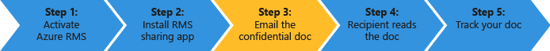

# Snel starten zelfstudie voor Azure Rights Management
Gebruik deze zelfstudie snel uit te proberen Microsoft Azure Rights Management (ook wel bekend als Azure RMS) voor uw organisatie met slechts 5 stappen die u minder dan 15 minuten gaat. U zult de service activeren, veilig vertrouwelijk document per e-mail verzenden aan iemand in een andere organisatie en kunnen bijhouden wanneer dat document wordt geopend. Wanneer de vertrouwelijk document per e-mail is verzonden, is versleuteld onderweg en kunnen alleen worden gelezen door de persoon, wordt verzonden met de machtigingen die zijn ingesteld door de afzender.

In deze zelfstudie is gericht op IT-beheerders en adviseurs, waarmee ze Azure Rights Management worden geëvalueerd als een oplossing voor de beveiliging van gegevens voor een organisatie. In een productieomgeving zou de instructies voor het activeren van de service door een beheerder worden uitgevoerd en de instructies voor het verzenden van het document door eindgebruikers zou worden uitgevoerd. Beide sets instructies zijn opgenomen in deze zelfstudie te demonstreren van het end-to-end scenario vertrouwelijk document veilig te verzenden naar iemand in een andere organisatie. Als u problemen voltooien van deze zelfstudie hebt, stuurt u een e-mailbericht naar [AskIPTeam](mailto:askipteam@microsoft.com?subject=Having%20problems%20with%20the%20Quick%20Start%20tutorial) en we helpen u af.

Deze zelfstudie moet u het volgende:

-   Een abonnement dat Azure Rights Management ondersteunt. Dit is een betaald abonnement of een proefabonnement. Als u gebruiken document bijhouden wilt, die vereist voor de stap 5 in deze zelfstudie is, moet uw abonnement document bijhouden ondersteunen. Zie voor meer informatie over de opties van abonnement en koppelingen naar de gratis proefversie de [Cloud-abonnementen die ondersteuning van Azure RMS](../Topic/Requirements_for_Azure_Rights_Management.md#BKMK_SupportedSubscriptions) sectie de [Vereisten voor Azure Rights Management](../Topic/Requirements_for_Azure_Rights_Management.md) onderwerp.

    Tip: Als u nodig hebt om een abonnement, hiervoor vooraf omdat dit proces soms even duren kan om te voltooien.

-   Een administrator-account voor aanmelding bij het Office 365-beheercentrum of de Azure-portal, zodat u de service Rights Management kan activeren. Dit account moet ook hebben een e-mailadres en een werkende e-service (bijvoorbeeld Exchange Online of Exchange Server).

-   Een computer met Windows (minimum van Windows 7 SP1) en die Office 2016, Office 2013 of Office 2010 is geïnstalleerd.

Laten we beginnen.

## Stap 1: De service Rights Management activeren

Hoewel er mogelijk een abonnement dat Azure Rights Management ondersteunt, wordt de service is standaard uitgeschakeld. Om deze te activeren, kunt u het Office 365-beheercentrum of het Azure-portal:

-   Als u een Office 365-abonnement met Azure Rights Management of een Office 365-abonnement hebt die worden uitgesloten Azure Rights Management, maar u hebt een abonnement voor Azure RMS zelfstandige: **Gebruik van het Office 365-beheercentrum**.

-   Als u beschikt niet over een Office 365-abonnement: **Het Azure-portal gebruiken**.

#### Rights Management van het Office 365-beheercentrum activeren

1.  Ga naar de [Office 365-portal](https://portal.office.com/) en meld u aan met uw werk of school-account.

2.  Als het Office 365-beheercentrum niet automatisch wordt weergegeven, selecteert u de app launcher-pictogram in de linkerbovenhoek en kies **Admin**. De **Admin** tegel alleen zichtbaar voor Office 365-beheerders.

    > [!TIP]
    > Raadpleeg voor informatie over admin center [over de Office 365-beheercentrum - beheer Help](https://support.office.com/article/About-the-Office-365-admin-center-Admin-Help-58537702-d421-4d02-8141-e128e3703547).

3.  Vouw in het linkerdeelvenster **SERVICE-instellingen**.

4.  Klik op **Rights Management**.

5.  Op de **RIGHTS MANAGEMENT** pagina, klikt u op **beheren**.

6.  Op de **rights management** pagina, klikt u op **activeren**.

7.  Als u wordt gevraagd **wilt u Rights Management activeren?**, klikt u op **activeren**.

U ziet nu **Rights management is geactiveerd** en de optie deactiveren (mogelijk moet u de pagina handmatig te vernieuwen)

Op dit moment niet op **Geavanceerde functies**. Dit gaat u naar de Azure-portal waar u de sjablonen die niet nodig zijn voor deze zelfstudie kunt configureren. U kunt in plaats daarvan het Office 365-beheercentrum sluiten.

#### Rights Management activeren van de Azure-portal

1.  Ga naar de [Azure-portal](http://go.microsoft.com/fwlink/p/?LinkID=275081) en aanmelden.

2.  Klik in het linkerdeelvenster op **ACTIVE DIRECTORY**.

3.  Uit de **active directory** pagina, klikt u op **RIGHTS MANAGEMENT**.

4.  Selecteer de map voor het beheren van voor [!INCLUDE[aad_rightsmanagement_2](../Token/aad_rightsmanagement_2_md.md)], klikt u op **activeren**, en Bevestig uw actie.

De **RIGHTS MANAGEMENT-STATUS** moet nu weergeven **Active** en de **activeren** optie wordt vervangen door **DEACTIVEREN**.

Hoewel u andere opties voor Rights Management in de portal configureren kunt, worden deze niet nodig voor deze zelfstudie, zodat u kunt de Azure-portal sluiten.

Dat hoeft u voor deze stap is. De service is geactiveerd, zodat alle gebruikers in uw organisatie nu beginnen met het kunnen beschermen van belangrijke en vertrouwelijke documenten. U kunt in een productieomgeving beperken die deze aanvankelijk voor een gefaseerde implementatie kunnen uitvoeren. Maar het is niet nodig is om deze zelfstudie.

Hoewel niet opgenomen, voor een productie-implementatie wilt u waarschijnlijk waarschijnlijk ook configureren van aangepaste sjablonen. Sjablonen maken het gemakkelijker voor gebruikers snel de juiste instellingen toepassen wanneer ze nodig hebt om bestanden te beschermen. Als u Rights Management activeren, wordt u automatisch 2 standaardsjablonen en is het waarschijnlijk wilt u aanvullen met uw eigen aangepaste sjablonen in een productieomgeving. Maar sjablonen zijn niet nodig voor deze zelfstudie, zodat u klaar bent om door te gaan met de volgende stap.

|Als u meer informatie|Aanvullende informatie|
|-------------------------|--------------------------|
|Over het activeren van Rights Management en te beheren die kunnen worden beveiligd bestanden en e-mailbericht wanneer de service is geactiveerd →|[Azure Rights Management activeren](../Topic/Activating_Azure_Rights_Management.md)|
|Over de standaardsjablonen en het maken van nieuwe, aangepaste sjablonen →|[Aangepaste sjablonen configureren voor Azure Rights Management](../Topic/Configuring_Custom_Templates_for_Azure_Rights_Management.md)|

## Stap 2: Installeer de Rights Management-toepassing delen

De Rights Management-toepassing (ook wel bekend als de "app RMS sharing") delen niet een vereiste voor Azure Rights Management, maar wij raden aan voor alle computers en mobiele apparaten die ondersteuning van Azure Rights Management. De RMS sharing van toepassing is geïntegreerd met Office toepassingen door de installatie van een Office-invoegtoepassing zodat gebruikers eenvoudig bestanden rechtstreeks vanuit het lint beveiligen kunnen. Ook kunt bestandstypen van alle beveiligen door toe te passen algemene beveiliging voor bestanden die worden niet ondersteund door Azure Rights Management en een document bijhouden van de site voor gebruikers bijhouden en bestanden die ze hebben beveiligd intrekken. We wilt het document bijhouden site later in deze zelfstudie gebruiken.

Deze toepassing is gratis te downloaden en biedt een installeren voor productieomgevingen. Maar voor deze zelfstudie we gaan deze lokaal installeren.

#### Downloaden en installeren van de Rights Management-toepassing delen

1.  Ga naar de [Microsoft Rights Management](http://go.microsoft.com/fwlink/?LinkId=303970) pagina op de website van Microsoft.

2.  In de **Computers** sectie, klikt u op het pictogram voor de **RMS-app voor Windows** en sla de **Setup.exe** bestand voor het installeren van de Microsoft Rights Management-toepassing voor delen.

3.  Voor een lokale installatie, moet u een administrator-account gebruiken om uit te voeren van de Setup.exe-bestand dat is gedownload. Als u wordt gevraagd om door te gaan, klikt u op **Ja**.

4.  Op de **Setup Microsoft RMS** pagina, klikt u op **volgende**, en wacht tot de installatie te voltooien.

5.  Als de installatie is voltooid, klikt u op **starten** als gevraagd de computer opnieuw opstarten of klik op  **Sluiten** om de installatie te voltooien.

U kunt nu beginnen met het beveiligen van bestanden met gegevens die u wilt delen met de mensen die u opgeeft.

|Als u meer informatie|Aanvullende informatie|
|-------------------------|--------------------------|
|Over een lokale installatie van de Rights Management-toepassing voor Windows en de gebruiker instructies → delen|[Rights Management delen toepassing handleiding](http://technet.microsoft.com/library/dn339006.aspx)|
|Over de installatie van de Rights Management-toepassing voor Windows en meer technische informatie → delen van scripts|[Rights Management delen toepassing beheerdershandleiding](http://technet.microsoft.com/library/dn339003.aspx)|
|Het verschil tussen de systeemeigen bescherming en algemene → begrijpen|[Wat is het verschil tussen algemene bescherming en ingebouwde (standaard)?](https://technet.microsoft.com/library/dn574738.aspx)|

## Stap 3: E-uw document dat u wilt beveiligen

Voor deze stap eerst maken en opslaan van een document met Word die vertegenwoordigen van uw document dat u wilt beveiligen en geef deze de naam **Confidential.docx**. Voor deze zelfstudie maakt niet uit welke tekst bevat in feite maar gewenste tekst bevatten, zodat het gemakkelijker om te bevestigen dat de geautoriseerde ontvanger kan lezen. U kunt bijvoorbeeld typen: **Als u dit van uw e-mailbijlage lezen kunt, heeft de afzender is een bestand dat is beveiligd gedeeld met Azure RMS.**

U kunt nu vervolgens veilig delen van dit document per e-mail.

#### Veilig delen van uw document per e-mail

1.  Met Outlook, een nieuw bericht maakt en koppelt het bestand dat u net hebt gemaakt.

2.  In de **naar** vak, typt u een of meer zakelijke e-adressen. Controleer of u een e-mailadres van het bedrijf, zoals **janetm@contoso.com** of **p.dover@fabrikam.com** omdat het momenteel Azure Rights Management ondersteunt geen persoonlijke e-mailadressen die u van uw internetprovider thuis kunt gebruiken. U hoeft niet of over de persoon die u het kan verzendt ook Azure Rights Management of niet.

3.  Typ een onderwerp, zoals  **vertrouwelijk document** en typ een korte bericht voor het e-mailbericht, zoals **Lees deze vertrouwelijk document en niet delen met anderen.**

4.  Klik vervolgens op de **bericht** tabblad in de **RMS** groep, klikt u op **beveiligd delen** en klik vervolgens op **beveiligd delen** opnieuw:

5.  In de **beveiligd delen** in het dialoogvenster:

    1.  Selecteer **Viewer – alleen in de weergave**.

        Dit betekent onze ontvangers het document weergeven, maar niet bewerken of af te drukken.

    2.  Selecteer **e-mailbericht mij wanneer iemand probeert te openen van deze documenten**.

        U krijgt een e-mailbericht telkens wanneer de ontvangers probeert te openen van de bijlage en ook als iemand anders wordt geprobeerd om deze te openen, bijvoorbeeld de ontvanger het e-mailbericht verzendt aan collega. In dit scenario laatste ziet u dat de toegang is geweigerd en van de gegevens van de gebruiker, u of bepalen kunt verzenden die persoon een kopie van het document dat ze kunnen openen.

    3.  Selecteer **toestaan me meteen intrekken toegang tot deze documenten**.

        Deze optie is vereist voor de geadresseerden hebt een internetverbinding telkens wanneer die zij de bijlage openen, maar met het voordeel dat als u het document later intrekt, de volgende keer dat ze proberen te openen, ze niet kunnen worden. Als u deze optie niet selecteert, is het mogelijk dat de ontvangers kunnen openen zelfs zonder een internetverbinding nodig, maar met het nadeel dat als u het document later intrekt, kan er een vertraging voor als die van kracht.

    4.  Klik op **nu verzenden**.

        Het e-mailbericht met bijlage wordt verzonden naar de e-mailadressen die u hebt opgegeven. Naast uw e-mailbericht zien ze instructies het lezen van het gekoppelde document die wordt beveiligd door Azure Rights Management.

Nu u uw beveiligde document verzonden heb, bent u klaar om te vragen van uw ontvangers moet worden gewacht op om door te komen en open deze. Maar niet sluit Outlook, omdat we deze opnieuw in ons laatste stap gebruiken gaat voor het bijhouden van de bijlage.

|Als u meer informatie|Aanvullende informatie|
|-------------------------|--------------------------|
|Volledige instructies en alternatieve methoden voor het beschermen van bestanden die u per e-mail → deelt|[Een bestand dat u per e-mail delen met behulp van de Rights Management-toepassing delen beveiligen](https://technet.microsoft.com/library/dn574735.aspx)|
|Over de opties in de **beveiligd delen** dialoogvenster →|[De opties in het dialoogvenster voor de Rights Management-toepassing delen](https://technet.microsoft.com/library/dn574738.aspx)|

## Stap 4: Stel uw ontvangers via e-mail verzonden document openen

Uw ontvangers kunnen veel apparaten gebruiken voor het lezen van het beveiligde document dat u als een e-mailbijlage verzonden. De apparaten die zijn iPads, iPhones, Android tablets en telefoons, Mac-computers, evenals Windows-computers.

Vragen om het lezen van het e-mailbericht dat u hebt verzonden. Ze zien uw e-mailbericht en vóór de volgende tekst:

**De afzender is bijlagen met Microsoft RMS beveiligd. Moet u** [Aanmelden](http://aka.ms/rms) **om deze te openen.**

Wanneer ze op de koppeling klikt, duurt deze instructies voor het installeren van de app RMS sharing en indien nodig, meld u voor een gratis account. Gratis account verleent ze een abonnement voor RMS voor personen die zorgt ervoor dat geautoriseerde gebruikers altijd een beveiligd document kunnen lezen, zelfs als hun organisatie geen Azure RMS heeft. Vervolgens zijn klaar om te lezen van de beveiligde bijlage met behulp van de volgende instructies.

#### De bijlage beveiligd document weergeven

1.  Omdat Azure Rights Management beveiligd een Word-document, zijn er twee bijlagen voor het e-mailbericht. Dit zijn daadwerkelijk twee versies van hetzelfde bestand, maar met verschillende bestandsextensies. Open de versie die de **.ppdf** -bestandsextensie (**Confidential.ppdf**).

    Als er een versie van [Office op het apparaat dat Rights Management ondersteunt](https://technet.microsoft.com/library/dn655136.aspx), kunt u de andere versie van het bestand openen (**Confidential.docx**), zodat in Word wordt geopend.

2.  Als u wordt gevraagd uw gebruikersnaam en wachtwoord, voert u uw gebruikersnaam in de indeling van het e-mailadres waarmee u het e-mailbericht en bijlage te verzenden. Bijvoorbeeld, **janetm@contoso.com** of **p.dover@fabrikam.com**. Typ het wachtwoord dat u hebt opgegeven als u aangemeld voor RMS voor personen om uw wachtwoord. Of als uw organisatie Azure RMS heeft, voert u uw wachtwoord gebruikelijke werk.

Het document wordt geopend en u kunt nu de inhoud lezen. Dit kan bijvoorbeeld **Als u dit van uw e-mailbijlage lezen kunt, de afzender is een bestand dat is beveiligd met Azure RMS. heeft gedeeld** Omdat het alleen-lezen, kunt u de inhoud niet wijzigen.

U kunt de geadresseerde voor het doorsturen van het e-mailbericht naar andere mensen die u hebt opgenomen in de oorspronkelijke e-mailbericht vragen als een optionele stap. Zelfs als de andere mensen werken voor een organisatie met Azure Rights Management of ze een aanvraag voor hun eigen RMS voor personen abonnement indienen, niet worden kunnen de bijlage openen. Wanneer ze worden gepromoveerd voor hun gebruikersnaam, worden toegang tot het document geweigerd.

Nu dat de ontvanger heeft de bijlage geopend en eventueel doorgestuurd naar iemand anders, verwacht voor het ophalen van een e-mailbericht van rapporten van deze activiteit. Maar e-mailberichten zijn gemakkelijk te verliezen gedurende een periode, zodat een betere manier om bij te houden die toegang uw document tot is het gebruik van het document bijhouden site die is beschreven in de laatste stap.

|Als u meer informatie|Aanvullende informatie|
|-------------------------|--------------------------|
|Volledige instructies voor het weergeven van bestanden die worden beschermd door → Azure Rights Management|[Weergeven en gebruiken van bestanden die zijn beveiligd door Rights Management](https://technet.microsoft.com/library/dn574741.aspx)|
|Over de gratis abonnement, RMS voor personen →|[RMS voor personen en Azure Rights Management](../Topic/RMS_for_Individuals_and_Azure_Rights_Management.md)|
|Over de twee versies van het bestand dat is gekoppeld aan het e-mailbericht →|[Wat is het bestand .ppdf die automatisch wordt gemaakt?](https://technet.microsoft.com/library/dn574738.aspx)|

## Stap 5: Uw beveiligde document bijhouden

> [!NOTE]
> Voor deze stap is uitgevoerd, moet u een abonnement dat document bijhouden ondersteunt hebben. Als u wilt controleren of uw abonnement bevat document bijhouden, Zie [aanbiedingen voor vergelijking van Rights Management Services (RMS)](https://technet.microsoft.com/dn858608.aspx).

Deze stap is optioneel, maar de meeste mensen graag weten of de bijlage die ze naar personen verzonden is geopend, wanneer en zelfs van waaruit. Bijvoorbeeld:

-   U verwacht een reactie van iemand door een bepaalde tijd en u kunt zien van de site document bijhouden dat zij het document is niet geopend, ondanks de deadline bijna is bereikt. U haar een follow-up e-mail verzenden of haar telefoonnummer als een tijdige herinnering.

-   Na die iemand het document heeft geopend, aan te vragen van haar als ze vragen heeft of is vereist als u meer informatie.

#### Uw beveiligde document bijhouden

1.  Met Outlook, op de **Home** tabblad in de **RMS** groep, klikt u op **bijhouden gebruik**.

2.  Als u de **beveiligen en delen op uw eigen voorwaarden** pagina, klikt u op **Aanmelden** en uw gebruikersnaam en wachtwoord opnieuw.

3.  Op de **uw gedeelde documenten** pagina ziet u het document dat u hebt gekoppeld aan het e-mailbericht, **Confidential.docx**. Op dit moment is het enige bestand weergegeven, maar als u aanvullende beveiligde documenten deelt, wordt de lijst met de grootte.

    Op deze pagina ziet u wanneer u het document (als u het e-mailbericht met de beveiligde bijlage verzonden), de datum van laatste activiteit en de naam van de geadresseerde verzonden van het e-mailbericht naar gedeeld. Klik op de naam van het document voor meer informatie.

4.  Op de nieuwe pagina heeft de naam van het bestand dat u hebt geklikt, ziet u samenvatting details voor dat document alleen en een lijst met andere opties die beschikbaar zijn voor het document (**lijst**, **tijdlijn**, **kaart**, **instellingen**).

    Klik op elke optie op verschillende manieren om bij te houden van uw beveiligde document verkennen. Nog steeds in de **Samenvatting** pagina, klikt u op **openen in Excel** naar de informatie die naar een spreadsheet exporteren of klik op **Toegang intrekken** delen van het document beëindigen.

U kunt terug naar deze site om bij te houden verder activiteit voor het beveiligde document of toegang intrekken indien nodig. U kunt ook toegang tot de site op het mobiele apparaat of tablet, met een browser met deze koppeling: [document bijhouden](http://go.microsoft.com/fwlink/?LinkId=529562)

|Als u meer informatie|Aanvullende informatie|
|-------------------------|--------------------------|
|Volledige instructies voor het bijhouden van uw documenten →|[Bijhouden en uw documenten intrekken wanneer u de RMS sharing toepassing](https://technet.microsoft.com/library/dn986611.aspx)|
|Twee minuut video die wordt beschreven en het document bijhouden → bevat|[Azure RMS Document bijhouden en intrekken](http://channel9.msdn.com/Series/Information-Protection/Azure-RMS-Document-Tracking-and-Revocation)|
|Voor het oplossen van problemen en klant vragen →|[Veelgestelde vragen over het Document bijhouden](https://technet.microsoft.com/dn947488)|

## Volgende stappen
In deze zelfstudie interval u slechts één scenario voor hoe Azure RMS kan helpen beschermen van uw gegevens. Andere vaak gebruikt, raadpleegt u de [Azure RMS in actie](https://technet.microsoft.com/library/jj585026.aspx) gedeelte van het [Wat is Azure Rights Management?](../Topic/What_is_Azure_Rights_Management_.md) artikel. Er zijn andere secties in dit artikel die mogelijk ook interessant, zoals de werking van Azure RMS en welke bedrijfsproblemen het kunt oplossen.

Als u klaar bent om te beginnen Azure RMS, gebruik implementeren de [Azure Rights Management-implementatieschema](../Topic/Azure_Rights_Management_Deployment_Roadmap.md) voor uw implementatiestappen en koppelingen voor procedures voor instructies.

## Zie ook
[Aan de slag met Azure Rights Management](../Topic/Getting_Started_with_Azure_Rights_Management.md)

