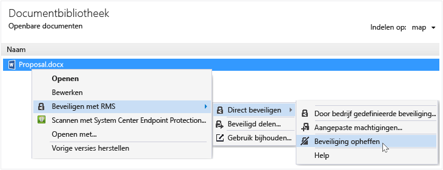

# Beveiliging verwijderen uit een bestand met behulp van de Rights Management-toepassing delen
Beveiliging verwijderen uit een bestand (dat wil zeggen, een bestand opheffen) die eerder is beveiligd met behulp van de RMS sharing toepassing, gebruikt u de **beveiliging verwijderen** optie vanuit bestand Explorer.

> [!IMPORTANT]
> U moet een eigenaar van het bestand opheffen.

### Beveiliging verwijderen uit een bestand

1.  Met de rechtermuisknop op het bestand (bijvoorbeeld Sample.ptxt) van File Explorer, selecteert u **beveiligen met RMS**, klikt u op **beveiligen**, en klik vervolgens op **beveiliging verwijderen**:

    

    Mogelijk moet u referenties.

De oorspronkelijke beveiligde bestand is (bijvoorbeeld Sample.ptxt) verwijderd en vervangen met een bestand met dezelfde naam, maar de niet-beveiligde bestandsnaamextensie (bijvoorbeeld voorbeeld.txt).

## Voorbeelden en andere instructies
Zie de volgende secties van de Rights Management delen application user guide voor voorbeelden voor het gebruik van de Rights Management-toepassing en praktische instructies delen:

-   [Voorbeelden voor het gebruik van de RMS sharing toepassing](../Topic/Rights_Management_sharing_application_user_guide.md#BKMK_SharingExamples)

-   [Wat wilt u doen?](../Topic/Rights_Management_sharing_application_user_guide.md#BKMK_SharingInstructions)

## Zie ook
[Rights Management delen toepassing handleiding](../Topic/Rights_Management_sharing_application_user_guide.md)

