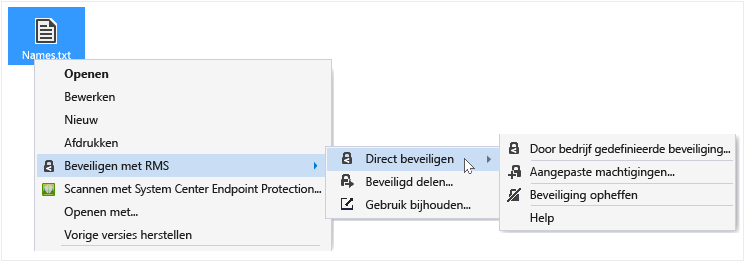
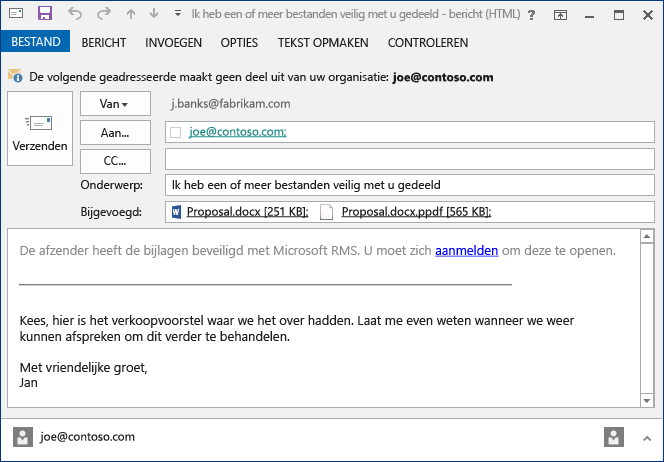
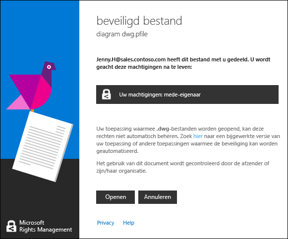
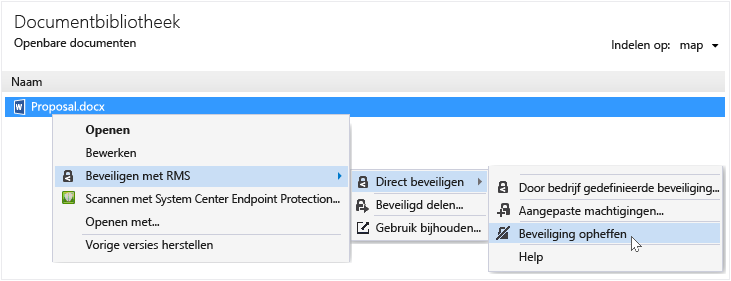

# Gebruikershandleiding voor Rights Management-toepassing voor delen: herziening voor enkel onderwerp
Met de Microsoft Rights Management (RMS)-toepassing voor delen voor Windows kunt u belangrijke documenten en foto's veilig afschermen van mensen die deze niet hoeven te zien, zelfs als u deze e-mailt of opslaat op een ander apparaat. U kunt deze toepassing ook gebruiken om bestanden te openen en te gebruiken die andere mensen hebben beveiligd met dezelfde Rights Management-technologie.

U hebt slechts een computer nodig hebt die ten minste Windows 7 uitvoert en een lokaal Administrator-account om de RMS-toepassing voor delen te installeren. [Download en installeer](http://go.microsoft.com/fwlink/?LinkId=303970) vervolgens deze gratis toepassing van Microsoft.

Als u vragen hebt die worden niet beantwoord in deze handleiding, raadpleegt u [Veelgestelde vragen over Microsoft Rights Management-toepassing voor delen voor Windows](http://go.microsoft.com/fwlink/?LinkId=303971).

Hier volgen enkele voorbeelden van hoe u de toepassing voor delen kunt gebruiken om uw bestanden te beveiligen.

|Ik wil...|Hoe u dit doet|
|-------------|------------------|
|**... financiële gegevens veilig delen met iemand die ik vertrouw en die geen onderdeel van mijn bedrijf is**  U werkt met een partnerbedrijf en wilt ze een Excel-werkblad mailen met geschatte verkoopcijfers. U wilt dat ze de cijfers kunnen zien, maar niet wijzigen.|Gebruik de knop Beveiligd delen in het lint in Excel, typ de e-mailadressen van de twee personen waarmee u samenwerkt in het partnerbedrijf, selecteer Viewer op de schuifregelaar en klik op Verzenden.  Wanneer de e-mail bij het partnerbedrijf aankomt, kunnen alleen de ontvangers in de e-mail het werkblad bekijken en ze kunnen dit niet opslaan, bewerken, afdrukken of doorsturen.  Details: Zie **Een bestand beveiligen dat u deelt via e-mail** in de sectie [What do you want to do?](../Topic/Rights_Management_sharing_application_user_guide_-_revision_for_single_topic.md#BKMK_UsingMSRMSApp) van deze handleiding.|
|**... veilig een document per e-mail verzenden aan iemand die gebruikmaakt van een iOS-apparaat**  U wilt een uiterst vertrouwelijk Word-document mailen naar een collega waarvan u weet dat deze regelmatig e-mail bekijkt op zijn iOS-apparaat.|Gebruik Verkenner om met de rechtermuisknop op het bestand te klikken en Beveiligd delen te selecteren. Selecteer de optie Verbruik toestaan op alle apparaten in de RMS-toepassing voor delen en stuur het bestand als bijlage naar uw collega.  De ontvanger ontvangt de e-mail op het iOS-apparaat, klikt op de koppeling in de e-mail waarin wordt uitgelegd hoe de toepassing voor delen kan worden gedownload, installeert de versie voor iOS-apparaten en kan vervolgens het document bekijken.  Details: Zie **Een bestand beveiligen dat u deelt via e-mail** in de sectie [What do you want to do?](../Topic/Rights_Management_sharing_application_user_guide_-_revision_for_single_topic.md#BKMK_UsingMSRMSApp) van deze handleiding.|
|**... een bijlage lezen die ik in een e-mailbericht heb ontvangen en die is beveiligd maar ik niet kan lezen omdat mijn bedrijf geen gebruikmaakt van Rights Management**  De afzender van het e-mailbericht is iemand die u vertrouwt omdat u al eerder zaken met hem hebt gedaan en u vermoedt dat deze persoon u informatie stuurt over een mogelijke nieuwe zakelijke kans.|U volg de instructies in het e-mailbericht en klikt op de koppeling om u aan te melden bij Microsoft Rights Management. U krijgt van Microsoft een bevestiging dat uw organisatie geen abonnement heeft op Office 365, u krijgt een e-mail waarin u het gratis aanmeldproces kunt voltooien en u meldt zich aan met uw nieuwe account. U klikt u op de tweede koppeling in het e-mailbericht voor het installeren van de Rights Management-app voor delen en vervolgens kunt u de e-mailbijlage openen om te lezen over de nieuwe zakelijke kans.  Details: Zie **Bestanden weergeven en gebruiken die zijn beveiligd door Rights Management** in de sectie [What do you want to do?](../Topic/Rights_Management_sharing_application_user_guide_-_revision_for_single_topic.md#BKMK_UsingMSRMSApp) van deze handleiding.|
|**... vertrouwelijke bestanden op mijn laptop beveiligen zodat ze niet toegankelijk zijn voor mensen buiten mijn bedrijf**  Als u veel op reis bent en uw laptop gebruikt voor toegang tot bestanden en ze wil updaten in een map die beveiligd is tegen onbevoegde toegang.|U hebt de RMS-toepassing voor delen op uw laptop geïnstalleerd. U gebruikt Verkenner om bestanden te beveiligen met een sjabloon waarmee u de bestanden snel kunt beveiligen. Als uw laptop wordt gestolen, hebt u zekerheid dat niemand buiten uw bedrijf toegang heeft tot deze documenten.  Details: Zie **Een bestand op een apparaat beveiligen (direct beveiligen)** in de sectie [What do you want to do?](../Topic/Rights_Management_sharing_application_user_guide_-_revision_for_single_topic.md#BKMK_UsingMSRMSApp) van deze handleiding.|

## Wat wilt u doen?
Gebruik de volgende instructies om te werken met beveiligde bestanden.

### De Rights Management-toepassing voor delen downloaden en installeren

1.  Ga naar de pagina [Microsoft Rights Management](http://go.microsoft.com/fwlink/?LinkId=303970) op de website van Microsoft.

2.  Klik in de sectie  **Computers** op het pictogram voor de **RMS-app voor Windows** en sla het installatiepakket voor de Microsoft Rights Management-toepassing voor delen op uw computer op.

3.  Dubbelklik op het gecomprimeerde bestand dat is gedownload en dubbelklik vervolgens op **setup.exe**. Als u wordt gevraagd om door te gaan, klikt u op **Ja**.

    > [!TIP]
    > Mogelijk moet u naar de onderkant van de lijst gaan in de huidige map om **setup.exe** te kunnen zien.

4.  Klik op de pagina **Setup Microsoft RMS** op **Volgende** en wacht tot de installatie is voltooid.

5.  Als de installatie is voltooid, klikt u op **Opnieuw starten** op uw computer opnieuw op te starten en de installatie te voltooien. U kunt ook op **Sluiten** klikken en de computer later opnieuw opstarten om de installatie te voltooien.

U kunt nu uw bestanden beveiligen of bestanden lezen die anderen hebben beveiligd.

#### Meer informatie
U moet een lokale beheerdersaccount hebben om de toepassing voor delen te installeren. Als u zich niet als lokale beheerder aanmeldt, kunt u de optie **Als administrator uitvoeren** gebruiken wanneer u Setup.exe in stap 3 uitvoert.

### Een bestand op een apparaat beveiligen (direct beveiligen)

1.  Selecteer in Verkenner een bestand, map of meerdere bestanden om te beveiligen. Klik met de rechtermuisknop en selecteer vervolgens **Direct beveiligen**. Bijvoorbeeld:

    

    > [!NOTE]
    > Als u de optie **Direct beveiligen** niet ziet, is het waarschijnlijk dat de toepassing voor delen niet is geïnstalleerd op uw computer of dat uw computer opnieuw moet worden gestart om de installatie te voltooien. Zie voor meer informatie over het installeren van de toepassing voor delen de instructies **De Rights Management-toepassing voor delen downloaden en installeren** instructies in de sectie [What do you want to do?](../Topic/Rights_Management_sharing_application_user_guide_-_revision_for_single_topic.md#BKMK_UsingMSRMSApp) van deze handleiding.

2.  Voer een van de volgende handelingen uit:

    -   Selecteer een beleidssjabloon: Dit zijn vooraf gedefinieerde machtigingen die toegang en gebruik beperken tot mensen in uw organisatie. Als dit de eerste keer dat u hebt een bestand op deze computer beveiligdt moet u eerst **Door bedrijf gedefinieerde beveiliging** selecteren om de sjablonen te downloaden. De naam van de sjablonen beginnen met de naam van uw bedrijf en vervolgens een beschrijvende naam van de machtiging. Bijvoorbeeld: **Contoso - alleen vertrouwelijke weergave**

    -   Selecteer **aangepaste machtigingen**: Selecteer deze optie als de sjablonen niet het niveau van beveiliging bieden dat u nodig hebt. Bijvoorbeeld als u toegang wilt verlenen aan mensen buiten uw organisatie of de beveiligingsopties expliciet zelf wilt instellen. Geef de opties die u voor dit bestand wilt gebruiken op het dialoogvenster **beveiliging toevoegen** en klik vervolgens op **Toepassen**.

        > [!NOTE]
        > Zie voor meer informatie over de opties in dit dialoogvenster de instructies **Opties opgeven in het dialoogvenster Rights Management** in de sectie [What do you want to do?](../Topic/Rights_Management_sharing_application_user_guide_-_revision_for_single_topic.md#BKMK_UsingMSRMSApp) van deze handleiding.

3.  U ziet kort een dialoogvenster waarin wordt uitgelegd dat het bestand wordt beveiligd en vervolgens gaat de focus terug naar Verkenner. Nu is het geselecteerde bestand of zijn de geselecteerde bestanden beveiligd. In sommige gevallen (wanneer het beveiligen de bestandsextensie wijzigt) wordt het oorspronkelijke bestand in Verkenner vervangen door een nieuw bestand met het Rights Management-beveiligingspictogram. Bijvoorbeeld:

    

Als u later beveiliging van een bestand wilt verwijderen, raadpleegt u de instructies **Beveiliging van een bestand verwijderen** in de sectie [What do you want to do?](../Topic/Rights_Management_sharing_application_user_guide_-_revision_for_single_topic.md#BKMK_UsingMSRMSApp) van deze handleiding.

#### Meer informatie
Wanneer u een bestand direct beveiligt, dan vervangt dit het oorspronkelijke, niet-beveiligde bestand. Vervolgens kunt u het bestand laten waar het is, kopiëren naar een andere map of apparaat, of de map waar het in zit delen en het bestand blijft beveiligd. U kunt ook het beveiligde bestand aan een e-mailbericht koppelen, hoewel de aanbevolen manier om een beveiligd bestand delen via e-mail rechtstreeks vanuit Verkenner of een Office-toepassing is (zie **Een bestand beveiligen dat u deelt via e-mail** in de sectie [What do you want to do?](../Topic/Rights_Management_sharing_application_user_guide_-_revision_for_single_topic.md#BKMK_UsingMSRMSApp) van deze handleiding).

U kunt met dezelfde techniek meerdere bestanden tegelijkertijd of een map beveiligen. Wanneer u een map beveiligt, worden alle bestanden in deze map geselecteerd voor beveiliging, maar worden nieuwe bestanden die u in die map maakt niet automatisch beveiligd.

Als u fouten ziet wanneer u probeert om bestanden te beschermen, raadpleegt u [Veelgestelde vragen over Microsoft Rights Management-toepassing voor delen voor Windows](http://go.microsoft.com/fwlink/?LinkId=303971).

### Een bestand beveiligen dat u per e-mail deelt

1.  Gebruik een van de volgende opties:

    -   Voor Verkenner: Klik met de rechtermuisknop op het bestand en selecteer **Beveiligd delen**:

        

    -   Voor Office-toepassing: Zorg ervoor dat u eerst het bestand hebt opgeslagen. Klik vervolgens in de groep **Beveiliging** op **Beveiligd delen**.

        

    > [!NOTE]
    > Als u deze opties voor beveiliging bij delen niet ziet, is het waarschijnlijk dat de toepassing voor delen niet is geïnstalleerd op uw computer of dat uw computer opnieuw moet worden gestart om de installatie te voltooien. Zie voor meer informatie over het installeren van de toepassing voor delen de instructies **De Rights Management-toepassing voor delen downloaden en installeren** instructies in de sectie [What do you want to do?](../Topic/Rights_Management_sharing_application_user_guide_-_revision_for_single_topic.md#BKMK_UsingMSRMSApp) van deze handleiding.

2.  Geef de opties die u voor dit bestand wilt gebruiken op het dialoogvenster **beveiligd delen** en klik vervolgens op **Verzenden**.

    

    > [!NOTE]
    > Zie voor meer informatie over de opties in dit dialoogvenster de instructies **Opties opgeven in het dialoogvenster Rights Management** in de sectie [What do you want to do?](../Topic/Rights_Management_sharing_application_user_guide_-_revision_for_single_topic.md#BKMK_UsingMSRMSApp) van deze handleiding.

3.  U ziet kort een dialoogvenster waarin wordt uitgelegd dat het bestand wordt beveiligd en vervolgens ziet u dat er een e-mailbericht voor u is gemaakt met het onderwerp **Ik heb een of meer bestanden veilig met u gedeeld**. In dit e-mailbericht is het bestand dat u hebt geselecteerd toegevoegd en beveiligd en bevat de tekst in het e-mailbericht een koppeling voor het volgende:

    -   RMS voor personen

    -   De RMS-toepassing voor delen

    -   Deze gebruikershandleiding

    Voorbeeld:

    

4.  Optioneel: U kunt wijzigen wat u wilt in dit e-mailbericht. U kunt bijvoorbeeld het onderwerp of de tekst in het bericht wijzigen of tekst toevoegen.

    > [!WARNING]
    > Hoewel u mensen aan dit bericht kunt toevoegen of verwijderen, worden de machtigingen niet gewijzigd die u voor de bijlage hebt opgegeven in het dialoogvenster **beveiligd delen**. Als u deze machtigingen wilt wijzigen, bijvoorbeeld een nieuwe persoon toestemming geven om het bestand te openen, sluit dan het e-mailbericht zonder op te slaan of te verzenden en ga terug naar stap 1.

5.  Verzend het e-mailbericht.

#### Meer informatie
Wanneer u een bestand beveiligt dat u per e-mail deelt, dan wordt er een nieuwe versie van het oorspronkelijke bestand gemaakt. Het oorspronkelijke bestand blijft onbeveiligd en de nieuwe versie is beveiligd en wordt automatisch toegevoegd aan een e-mailbericht dat u vervolgens verzendt.

Het e-mailbericht heeft een standaardonderwerp en standaardtekst die u kunt wijzigen voordat u het verstuurt.

Er zijn twee manieren om een bestand dat u via e-mail deelt te beveiligen

-   Via Verkenner: Deze methode werkt voor alle bestanden.

-   Vanuit een Office-toepassing: Deze methode werkt voor toepassingen die worden ondersteund door de Right Management-toepassing voor delen met behulp van de invoegtoepassing Office zodat u de groep **Beveiliging** ziet op het lint.

> [!NOTE]
> In deze versie van de Rights Management-toepassing voor delen is er geen invoegtoepassing voor Outlook waarmee u bestanden en e-mailberichten rechtstreeks vanuit de Outlook-toepassing kunt beveiligen. Gebruik in plaats daarvan de procedure in deze sectie.

### Bestanden weergeven en gebruiken die zijn beveiligd door Rights Management

#### Een beveiligd bestand weergeven
Dubbelklik op het beveiligde bestand via de Verkenner of het e-mailbericht met de bijlage en voer uw referenties in als u daarom wordt gevraagd. Hoe het bestand wordt geopend is afhankelijk van hoe het is beveiligd.

-   Als het bestand algemeen is beveiligd (het heeft extensie .pfile):

    U ziet een dialoogvenster **beveiligd bestand** van de toepassing voor delen waarin staat wie het bestand heeft beveiligd en dat er van u wordt verwacht dat u de machtigingen voor de mede-eigenaar in acht neemt. U wordt geïnformeerd dat deze actie wordt gecontroleerd wanneer u het bestand opent.

    

    Klik op **Openen** om het bestand te lezen.

-   Als het bestand systeemeigen is beveiligd (het heeft geen extensie .pfile):

    Het bestand wordt geopend met de toepassing dat is gekoppeld aan de originele bestandsnaamextensie en een beperkingsbanner wordt boven aan het bestand weergegeven. De banner bevat mogelijk de toestemmingen die van toepassing zijn op het bestand of bevat een koppeling om deze weer te geven. U ziet bijvoorbeeld het volgende waarbij u op **De toegang is momenteel beperkt** moet klikken om de werkelijke machtigingen die worden toegepast op het bestand en de mensen die er toegang toe hebben te zien.

    

    Dit bestand wordt ook gecontroleerd en blijft gecontroleerd zolang het is beveiligd.

##### Meer informatie
Voordat u het beveiligde bestand kunt weergeven, moet RMS eerst bevestigen dat u bent gemachtigd om het bestand weer te geven door uw gebruikersnaam en wachtwoord te controleren. In sommige gevallen kan dit mogelijk in de cache worden opgeslagen en wordt u niet gevraagd om uw aanmeldgegevens. In andere gevallen wordt u gevraagd uw aanmeldgegevens op te geven.

Als uw organisatie geen gebruik maakt van Windows Azure Rights Management (Windows Azure RMS) of AD RMS kunt u zich aanmelden voor een gratis account waarmee uw referenties worden geaccepteerd, zodat u bestanden kunt openen die met RMS zijn beveiligd. Om u aan te melden voor dit account klikt u op de koppeling om u aan te melden voor [RMS voor personen](http://go.microsoft.com/fwlink/?LinkId=309469).

#### Om bestanden te gebruiken die zijn beveiligd (bijvoorbeeld het bestand bewerken en afdrukken)
Als het beveiligde bestand een extensie .pfile heeft:

-   Sla het geopende bestand op en geeft dit een nieuwe bestandsnaamextensie die is gekoppeld aan de toepassing die u wilt gebruiken.

    Als een bestand bijvoorbeeld is beveiligd met gebruik van de bestandsnaam document.vsdx.pfile, bekijkt u het bestand en slaat u het bestand in Verkenner op als document.vsdx.

    Het nieuwe bestand is niet langer beveiligd. Als u het wilt beveiligen, moet u dit handmatig doen. Zie voor instructies **Een bestand beveiligen op een apparaat (direct beveiligen) met behulp van de Rights Management-toepassing voor delen** in de sectie [What do you want to do?](../Topic/Rights_Management_sharing_application_user_guide_-_revision_for_single_topic.md#BKMK_UsingMSRMSApp) van deze handleiding.

Als het oorspronkelijk beveiligde bestand geen extensie .pfile heeft:

-   U kunt het bestand alleen weergeven, tenzij u een toepassing hebt die Rights Management begrijpt. Deze toepassingen heten Rights Management-geschikte toepassingen. Toepassingen van Office 2013 en Office 2010 (zoals Word, Excel, PowerPoint en Outlook) zijn voorbeelden van toepassingen die zijn 'enlightened' voor Rights Management. Maar ook toepassingen die niet afkomstig zijn van Microsoft, zoals andere softwarebedrijven en uw eigen zakelijke toepassingen, kunnen geschikt zijn voor Rights Management.

    Toepassingen die geschikt zijn voor Rights Management kunnen bestanden openen die zijn beveiligd door andere toepassingen die voor Rights Management geschikt zijn. Ze bewaren tevens de beveiliging die op ze is toegepast, zelfs wanneer u het bestand wijzigt of opslaat onder een andere bestandsnaam of op een andere locatie. Met deze toepassingen kunt u het bestand gebruiken volgens de machtigingen die momenteel van toepassingen zijn op het bestand, zodat u het bestand kunt gebruiken als u hiervoor bent gemachtigd. Als het bestand bijvoorbeeld is beveiligd als Alleen-lezen, kunt u het bestand niet wijzigen of afdrukken.

### Beveiliging van een bestand verwijderen
Klik vanuit Verkenner met de rechtermuisknop op het bestand (bijvoorbeeld Sample.ptxt), klik op **Direct beveiligen** en klik vervolgens op **Beveiliging opheffen**:

Mogelijk moet u uw referenties invoeren.

#### Meer informatie
Het oorspronkelijke beveiligde bestand wordt verwijderd (bijvoorbeeld Sample.ptxt) en vervangen door een bestand met dezelfde naam, maar met de niet-beveiligde bestandsnaamextensie (bijvoorbeeld Sample.txt).

Om de beveiliging van een bestand te verwijderen (dat wil zeggen, de beveiliging van een bestand opheffen) dat eerder is beveiligd met de RMS-toepassing voor delen, gebruikt u de optie **Beveiliging opheffen** in Verkenner.

> [!IMPORTANT]
> U moet de eigenaar zijn van een bestand om de beveiliging op te heffen.

### Sneltoetsen gebruiken in de Rights Management-toepassing voor delen
Druk op de toets **Alt** voor een overzicht van de beschikbare sneltoetsen en druk vervolgens op **Alt** + de sneltoets om een optie te selecteren.

#### Meer informatie
In het dialoogvenster voor **beveiligd delen** drukt u bijvoorbeeld op **Alt** voor een overzicht van de sneltoetsen, en drukt u vervolgens op **Alt + u** om het selectievakje **Gebruikers moeten zich elke keer aanmelden wanneer ze dit bestand openen** in te schakelen.

### Opties opgeven in het dialoogvenster Rights Management

|Optie|Beschrijving|
|---------|----------------|
|**GEBRUIKERS**|Typ de e-mailadressen van de mensen waarvan u wilt dat zij het bestand kunnen openen. Gebruik puntkomma's voor meerdere adressen. Dit kunnen e-mailadressen binnen of buiten uw organisatie zijn.  Bijvoorbeeld: janetm@contoso.com; pdover@fabricom.com|
|**Gebruik op alle apparaten toestaan**|Als u deze optie kiest waarmee gebruikers het bestand kunnen openen op mobiele apparaten zoals een iPad, worden de machtigingen automatisch ingesteld op **MEDE-EIGENAAR** (alle machtigingen) zodat algemene beveiliging wordt gebruikt voor het beveiligen van het bestand.|
|**MACHTIGINGEN**|Verplaats de schuifregelaar naar de machtiging die u wilt gebruiken voor dit bestand.  In sommige gevallen worden de machtigingen automatisch ingesteld op MEDE-EIGENAAR en kunnen deze niet worden gewijzigd. Dit gebeurt als u de optie **Gebruik op alle apparaten toestaan** inschakelt. Het gebeurt ook wanneer u een bestand beveiligt dat niet systeemeigen kan worden beveiligd door RMS en dus algemeen moet worden beveiligd. De toepassing voor delen maakt deze beslissing op basis van de bestandsnaamextensie. **Tip:** U kunt de pagina [Microsoft Rights Management](http://go.microsoft.com/fwlink/?LinkId=303970) op de website van Microsoft gebruiken om snel te controleren welke toepassingen geïntegreerde beveiliging ondersteunen.|
|**Gebruikers moeten zich elke keer aanmelden wanneer ze dit bestand openen**|Selecteer deze optie als u betere beveiliging nodig hebt voor een bestand omdat het vereist dat de gebruikers die u opgeeft altijd worden geverifieerd, elke keer wanneer ze het bestand openen. Hiervoor worden zij gevraagd om hun gebruikersnaam en wachtwoord als hun referenties niet in de cache zijn opgeslagen. Voor deze instelling is echter vereist dat deze gebruikers altijd internettoegang hebben om het bestand te openen, en het kan frustrerend zijn om een bestand te ontgrendelen en te moeten wachten tot het verificatieproces is voltooid.|
|**Inhoud verloopt op**|Selecteer deze optie alleen voor tijdsgebonden bestanden die de gebruikers die u hebt geselecteerd niet kunnen openen na de datum die u opgeeft. U kunt het oorspronkelijke bestand nog wel openen.|

#### Meer informatie
Gebruik de tabel bij het opgeven van de opties in het dialoogvenster **beveiliging toevoegen** of **beveiligd delen** van de toepassing voor delen. U ziet dit dialoogvenster wanneer u een bestand in-place beveiligt en kiest voor aangepaste machtigingen of wanneer u een bestand om te delen beveiligt.

Zie voor meer informatie over het direct beveiligen van een bestand en het beveiligen van een bestand om te delen de sectie [What do you want to do?](../Topic/Rights_Management_sharing_application_user_guide_-_revision_for_single_topic.md#BKMK_UsingMSRMSApp) van deze handleiding.

## Zie ook
[Rights Management delen toepassing beheerdershandleiding](../Topic/Rights_Management_sharing_application_administrator_guide.md)
 [Microsoft Rights Management-toepassing voor delen downloaden](http://go.microsoft.com/fwlink/?LinkId=303970)
 [Veelgestelde vragen over Microsoft Rights Management-toepassing voor delen voor Windows](http://go.microsoft.com/fwlink/?LinkId=303971)

