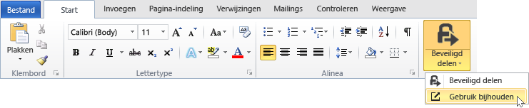
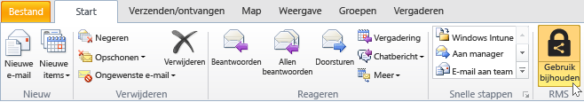
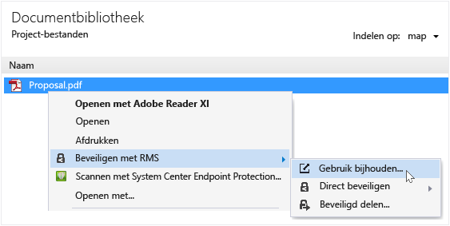
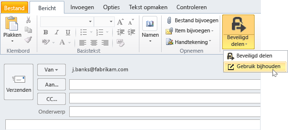

# Bijhouden en uw documenten intrekken wanneer u de RMS sharing toepassing
Nadat u hebt uw documenten beveiligd met behulp van de RMS sharing toepassing, als uw organisatie van Azure Rights Management in plaats van Active Directory Rights Management Services gebruikmaakt, kunt u bijhouden hoe mensen uw beveiligde documenten gebruiken. Indien nodig, kunt u ook toegang tot deze documenten intrekken als u wilt delen stoppen. Hiervoor gebruikt u de **document bijhouden site**, die u kunt openen vanuit de Windows-computers, Mac-computers en zelfs van tablets en telefoons.

> [!TIP]
> Twee minuut video: [Azure RMS Document bijhouden en intrekken](http://channel9.msdn.com/Series/Information-Protection/Azure-RMS-Document-Tracking-and-Revocation)

Als u toegang deze site tot, moet u zich aanmelden voor het bijhouden van uw documenten. Geven van uw organisatie heeft een [abonnement dat document bijhouden en intrekken ondersteunt](https://technet.microsoft.com/dn858608.aspx) en u een licentie voor dit abonnement zijn toegewezen, kunt u zien die er is geprobeerd om de bestanden die u beveiligd te openen en of ze zijn voltooid (ze zijn geverifieerd) of niet. Telkens wanneer ze heeft geprobeerd toegang tot het document en de locatie op het moment. Bovendien:

-   Als u een document delen stoppen: Klik op **Toegang intrekken**, ziet u de tijd die het document blijft beschikbaar, en bepaalt of om te laten weten dat u toegang tot het document bent u mensen u eerder hebt gedeeld, en een eigen bericht bieden.

-   Als u exporteren naar Excel wilt: Klik op **openen in Excel**, zodat u kunt vervolgens de gegevens wijzigen en uw eigen weergaven en diagrammen maken.

-   Als u e-mailmeldingen configureren wilt: Klik op **instellingen** en selecteren hoe en of moet worden gestuurd wanneer het document wordt geopend.

-   Als u vragen hebt of wilt u feedback over het document bijhouden site: Klik op het pictogram Help voor toegang tot de [Veelgestelde vragen voor het bijhouden van Document](http://go.microsoft.com/fwlink/?LinkId=523977).

## Toegang tot het bijhouden van site document met behulp van Office

-   Voor de Office-toepassingen, Word, Excel en PowerPoint: Op de **Home** tabblad in de **RMS** groep, klikt u op **beveiligd delen**, en klik vervolgens op **bijhouden gebruik**.

    

-   Voor Outlook: Op de **Home** tabblad in de  **RMS** groep, klikt u op **bijhouden gebruik**:

    

Als u deze opties voor RMS niet ziet, is het waarschijnlijk dat de RMS sharing van toepassing is niet geïnstalleerd op uw computer, de meest recente versie is niet geïnstalleerd of de computer moet opnieuw worden gestart om de installatie te voltooien. Zie voor meer informatie over het installeren van de toepassing delen [Download en installeer de Rights Management-toepassing delen](../Topic/Download_and_install_the_Rights_Management_sharing_application.md).

### Andere manieren om te controleren en uw documenten intrekken
Naast uw documenten op Windows-computers met behulp van Office-toepassingen bijhouden, kunt u ook andere deze alternatieven gebruiken:

-   **Met een webbrowser**: Deze methode werkt voor alle ondersteunde apparaten.

-   **Bestand Verkenner**: Deze methode werkt voor Windows-computers.

-   **Met behulp van een e-mailbericht van Outlook**: Deze methode werkt voor Windows-computers.

##### Met behulp van een webbrowser toegang tot de site doc bijhouden

-   Met een ondersteunde browser, gaat u naar de [document bijhouden site](http://go.microsoft.com/fwlink/?LinkId=529562).

    Ondersteunde browsers: Gebruik van Internet Explorer die wordt ten minste versie 10, maar u kunt een van de volgende browsers gebruiken het document bijhouden van de site te gebruiken:

    -   Internet Explorer: Ten minste versie 10

    -   Internet Explorer 9 met ten minste MS12-037: Cumulatieve beveiligingsupdate voor Internet Explorer: 12 juni 2012

    -   Mozilla Firefox: Ten minste versie 12

    -   Apple Safari 5: Ten minste versie 5

    -   Google Chrome: Ten minste versie 18

##### File Explorer gebruiken voor toegang tot het document bijhouden van site

-   Met de rechtermuisknop op het bestand, selecteert u **beveiligen met RMS**, en selecteer vervolgens **bijhouden gebruik**:

    

##### Met behulp van een e-mailbericht van Outlook toegang tot de site doc bijhouden

-   In een e-mailbericht in de **bericht** tabblad in de  **RMS** groep, klikt u op **beveiligd delen**, en klik vervolgens op **bijhouden gebruik**:

    

## Voorbeelden en andere instructies
Zie de volgende secties van de Rights Management delen application user guide voor voorbeelden voor het gebruik van de Rights Management-toepassing en praktische instructies delen:

-   [Voorbeelden voor het gebruik van de RMS sharing toepassing](../Topic/Rights_Management_sharing_application_user_guide.md#BKMK_SharingExamples)

-   [Wat wilt u doen?](../Topic/Rights_Management_sharing_application_user_guide.md#BKMK_SharingInstructions)

## Zie ook
[Rights Management delen toepassing handleiding](../Topic/Rights_Management_sharing_application_user_guide.md)

