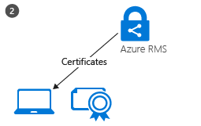

# Wat is Azure Rights Management?
Azure Rights Management (Azure RMS) is een oplossing voor de beveiliging van informatie voor organisaties die u wilt beveiligen, hun gegevens in de huidige uitdagende werkomgeving.

Deze problemen zijn moeten worden Internet verbonden zijn met gebruikers dat het apparaat persoonlijke werken, toegang tot zakelijke gegevens op de introductiepagina en weg en gevoelige gegevens delen met belangrijke zakelijke partners. Als onderdeel van hun dagelijkse werk gebruikers gegevens delen via e-mailberichten, delen van bestanden sites en cloud-services. In deze scenario's beperkt traditioneel beveiliging besturingselementen (zoals access control lists en NTFS-machtigingen) en firewalls effectiviteit als u wilt waarborgen dat de gegevens van uw bedrijf nog steeds zodat uw gebruikers efficiënt werken.

Azure RMS kunnen vertrouwelijke informatie in deze scenario's van uw bedrijf beveiligen in vergelijking. Versleuteling, identiteit en autorisatiebeleid gebruikt om te helpen beveiligen van uw bestanden en e-mailbericht en werkt op meerdere apparaten, telefoons, tablets en pc's. Gegevens kan worden beveiligd binnen uw organisatie en buiten uw organisatie, omdat dat beveiliging met de gegevens, blijft zelfs wanneer de grenzen van uw organisatie verlaat. Als u bijvoorbeeld werknemers mogelijk per e-mail een document aan het bedrijf van een partner of ze een document opslaan in de cloud-station. De persistente bescherming die Azure RMS biedt niet alleen helpt uw bedrijfsgegevens te beveiligen maar kan ook wettelijk verplicht voor naleving, juridische detectie vereisten of gewoon goede informatie management procedures.

Maar zeer belangrijker gemachtigde personen en -services (zoals zoeken en indexeren) kunnen worden voortgezet om te lezen en controleren van de gegevens die Azure RMS beveiligt, die niet gemakkelijk wordt uitgevoerd met andere oplossingen voor beveiliging peer-to-peer-codering gebruiken. Deze mogelijkheid is ook wel "redeneren over gegevens" genoemd en een essentieel onderdeel is van de controle van uw organisatie gegevens te behouden.

De volgende afbeelding ziet Azure RMS werking als een Rights Management-oplossing voor Office 365, evenals voor lokale servers en services. U ziet ook of de eindgebruiker populaire apparaten die worden uitgevoerd van Windows, Mac OS iOS, Android en Windows Phone wordt ondersteund.

> [!TIP]
> Op dit moment nuttig aanvullende bronnen:
> 
> -   Twee minuut video: [Wat is Microsoft Azure Rights Management](http://technet.microsoft.com/dn833005.aspx)
> -   Vijf stappen zelfstudie: [Snel starten zelfstudie voor Azure Rights Management](../Topic/Quick_Start_Tutorial_for_Azure_Rights_Management.md)
> -   Azure RMS-vereisten, inclusief abonnement aanschaffen of evalueren: [Vereisten voor Azure Rights Management](../Topic/Requirements_for_Azure_Rights_Management.md)

Gebruik de volgende secties voor meer informatie over Azure RMS:

-   [Welke problemen zijn opgelost in Azure RMS?](../Topic/What_is_Azure_Rights_Management_.md#BKMK_RMSrequirements)

    -   [Beveiliging, compatibiliteit en regelgevingsvereisten](../Topic/What_is_Azure_Rights_Management_.md#BKMK_RMScompliance)

-   [Azure RMS in actie: Zie welke beheerders en gebruikers](../Topic/What_is_Azure_Rights_Management_.md#BKMK_RMSpictures)

    -   [Activeren en Rights Management configureren](../Topic/What_is_Azure_Rights_Management_.md#BKMK_Example_ManagementPortal)

    -   [Bestanden op bestandsservers met Windows Server en bestand classificatie infrastructuur beveiligen automatisch](../Topic/What_is_Azure_Rights_Management_.md#BKMK_Example_FCI)

    -   [Automatisch beveiligen e-mailberichten met Exchange Online en beleid voor gegevensverlies te voorkomen](../Topic/What_is_Azure_Rights_Management_.md#BKMK_Example_DLP)

    -   [Bestanden met SharePoint Online en beveiligde bibliotheken beveiligen automatisch](../Topic/What_is_Azure_Rights_Management_.md#BKMK_Example_SharePoint)

    -   [Bijlagen delen gebruikers veilig met mobiele gebruikers](../Topic/What_is_Azure_Rights_Management_.md#BKMK_Example_SharingApp)

-   [Hoe werkt Azure RMS? Onder de oppervlakte](../Topic/What_is_Azure_Rights_Management_.md#BKMK_HowRMSworks)

    -   [Cryptografische besturingselementen gebruikt door Azure RMS: Algoritmen en sleutellengte](../Topic/What_is_Azure_Rights_Management_.md#BKMK_RMScrytographics)

    -   [Overzicht van de werking van Azure RMS: Eerst gebruikt, beveiliging, inhoud verbruik van inhoud](../Topic/What_is_Azure_Rights_Management_.md#BKMK_Walthrough)

-   [Volgende stappen](../Topic/What_is_Azure_Rights_Management_.md#BKMK_NextSteps)

## Welke problemen zijn opgelost in Azure RMS?
Gebruik de volgende tabel om zakelijke vereisten of problemen die uw organisatie heeft mogelijk te identificeren en hoe Azure RMS adres deze.

|Vereiste of probleem|Kunnen worden opgelost door Azure RMS|
|------------------------|-----------------------------------------|
|Alle bestandstypen beveiligen|√ In de vorige implementatie van Rights Management, alleen Office bestanden kunnen worden beveiligd, met systeemeigen beveiliging. Nu [algemene beveiliging](https://technet.microsoft.com/library/dn574738%28v=ws.10%29.aspx) betekent dat alle bestandstypen worden ondersteund.|
|Overal bestanden beveiligen|√ Wanneer een bestand wordt opgeslagen op een locatie ([beveiligen](https://technet.microsoft.com/library/dn574733%28v=ws.10%29.aspx)), de beveiliging blijft met het bestand, zelfs als deze is gekopieerd naar opslag, dat niet onder het beheer van IT, zoals een cloud storage-service.|
|Bestanden veilig delen via e-mail|√ Wanneer een bestand wordt gedeeld door de e-mailbericht ([beveiligd delen](https://technet.microsoft.com/library/dn574735%28v=ws.10%29.aspx)), het bestand is beveiligd als bijlage aan een e-mailbericht met instructies voor het openen van de beveiligde bijlage. De e-tekst is niet versleuteld, zodat de ontvanger deze instructies kunt lezen. Omdat het gekoppelde document is beveiligd, wordt alleen geautoriseerde gebruikers echter kunnen openen, zelfs als het e-mailbericht of het document wordt doorgestuurd naar andere mensen.|
|Controle|√ u kunt [worden gecontroleerd, gebruik](https://technet.microsoft.com/library/dn529121.aspx) beveiligde bestanden, zelfs nadat deze bestanden de grenzen van uw organisatie laat.  Werken bijvoorbeeld voor Contoso. U werkt op een gemeenschappelijk project 3 mensen van Fabrikam, Inc. U e-deze 3 mensen een document dat u beveiligen en te beperken tot alleen-lezen. Azure RMS controle biedt de volgende gegevens:  -   Of de mensen die u hebt opgegeven in Fabrikam het document geopend en wanneer. -   Of andere mensen die u hebt opgegeven heeft geprobeerd (en kan niet) het document te openen, waarschijnlijk omdat deze is doorgestuurd of opgeslagen in een gedeelde locatie die anderen kunnen openen. -   Of een van de opgegeven personen geprobeerd (en kan niet) af te drukken of te wijzigen van het document.|
|Ondersteuning voor alle veelgebruikte apparaten, niet alleen Windows-computers|√ [apparaten ondersteund](https://technet.microsoft.com/library/dn655136.aspx) omvatten:  -   Windows-computers en telefoons -   Mac-computers -   iOS-tablets en telefoons -   Android tablets en telefoons|
|Ondersteuning voor bedrijven samenwerking|√ Omdat Azure RMS is een cloudservice, hoeft u expliciet vertrouwensrelaties configureren met andere organisaties voordat u beveiligde inhoud met hen delen kunt. Als ze al een Office 365- of een map Azure AD, wordt automatisch samenwerking tussen organisaties ondersteund. Als dat niet het geval is, gebruikers kunnen aanmelden voor de gratis [RMS voor personen](https://technet.microsoft.com/library/dn592127.aspx) abonnement.|
|Ondersteuning voor lokale services, evenals Office 365|√ naast hun werk [naadloos met Office 365](https://technet.microsoft.com/library/jj585004.aspx), u kunt ook Azure RMS met de volgende lokale services gebruiken wanneer u implementeert de [RMS-connector](https://technet.microsoft.com/library/dn375964.aspx):  -   Exchange-Server -   SharePoint-Server -   Windows-Server met bestand classificatie infrastructuur|
|Eenvoudig activering|√ [activeren van de service Rights Management](https://technet.microsoft.com/library/jj658941.aspx) voor gebruikers moet een paar klikken in de Azure-portal.|
|Mogelijkheid om de schaal voor uw organisatie, indien nodig|√ Omdat Azure RMS wordt uitgevoerd als een cloudservice met de Azure elasticiteit geschikt omhoog en out, hoeft u te creëren of meer lokale servers implementeren.|
|Eenvoudige en flexibele beleidsregels maken|√ [aangepast rechtenbeleidssjablonen](https://technet.microsoft.com/library/dn642472.aspx) bieden een oplossing snel en eenvoudig voor beheerders kunnen beleid toepassen en voor gebruikers toe te passen van het juiste niveau van bescherming voor elk document en beperken van toegang tot de mensen binnen uw organisatie.  Voor een hele bedrijf strategiedocument worden gedeeld met alle werknemers, kunt u een alleen-lezen-beleid kan toepassen op alle interne werknemers. Klik voor een meer gevoelige document, zoals een financieel rapport u toegang tot leidinggevenden alleen beperken kan.|
|Brede ondersteuning voor toepassingen|√ Azure RMS nauwe integratie met Microsoft Office-toepassingen en services, en wordt uitgebreid ondersteuning voor andere toepassingen met behulp van de RMS sharing van toepassing.  √ De   [Microsoft Rights Management SDK](https://msdn.microsoft.com/library/hh552972%28v=vs.85%29.aspx) biedt uw interne ontwikkelaars en leveranciers met schrijven van aangepaste toepassingen die ondersteuning van Azure RMS-API's.  Zie voor meer informatie [Hoe toepassingen ondersteunen Azure Rights Management](../Topic/How_Applications_Support_Azure_Rights_Management.md).|
|IT moet beheer van gegevens|√ Organisaties kunt beheren hun eigen tenant-sleutel en gebruiken de "[brengt uw eigen sleutel](https://technet.microsoft.com/library/dn440580.aspx)" (BYOK) oplossing en sla de tenant-sleutel in Hardware beveiligingsmodules (HSM's).  √ Ondersteuning voor controle en [gebruikslogboekregistratie](https://technet.microsoft.com/library/dn529121.aspx) zodat u voor meer inzicht analyseren kunt, monitor misbruik, en (als er een geheugenlek informatie) forensische analyses uitvoeren.  √ Gemachtigde toegang met behulp van de [supergebruiker functie](https://technet.microsoft.com/library/mt147272.aspx) zorgt ervoor dat IT kan altijd toegang tot beveiligde inhoud, zelfs als een document is beveiligd door een werknemer die vervolgens de organisatie verlaat. In de vergelijking, peer-to-peer-versleuteling oplossingen risico overdragende toegang tot zakelijke gegevens.  √ Synchroniseren [de directorykenmerken Azure RMS moet](https://azure.microsoft.com/documentation/articles/active-directory-aadconnectsync-attributes-synchronized/) ter ondersteuning van een algemene identiteit voor uw lokale Active Directory-accounts met behulp van een [directory synchronisatieprogramma](https://azure.microsoft.com/documentation/articles/active-directory-aadconnect-get-started-tools-comparison/), zoals Azure AD Connect.  √ Inschakelen eenmalige aanmelding voor zonder wachtwoorden worden gerepliceerd naar de cloud met behulp van AD FS.  √ Organisaties hebben altijd de keuze te stoppen met behulp van Azure RMS zonder verlies van toegang tot inhoud die eerder door Azure RMS is beveiligd. Zie voor meer informatie over het buiten gebruik stellen opties [Buiten gebruik stellen en Azure Rights Management deactiveren](../Topic/Decommissioning_and_Deactivating_Azure_Rights_Management.md). Daarnaast organisaties die van Active Directory Rights Management Services (AD RMS gebruikmaken) kunnen [migreren naar Azure RMS](https://technet.microsoft.com/library/dn858447.aspx) zonder verlies van toegang tot gegevens die eerder is beveiligd door AD RMS.|
> [!TIP]
> Als u bekend bent met de lokale versie van Rights Management, Active Directory Rights Management Services (AD RMS), kunt u mogelijk bent geïnteresseerd in de vergelijkingstabel van [Azure Rights Management en AD RMS vergelijken](../Topic/Comparing_Azure_Rights_Management_and_AD_RMS.md).

### Beveiliging, compatibiliteit en regelgevingsvereisten
Azure RMS ondersteunt de volgende beveiliging, compatibiliteit en regelgevingsvereisten:

√ Gebruik van de standaard-cryptography en ondersteunt FIPS 140-2. Zie voor meer informatie de [Cryptografische besturingselementen gebruikt door Azure RMS: Algoritmen en sleutellengte](../Topic/What_is_Azure_Rights_Management_.md#BKMK_RMScrytographics) in dit onderwerp.

√ Ondersteuning voor Thales Hardware beveiligingsmodules (HSM's) voor het opslaan van uw tenant-sleutel in Microsoft Azure gegevens draait. Azure RMS gebruikt werelden afzonderlijke beveiliging voor de datacenters in Noord-Amerika, EMEA (Europa, Midden-Oosten en Afrika) en Azië, zodat de sleutels kunnen alleen worden gebruikt in uw regio.

√ Gecertificeerd voor het volgende:

-   ISO/IEC 27001:2013 (inclusief [ISO/IEC 27018](http://azure.microsoft.com/blog/2015/02/16/azure-first-cloud-computing-platform-to-conform-to-isoiec-27018-only-international-set-of-privacy-controls-in-the-cloud/))

-   SOC 2 SSAE 16/ISAE 3402 verklaringen

-   HIPAA BAA

-   EU Model-component

-   FedRAMP als onderdeel van Azure Active Directory in Office 365-certificering verleend FedRAMP Bureau certificeringsinstantie aan Operate door HHS

-   PCI DSS niveau 1

Zie voor meer informatie over deze externe certificaten, de [Azure Vertrouwenscentrum](http://azure.microsoft.com/support/trust-center/compliance/).

## Azure RMS in actie: Zie welke beheerders en gebruikers
De afbeeldingen in dit gedeelte weergeven typische voorbeelden van hoe beheerders en gebruikers zien en kunnen Azure RMS gebruiken om u te helpen bij het beschermen van gevoelige of vertrouwelijke informatie.

> [!NOTE]
> Eigenaar van de inhoud blijft in al deze voorbeelden waarin gegevens worden beschermd door Azure RMS, volledige toegang hebben tot de gegevens (bestand of e-mail), zelfs als de toegepaste bescherming machtigingen worden verleend aan een groep die eigenaar is niet lid zijn van of zelfs als de toegepaste protection beschikt over een verloopdatum.
> 
> Op deze manier kan IT altijd toegang tot de beveiligde gegevens zonder beperkingen, met de functie supergebruiker van Rights Management waarmee gemachtigde toegang wordt verleend aan gebruikers of services die u opgeeft. Bovendien kan IT traceren en controleren Gebruik voor gegevens die zijn beveiligd, bijvoorbeeld wie toegang heeft tot de gegevens en wanneer.

Voor andere schermafdrukken en video's die RMS in actie weergeven, controleert u de [Microsoft Rights Management serviceportal](http://www.microsoft.com/rms), de [Microsoft Rights Management (RMS)-teamblog](http://blogs.technet.com/b/rms), en [curated inhoud voor Azure RMS op de Curah! site](http://curah.microsoft.com/Search?query="Azure%20RMS").

### Activeren en Rights Management configureren
Hoewel u Windows PowerShell gebruiken kunt om te activeren en Azure RMS configureren, is het eenvoudigste van de beheerportal. Zodra de service is geactiveerd, worden er twee standaardsjablonen waarmee beheerders en gebruikers snel en eenvoudig informatiebeveiliging op bestanden wilt toepassen kunnen selecteren. Maar u kunt ook uw eigen aangepaste sjablonen voor aanvullende opties en instellingen maken.

|||
|-|-|
|  [Groots beeld](http://technet.microsoft.com/98d53a12-3b19-4622-bb1e-75ef56df5438) (standaard in dezelfde browservenster)|U kunt een van beide het Office 365-beheercentrum (eerst picture) of het Azure-portal (tweede afbeelding) RMS activeren.  Slechts één Klik hier om te activeren en een andere Klik hier om te bevestigen, en vervolgens de beveiliging van gegevens is ingeschakeld voor beheerders en gebruikers in uw organisatie.|
|  [Groots beeld](http://technet.microsoft.com/596e4fec-124c-41b1-8efd-63d5179193fb) (standaard in dezelfde browservenster)|Na activering van sjablonen voor twee rechten automatisch beschikbaar zijn voor uw organisatie. Een sjabloon voor is alleen-lezen (**alleen vertrouwelijke weergeven** is opgenomen in de naam), de andere voor lezen en wijzigingsrechten (**vertrouwelijk**).  Wanneer deze sjablonen zijn toegepast op bestanden of e-mailberichten, beperken ze toegang tot de gebruikers in uw organisatie. Dit is een zeer snel en eenvoudig manier om te voorkomen dat de gegevens van uw bedrijf lekken voor mensen buiten uw organisatie. **Tip:** U kunt deze standaardsjablonen eenvoudig te herkennen omdat ze automatisch worden voorafgegaan door de naam van uw organisatie. In ons voorbeeld **VanArsdel Ltd**. Als u niet wilt dat gebruikers deze sjablonen of als u wilt maken van uw eigen sjablonen, kunt u dit doen vanuit de Azure-portal. Als deze afbeelding kunt zien, gaat u verder een wizard door het proces voor het maken van aangepaste sjabloon.|
|  [Groots beeld](http://technet.microsoft.com/f5df80e5-efc9-4c0f-91be-060225977356) (standaard in dezelfde browservenster)|Offline toegang, vervaldatum instellingen en of de sjabloon onmiddellijk publiceren (zichtbaar maken in toepassingen die ondersteuning bieden voor Rights Management) vindt u enkele van de configuratie-instellingen als u besluit om uw eigen sjablonen te maken.|
|  [Groots beeld](http://technet.microsoft.com/597a3402-fd5a-4bcf-b5e6-5c983dbde697) (standaard in dezelfde browservenster)|Als gevolg van deze sjablonen publiceren, kunnen gebruikers ze nu selecteren in toepassingen zoals File Explorer en Microsoft Word:  -   Een gebruiker kan kiezen de standaardsjabloon **VanArsdel Ltd – vertrouwelijk**. Alleen werknemers uit de organisatie VanArsdel kunnen vervolgens openen en gebruiken van dit document, zelfs als het later is per e-mail naar iemand buiten de organisatie verzonden of opgeslagen in een openbare locatie. -   Een gebruiker kan de aangepaste sjabloon die de beheerder is gemaakt, kiezen **verkoop en Marketing-lezen en afdrukken alleen**. Klik, niet alleen het bestand is beveiligd van mensen buiten de organisatie, maar ook beperkt tot werknemers uit de verkoop en Marketing afdeling. Bovendien deze werknemers niet volledige rechten voor het document, alleen-lezen en afdrukken. Ze kunnen bijvoorbeeld wijzigen of uit het kopiëren.|
Zie voor meer informatie [Azure Rights Management activeren](../Topic/Activating_Azure_Rights_Management.md) en [Aangepaste sjablonen configureren voor Azure Rights Management](../Topic/Configuring_Custom_Templates_for_Azure_Rights_Management.md).

Om gebruikers te helpen belangrijk bedrijfsbestanden beveiligen, Zie [Waardoor gebruikers kunnen bestanden beveiligen met Azure Rights Management](../Topic/Helping_Users_to_Protect_Files_by_Using_Azure_Rights_Management.md).

Vervolgens enkele voorbeelden van hoe beheerders de sjablonen automatisch configureren van beveiliging van gegevens voor bestanden en e-mailberichten kunnen toepassen.

### Bestanden op bestandsservers met Windows Server en bestand classificatie infrastructuur beveiligen automatisch
In dit voorbeeld ziet u hoe u kunt Azure RMS automatisch beveiligen bestanden op bestandsservers die worden uitgevoerd ten minste Windows Server 2012 en zijn geconfigureerd voor het gebruik van bestand classificatie infrastructuur.

Er zijn vele manieren classificatie waarden op bestanden wilt toepassen. U kunt bijvoorbeeld de inhoud van bestanden controleren en dienovereenkomstig toepassen ingebouwde classificaties zoals vertrouwelijkheid en persoonlijke informatie. In dit voorbeeld echter maakt een beheerder een aangepaste indeling van de **Marketing** die automatisch wordt toegepast op alle gebruikersdocumenten die worden opgeslagen in de **Marketing promoties** map. Hoewel deze map is beveiligd met NTFS-machtigingen die alleen toegankelijk voor leden van de groep Marketing, wordt door de beheerder weet dat deze machtigingen verloren worden kunnen als iemand in die groep wordt verplaatst of de bestanden e-mails. Vervolgens kan de informatie in de bestanden worden geopend door niet-geautoriseerde gebruikers.

|||
|-|-|
|  [Groots beeld](http://technet.microsoft.com/cf18c56b-c301-4640-8d9e-9e677e494091) (standaard in dezelfde browservenster)|De beheerders installeert en configureert u de connector RMS (Rights Management), die als een relay tussen lokale servers en Azure RMS fungeert.|
|  [Groots beeld](http://technet.microsoft.com/ba3e247d-ea5e-4009-8eac-74f70270ece0) (standaard in dezelfde browservenster)|Op de bestandsserver configureert de beheerder de classificatieregels en taken zodat alle bestanden in de **Marketing promoties** map automatisch worden geclassificeerd als **Marketing** en beveiligd met RMS-versleuteling.  Selecteert ze de aangepaste RMS-sjabloon die is gemaakt in ons eerste voorbeeld, dat is alleen toegankelijk voor leden van de verkoop en Marketing afdelingen: **Verkoop en Marketing-lezen en alleen afdrukken**.  Als gevolg hiervan alle documenten in de map automatisch worden geconfigureerd met de classificatie Marketing en beveiligd door de verkoop en Marketing RMS sjabloon.|
|  [Groots beeld](http://technet.microsoft.com/ad666594-68df-4289-835a-235b2af9bf4b) (standaard in dezelfde browservenster)|Hoe RMS helpt voorkomen dat gegevens lekken voor mensen die geen toegang tot gevoelige of vertrouwelijke informatie:  -   Janet, e-mails van Marketing, een vertrouwelijke rapport uit de map Marketing aanbiedingen. Dit rapport bevat nieuwe producten en advertenties plannen en is aangevraagd door een collega die momenteel op zakelijke wordt verzonden. Echter Janet per ongeluk e-mails deze naar de verkeerde persoon — ze niet zoals u ziet dat ze een ontvanger met een vergelijkbare naam per ongeluk hebt geselecteerd in een ander bedrijf.     De ontvanger kan het rapport vertrouwelijke lezen omdat hij is geen lid van de verkoop en Marketing groep.|
Zie voor meer informatie [Implementatie van de Connector van de Azure Rights Management](../Topic/Deploying_the_Azure_Rights_Management_Connector.md).

### Automatisch beveiligen e-mailberichten met Exchange Online en beleid voor gegevensverlies te voorkomen
Het vorige voorbeeld blijkt hoe bestanden die gevoelige of vertrouwelijke informatie, maar wat bevatten als de gegevens niet in een bestand, maar in een e-mailbericht automatisch kan worden beveiligd? Dit is de daarvoor van Exchange Online gegevensverlies te voorkomen (DLP) beleid, de gebruikers toe te passen information protection (via beleid Tips) of automatisch voor deze toepassing (met behulp van transportregels).

In dit voorbeeld configureert de beheerder een beleid ervoor zorgen dat de organisatie voldoen aan ons regelgeving voor de bescherming van persoonlijke gegevens, maar kunnen ook regels worden geconfigureerd voor andere regelgeving of aangepaste regels die u definieert.

|||
|-|-|
|  [Groots beeld](http://technet.microsoft.com/58461319-3981-4b7f-a195-956a1778e907) (standaard in dezelfde browservenster)|De Exchange-sjabloon met de naam **VS Persoonlijk identificeerbaar informatie verzameld gegevens** maken en configureren van een nieuw DLP-beleid wordt gebruikt door de beheerder. Met deze sjabloon wordt gezocht naar informatie zoals nummers van sociale verzekeringen en telefoonnummers in e-mailberichten.  De regels worden geconfigureerd zodat e-mailberichten die deze informatie bevatten en die worden automatisch verzonden buiten de organisatie is de rechten beveiliging toegepast met behulp van een RMS-sjabloon die toegankelijk alleen werknemers van het bedrijf alleen.  Hier de regel is geconfigureerd voor gebruik een van de standaardsjablonen **VanArsdel Ltd – vertrouwelijk**, van ons eerste voorbeeld. Maar u kunt ook zien hoe de keuze van sjablonen bevat aangepaste sjablonen die u hebt gemaakt en een **Nee doen naar voren halen** optie die specifiek is voor Exchange.|
|  [Groots beeld](http://technet.microsoft.com/bfb0762d-06fb-42e4-beff-eb391f4bedf0) (standaard in dezelfde browservenster)|De dienst manager schrijft een e-mailbericht met de gratis telefoonnummer van een onlangs een werknemer. Hij verzendt dit e-mailbericht naar Sherrie in de afdeling Human Resources.|
|  [Groots beeld](http://technet.microsoft.com/59e3b68e-4bed-4962-bb1e-e82d82f8000a) (standaard in dezelfde browservenster)|Als dit e-mailbericht wordt verzonden of wordt doorgestuurd naar iemand buiten de organisatie, de regel DLP automatisch rechten beveiliging toegepast.  Het e-mailbericht is versleuteld wanneer laat u de infrastructuur van de organisatie, zodat de gratis telefoonnummer in het e-mailbericht onderweg of in het postvak in van de ontvanger kan niet worden gelezen. De ontvanger is niet mogelijk het bericht te lezen tenzij hij of zij een werknemer VanArsdel.|
Voor meer informatie raadpleegt u de volgende secties:

-   [Exchange Online en Exchange Server](../Topic/How_Applications_Support_Azure_Rights_Management.md#BKMK_ExchangeIntro) in de [Hoe toepassingen ondersteunen Azure Rights Management](../Topic/How_Applications_Support_Azure_Rights_Management.md) onderwerp.

-   [Exchange Online: IRM-configuratie](../Topic/Configuring_Applications_for_Azure_Rights_Management.md#BKMK_ExchangeOnline) in de [Toepassingen voor Azure Rights Management configureren](../Topic/Configuring_Applications_for_Azure_Rights_Management.md) onderwerp.

### Bestanden met SharePoint Online en beveiligde bibliotheken beveiligen automatisch
Geeft aan hoe u kunt eenvoudig te beschermen documenten bij gebruik van SharePoint Online en beveiligde bibliotheken.

In dit voorbeeld is de SharePoint-beheerder voor Contoso een bibliotheek voor elke afdeling waarmee ze centraal opslaan en uitchecken van documenten voor bewerken en versie besturingselement gemaakt. Er is bijvoorbeeld een bibliotheek voor verkoop, een voor Marketing, een voor Human Resources, enzovoort. Wanneer u een nieuw document is geüpload of op een van deze beveiligde bibliotheken gemaakt, dat document neemt de bescherming van de bibliotheek (is niet nodig om een sjabloon rechten beleid te selecteren) en dat document automatisch is beveiligd en blijft beveiligd, zelfs als het buiten de SharePoint-documentbibliotheek wordt verplaatst.

|||
|-|-|
|  [Groots beeld](http://technet.microsoft.com/2fc90989-9289-4431-9e6a-07740b7f6e5a) (standaard in dezelfde browservenster)|De beheerder kan Information Rights Management voor de SharePoint-site.|
|  [Groots beeld](http://technet.microsoft.com/a18f2e99-5ac4-4103-a88c-527846374091) (standaard in dezelfde browservenster)|Vervolgens kan zij Rights Management voor een bibliotheek. Er zijn extra opties, is deze eenvoudige instelling vaak alle die nodig is.  Documenten worden nu gedownload van deze bibliotheek, worden automatisch door Rights Management, overnemen van de beveiliging, die geconfigureerd voor de bibliotheek beschermd.|
|  [Groots beeld](http://technet.microsoft.com/0ebd6806-0190-441e-84db-72ac4b97e4a2) (standaard in dezelfde browservenster)|Wanneer iemand van de verkoopafdeling deze Verkoop rapport uit de bibliotheek controleert, kunnen deze duidelijk zien van de banner informatie aan de bovenkant is een beveiligd document met beperkte toegang.  Het document blijft beveiligd, zelfs als de gebruiker wijzigt de naam van het opgeslagen in een andere locatie of deze per e-mail deelt. Ongeacht wat het bestand met de naam, waar het opgeslagen of gedeeld door de e-mailbericht, alleen leden van de verkoopafdeling kunnen worden gelezen.|
Voor meer informatie raadpleegt u de volgende secties:

-   [SharePoint Online en SharePoint Server](../Topic/How_Applications_Support_Azure_Rights_Management.md#BKMK_SharePointIntro) in de [Hoe toepassingen ondersteunen Azure Rights Management](../Topic/How_Applications_Support_Azure_Rights_Management.md) onderwerp.

-   [SharePoint Online en OneDrive voor bedrijven: IRM-configuratie](../Topic/Configuring_Applications_for_Azure_Rights_Management.md#BKMK_SharePointOnline) in de [Toepassingen voor Azure Rights Management configureren](../Topic/Configuring_Applications_for_Azure_Rights_Management.md) onderwerp.

### Bijlagen delen gebruikers veilig met mobiele gebruikers
De vorige voorbeelden gezien hoe beheerders kunnen automatisch informatiebeveiliging toepassen op gevoelige en vertrouwelijke gegevens. Maar er zijn bepaalde situaties wanneer gebruikers mogelijk om toe te passen deze bescherming zelf. Bijvoorbeeld ze samen met partners in een andere organisatie, moeten aangepaste machtigingen of de instellingen die niet zijn gedefinieerd in sjablonen voor of de ad-hoc situaties die niet in de vorige voorbeelden. In deze gevallen kunnen gebruikers de RMS-sjablonen zelf toepassen of aangepaste machtigingen configureren.

Dit voorbeeld toont hoe gebruikers kunnen gemakkelijk een document delen met iemand ze samen met anderen werkt met van een ander bedrijf, maar wel het document beveiligen en er zeker van te zijn dat de ontvanger kan worden gelezen, zelfs vanuit een populaire mobiel apparaat. Dit scenario maakt gebruik van de toepassing voor delen op Rights Management, die u automatisch voor Windows-computers in uw organisatie implementeren kunt. Of, kunnen gebruikers de installeren zichzelf.

In dit voorbeeld e-mails Robert van Contoso, een vertrouwelijke Word-document waarmee ze worden verzonden naar Robert bij Fabrikam. Hij het document leest op zijn iPad, maar hij kan het net zo gemakkelijk lezen op een iPhone, een Android tablet of telefoonnummer, een Mac-computer of een Windows phone of computer.

|||
|-|-|
|  [Groots beeld](http://technet.microsoft.com/feeef78d-3c2e-432b-817d-d06f784be226) (standaard in dezelfde browservenster)|Van haar Windows-PC Robert maakt een standaard e-mailbericht en een document is gekoppeld.  Ze klikt op **beveiligd delen** in het lint die wordt geladen de **beveiligd delen** in het dialoogvenster van de RMS-toepassing voor delen.  Robert wil Bob beperken tot weergeven en bewerken van het document en niet wilt dat kopiëren of afdrukken, zodat zij selecteert **REVISOR – weergeven en bewerken**. Ze wil ook per e-mail verzonden wanneer iemand probeert het document openen en de mogelijkheid om het document later intrekken indien nodig te weten dat intrekken direct van kracht.|
|  [Groots beeld](http://technet.microsoft.com/e748fd78-8bba-4168-96cf-f96def078283) (standaard in dezelfde browservenster)|Bob ziet het e-mailbericht op zijn iPad.  Naast de Robert bericht en bijlage zijn er instructies die hij, volgt Meld u aan en installeer de app op zijn iPad RMS sharing.|
|  [Groots beeld](http://technet.microsoft.com/7dba5ff9-a61d-4a83-8adc-d6ffb0e85df6) (standaard in dezelfde browservenster)|Bob kunt nu de bijlage openen. Hij eerst gevraagd zich aan te melden om te bevestigen dat hij de geadresseerde is.  Als Bob het document bekijkt, ziet hij ook de informatie met beperkte toegang hem Vertel je hij kunt weergeven en bewerken van het document, maar niet kopiëren of afdrukken.|
|  [Groots beeld](http://technet.microsoft.com/9f642a2e-58ad-44ab-9f81-f890d15380f9) (standaard in dezelfde browservenster)|Robert ontvangt een e-mailbericht waarin haar dat Bob het document dat zij verzonden en wanneer hij toegang krijgen tot het document is geopend.  Als Bob zijn e-mailen met de bijlage verzendt of opgeslagen waar anderen het kunnen openen of het is onderschept op het netwerk, kunnen andere gebruikers worden niet lezen van het document.|
Zie voor meer informatie [beveiligen van een bestand dat u per e-mail delen](https://technet.microsoft.com/library/dn574735.aspx) en [weergeven en het gebruik van de bestanden die zijn beveiligd](https://technet.microsoft.com/library/dn574741.aspx) van de [delen toepassing Rights Management-handleiding](https://technet.microsoft.com/library/dn339006.aspx).

Bovendien de [Snel starten zelfstudie voor Azure Rights Management](../Topic/Quick_Start_Tutorial_for_Azure_Rights_Management.md) omvat stapsgewijze instructies voor dit scenario.

Nu u zag enkele voorbeelden van wat Azure RMS kan doen, is het mogelijk dat u geïnteresseerd in hoe het werkt. Zie de volgende sectie voor technische informatie over de werking van Azure RMS.

## Hoe werkt Azure RMS? Onder de oppervlakte
Een belangrijkste om inzicht te krijgen over de werking van Azure RMS is dat de Rights Management-service (en Microsoft) niet zien of uw gegevens worden opgeslagen als onderdeel van de beveiliging van informatie. Informatie die u beveiligen wordt nooit verzonden naar of opgeslagen in Azure, tenzij u expliciet opslaan in Azure of gebruik een andere cloudservice die wordt opgeslagen in Azure. Azure RMS gewoon zorgt ervoor dat de gegevens in een document onleesbare aan iemand anders dan de toegestane gebruikers en services:

-   De gegevens op het toepassingsniveau van is versleuteld en een beleid dat hiermee de toegestaan gebruik van dat document worden bevat.

-   Wanneer u een beveiligd document wordt gebruikt door een geldige gebruiker of deze is verwerkt door een geautoriseerde service, de gegevens in het document is ontsleuteld en de rechten die zijn gedefinieerd in het beleidsarchief worden afgedwongen.

Op hoog niveau, kunt u zien hoe dit proces werkt in de volgende afbeelding. Een document met de geheime formule is beveiligd en is geopend door een geautoriseerde gebruiker of de service. Het document wordt beveiligd door een inhoud sleutel voor de groene in deze afbeelding. Het is uniek voor elk document en in de koptekst van het bestand wordt geplaatst waar is beveiligd door de RMS-tenant root sleutel voor het red in deze afbeelding. Uw tenant sleutel kan worden gegenereerd en beheerd door Microsoft of u kunt genereren en beheren van uw eigen tenant-sleutel.

Tijdens het proces beveiliging bij Azure RMS is coderen en decoderen, goedkeuren en beperkingen afdwingen, de geheime formule nooit wordt verzonden naar Azure.

Voor een gedetailleerde beschrijving van wat er gebeurt, raadpleegt u de [Overzicht van de werking van Azure RMS: Eerst gebruikt, beveiliging, inhoud verbruik van inhoud](../Topic/What_is_Azure_Rights_Management_.md#BKMK_Walthrough) in dit onderwerp.

Zie de volgende sectie voor technische gegevens over de algoritmen en sleutellengte die gebruikmaakt van Azure RMS.

### Cryptografische besturingselementen gebruikt door Azure RMS: Algoritmen en sleutellengte
Zelfs als u niet hoeft te weten zelf hoe RMS werkt, wordt u mogelijk gevraagd over de cryptografische besturingselementen dat gebruikt, om ervoor te zorgen dat de beveiliging standaard is.

|||
|-|-|
|Documentatie beveiligingsmethode:|Algoritme: AES  Sleutellengte: 128-bits en 256 bits 1|
|Beveiligingsmethode:|Algoritme: RSA  Sleutellengte: 2048 bits|
|Ondertekenen van certificaat:|Algoritme: SHA-256|
1 256 bits wordt gebruikt door de Rights Management-toepassing delen voor algemene bescherming en native als het bestand een .ppdf heeft bestandsnaamextensie of een beveiligd bestand tekst of afbeelding (zoals .ptxt of .pjpg is).

### Overzicht van de werking van Azure RMS: Eerst gebruikt, beveiliging, inhoud verbruik van inhoud
Gedetailleerder begrijpen hoe Azure RMS werkt, gaan we doorloopt u een normale stroom na de [Azure RMS-service is geactiveerd](https://technet.microsoft.com/library/jj658941.aspx) en als een gebruiker eerst gebruikt RMS op hun Windows-computer (een proces ook wel **bij het initialiseren van de gebruikersomgeving** of het uitvoeren van de bootstrap), **inhoud beveiligt** (een document of e-mailbericht), en vervolgens **verbruikt**  (wordt geopend en wordt) inhoud die door iemand anders is beveiligd.

Nadat de gebruikersomgeving is geïnitialiseerd, kan vervolgens die gebruiker documenten beveiligen of beveiligde documenten op die computer gebruiken.

> [!NOTE]
> Als deze gebruiker wordt verplaatst naar een andere computer of een andere gebruiker deze dezelfde Windows-computer gebruikt, wordt de initialisatieproces wordt herhaald.

#### Bij het initialiseren van de gebruikersomgeving
Voordat een gebruiker kan inhoud worden beveiligd of beveiligde inhoud op een Windows-computer gebruiken, moet de gebruikersomgeving van de op het apparaat worden voorbereid. Dit is een eenmalige proces en gebeurt automatisch zonder tussenkomst van de gebruiker wanneer een gebruiker probeert te beveiligen of beveiligde inhoud gebruiken:

|||
|-|-|
||De RMS-client op de computer eerst maakt verbinding met Azure RMS en de gebruiker wordt geverifieerd met hun Azure Active Directory-account.  Account van de gebruiker is federatieve met Azure Active Directory, deze verificatie wordt automatisch als de gebruiker wordt niet gevraagd om referenties.|

|||
|-|-|
||Nadat de gebruiker wordt geverifieerd, wordt de verbinding automatisch omgeleid naar de organisatie RMS tenant, problemen met certificaten waarmee de gebruiker bij Azure RMS verifiëren om beveiligde inhoud te gebruiken en om offline inhoud te beschermen.  Een kopie van het certificaat van de gebruiker is opgeslagen in Azure RMS zodat als de gebruiker wordt verplaatst naar een ander apparaat, de certificaten zijn gemaakt met dezelfde sleutels.|

#### Beveiligde inhoud
Wanneer een gebruiker een document is beveiligd, de RMS-client de volgende acties uitgevoerd op een niet-beveiligde document:

|||
|-|-|
||De RMS-client wordt gemaakt van een willekeurige sleutel voor de inhoud en het document met deze sleutel met de symmetrische algoritme AES versleutelt.|

|||
|-|-|
||De RMS-client maakt u een certificaat met een beleid voor het document, hetzij op basis van een sjabloon of door op te geven van specifieke rechten voor het document. Dit beleid omvat de rechten voor andere gebruikers of groepen en andere beperkingen, zoals een verloopdatum.  De RMS-client wordt vervolgens de organisatie-sleutel die is verkregen wanneer de gebruikersomgeving is geïnitialiseerd en deze sleutel wordt gebruikt voor het versleutelen van het beleid en de symmetrische sleutel gebruikt. De RMS-client zich ook het beleid met het certificaat van de gebruiker die is verkregen als de gebruikersomgeving is geïnitialiseerd.|

|||
|-|-|
||Ten slotte, sluit de RMs-client het beleid in een bestand met de hoofdtekst van het document versleuteld eerder, die samen een beveiligd document.  Dit document kan worden opgeslagen of gedeeld met behulp van een methode en het beleid blijft altijd met het versleutelde document.|

#### Inhoud verbruik
Wanneer een gebruiker wil gebruiken een beveiligd document, wordt de RMS-client begint met het aanvragende toegang tot de Azure RMS-service:

|||
|-|-|
||De geverifieerde gebruiker verzendt het document beleid en de gebruiker certificaten naar Azure RMS. De service decodeert en het beleid evalueert en wordt een lijst met rechten (indien aanwezig) de gebruiker heeft voor het document.|

|||
|-|-|
||De service de inhoud AES-sleutel wordt vervolgens wordt opgehaald uit de gedecodeerde beleid. Deze sleutel is vervolgens met de gebruiker openbare RSA-sleutel die is verkregen bij de aanvraag versleuteld.  De inhoud opnieuw versleutelde sleutel wordt vervolgens ingesloten in een versleutelde licentie met de lijst met gebruikersrechten, die vervolgens wordt geretourneerd aan de RMS-client.|

|||
|-|-|
||Ten slotte de RMS-client heeft de versleutelde licentie en ontsleutelt deze met een eigen persoonlijke sleutel van de gebruiker. Hiermee kunt de RMS-client ontsleutelen van de hoofdtekst van het document nodig is en deze op het scherm weer te geven.  De client wordt ook Hiermee ontsleutelt u de lijst met rechten en geeft deze naar de toepassing die deze rechten in de gebruikersinterface van de toepassing geldig.|

#### Variaties
De voorgaande walkthroughs betrekking hebben op de standaard scenario's, maar er zijn bepaalde variaties:

-   **Mobiele apparaten**: Wanneer u mobiele apparaten worden beveiligd of bestanden met Azure RMS gebruiken, zijn de stromen proces veel eenvoudiger. Mobiele apparaten gaan niet eerst door het proces gebruiker geïnitialiseerd omdat in plaats daarvan elke transactie (te beveiligen of gebruik inhoud) onafhankelijk is. Als met Windows-computers, mobiele apparaten verbinding maken met de Azure RMS-service en verifiëren. Om inhoud te beveiligen, mobiele apparaten verzenden een beleid en Azure RMS verzonden een publicatie licentie en de symmetrische sleutel ter bescherming van het document. Inhoud, gebruiken als mobiele apparaten verbinding met de Azure RMS-service maken en verifiëren, zij het beleid document verzenden naar Azure RMS en een licentie gebruiken van het document aanvragen. Als antwoord verzendt Azure RMS nodig sleutels en beperkingen voor de mobiele apparaten. TLS beide processen gebruiken om het uitwisselen van sleutels en andere berichten te beschermen.

-   **RMS-connector**: Azure RMS wordt gebruikt in combinatie met de RMS-connector, blijven de stromen proces. Het enige verschil is dat de verbindingslijn als een relay tussen de lokale services (zoals Exchange Server en SharePoint Server) en Azure RMS fungeert. De connector zelf bewerkingen, zoals de initialisatie van de omgeving van de gebruiker, of versleutelen of ontsleutelen niet uitgevoerd. De communicatie meestal zou gaat u naar een AD RMS-server voor het verwerken van de vertaling tussen de protocollen die worden gebruikt voor elke zijde gewoon doorgegeven. Dit scenario kunt u Azure RMS met lokale services gebruiken.

-   **Algemene protection (.pfile)**: Als u Azure RMS beveiligt generieke een bestand, is de stroom in feite hetzelfde voor beveiligde inhoud, behalve dat de RMS-client wordt gemaakt van een beleid dat alle rechten verleent. Als het bestand is gebruikt, wordt het voordat deze wordt doorgegeven aan de doeltoepassing gedecodeerd. Dit scenario kunt u alle bestanden worden beveiligd, zelfs als ze niet standaard ondersteund RMS.

-   **Beveiligd PDF-bestand (.ppdf)**: Als u een Office-bestand is Azure RMS systeemeigen beveiligd, ook wordt een kopie van het bestand en wordt deze op dezelfde manier beveiligd. Het enige verschil is dat de bestanden zijn gekopieerd in de bestandsindeling PPDF, die de RMS sharing toepassing openen voor het weergeven van alleen weet. Dit scenario kunt u verzenden beveiligde bijlagen via e-mail, waarbij u weet dat de ontvanger op een mobiel apparaat wordt altijd kunnen zelfs als het mobiele apparaat heeft een app die ondersteunt geen beveiligde bestanden van Office.

## Volgende stappen
Voor meer informatie over Azure RMS, gebruikt u de andere onderwerpen in de [Aan de slag met Azure Rights Management](../Topic/Getting_Started_with_Azure_Rights_Management.md) sectie, zoals [Hoe toepassingen ondersteunen Azure Rights Management](../Topic/How_Applications_Support_Azure_Rights_Management.md) om te leren hoe uw bestaande toepassingen kunnen integreren met Azure RMS naar een oplossing informatie beveiliging. Controle [Terminologie voor Azure Rights Management](../Topic/Terminology_for_Azure_Rights_Management.md) zodat u bekend met de voorwaarden die u mogelijk tegenkomt bent tijdens het configureren en gebruiken van Azure RMS en moet ook controleren [Vereisten voor Azure Rights Management](../Topic/Requirements_for_Azure_Rights_Management.md) voordat u uw implementatie. Als u wilt Spring direct in en probeer het zelf, gebruikt u de [Snel starten zelfstudie voor Azure Rights Management](../Topic/Quick_Start_Tutorial_for_Azure_Rights_Management.md).

Als u klaar bent om te beginnen Azure RMS implementeren voor uw organisatie, gebruikt u de [Azure Rights Management-implementatieschema](../Topic/Azure_Rights_Management_Deployment_Roadmap.md) voor uw implementatiestappen en koppelingen voor procedures voor instructies.

> [!TIP]
> Gebruik de hulpbronnen en de koppelingen in voor aanvullende informatie en hulp [Informatie en ondersteuning voor Azure Rights Management](../Topic/Information_and_Support_for_Azure_Rights_Management.md).

## Zie ook
[Aan de slag met Azure Rights Management](../Topic/Getting_Started_with_Azure_Rights_Management.md)

